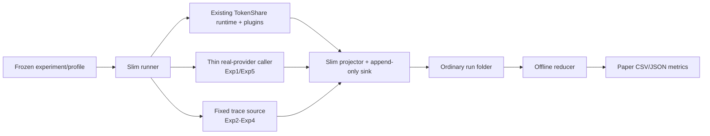

# Slim V2 设计宪章

## 0. 最高设计指示：最快得到真实有效的实验结果

> **Slim V2 以最快速度得到真实有效的论文实验结果为唯一核心，只保留产生这些结果不可缺少的功能。**

这里的“真实有效”只表示：Experiment 1/5 使用权威指定的真实 provider，实验真实接入现有 TokenShare 系统本体、Factorization/Lean插件和checker，结果来自实际运行事实，固定分母和指标计算符合权威文档。它**不表示**需要证明本地文件没有被人为伪造，也不要求建立攻击者模型、证据链或防篡改系统。

最高取舍规则：

1. 在两个方案都能产出权威指标时，选择代码更少、依赖更少、调用更少、运行更快、恢复更直接的方案。
2. 新增任何组件、字段、抽象、检查或审查要求前，提出者必须指出它直接服务的冻结实验、必需字段或不可恢复故障；无法指出则禁止加入。
3. “更严谨”“更安全”“以后可能需要”“旧系统已经有”“reviewer担心”都不能单独构成新增设施的理由。
4. 不得用精简为理由伪造、漏记或改写实验结果；除此之外，优先删除而不是扩建。
5. 本节优先于后续Agent、reviewer和实施计划的偏好。只有用户可以降低或改变该优先级。

### 0.1 受信本地环境与明确排除的威胁

Slim V2 运行在用户控制的受信本地研究环境中，不防护也不审查以下范围外威胁：

- 人为伪造、手工篡改或替换实验结果；
- 恶意路径、链接、symlink或目录逃逸攻击；
- SQL、JSON、prompt或命令注入攻击；
- 恶意输入、schema/security fuzzing；
- 恶意plugin、executor、provider envelope或伪造provider响应；
- 签名鉴权、RBAC、权限隔离、反重放和攻击者身份模型；
- 为发现上述攻击而增加的hash、digest、receipt、lineage、审计日志、sandbox或publication gate。

保留的只有正常路径正确性和最小secret卫生：受控输入能被正确解析，输出schema足以计算指标，API key不写入结果或日志。这不是通用安全工程。

Experiment 3的五类冻结fault、worker death和Experiment 4的mode-blind challenge是论文预注册实验变量，不是攻击者模型。不得借这些实验变量扩展新的故障类型、对抗测试或安全加固。

reviewer如果基于本节已排除的威胁提出意见，Stage owner必须记录为`out_of_scope_by_user`并拒绝实施；这类意见不是Critical/Important，不能阻塞设计、计划、实现或运行收口。

## 1. 文档角色

本文冻结 Slim V2 的顶层设计思想、取舍原则、必须保留的能力和明确放弃的设施。它回答的是“要建成什么样的实验设施，以及为什么只能这样建”，不是 Experiment 1–5 的指标表、系统公共 API 清单、实现规格或实施计划。

权威分工如下：

1. `README.md`：入口、阅读顺序和工作边界；
2. 本文：架构理念、最小化原则和不可扩张约束；
3. `slim_v2_experiment_metrics_authority.md`：实验、统计口径、指标和最小原始字段；
4. `slim_v2_system_integration_contract.md`：系统接线、公共接口和 Slim-local 缺口；
5. `slim_v2_reuse_inventory.md`：只读支持材料，不是权威。

指标细节以指标权威为准，系统接口细节以接线合同为准。任何后续设计、计划、代码或 Agent prompt 都不得省略、弱化或反向覆盖本文；只有用户的新明确决定可以修改本文。

## 2. 为什么必须有 Slim V2

旧实验设施的主要失败不是单个 bug，而是职责和约束不断叠加：多个 paper runner 同时承担实验调度、预算、checkpoint、回答来源、证据、投影和发布资格，导致一个问题可能穿过多条 authority/gate 链，修复成本与实验本身不成比例。

Slim V2 的目标不是修好或裁剪旧设施，而是建立一条独立、足够小、可以直接回答论文问题的新路径。完成标准只有一个：在正确接入现有系统本体和真实模型的前提下，可靠地产生计算冻结论文指标所需的数据。

可追溯、防伪、发布资格、预算审批和生产平台能力都不是当前论文实验的必要条件。不能因为旧代码已经存在这些设施，就把它们继续带入新路径。

## 3. 一句话架构原则

> Slim V2 是“冻结实验计划 + 现有系统本体 + 两种回答来源 + 普通增量输出 + 离线 reducer”，不是新的实验治理平台。

两种回答来源只有：

- Experiment 1/5：薄 real-provider caller 发起必要的真实 API 调用；
- Experiment 2–4：只读复用 Experiment 1 普通 per-unit traces，provider calls 固定为 0。

概念数据流：

## 4. 十条不可违反的设计原则

### 4.1 指标优先于旧代码

实验和指标先由权威文档定义，设施再为其提供数据。新增指标在旧实现中没有现成字段、模块或公式是正常情况；不得为了迁就已有代码删减指标、改变统计口径或把缺失字段伪装为可复用能力。

### 4.2 最小充分，而非未来完备

组件只有在直接服务于以下至少一项时才可进入 Slim V2：冻结实验执行、必要真实 API、系统接线、最小原始数据、崩溃恢复、离线指标计算或全量资源有界。不能明确回答“它为哪项必需能力服务”的组件必须删除。

### 4.3 Slim 是薄适配层，不是第二个系统本体

协议状态机、worker、scheduler、租约、恢复、Factorization 和 Lean 领域语义继续由现有公共系统承担。Slim V2 只拥有实验计划、窄 adapter、回答来源、hook/collector、projector、普通 sink、profile 和 reducer。不得复制协议核心或在 Slim 中建立另一套真值。

### 4.4 现有代码是候选材料，不是需求来源

复用必须逐项证明“足够小、接口匹配、没有旧 gate/authority 依赖”。允许直接复用底层纯能力、轻量适配公共接口或只借局部公式；禁止为了提高复用率而让新设计服从旧 paper runner 的形状。

### 4.5 普通数据足够

Slim V2 假设受信本地研究工作流。输出用可读的 JSONL/JSON/CSV 和响应文件，以普通文本主键关联和恢复。数据不需要 hash、digest、receipt、lineage 或 evidence closure 来证明真实性。

### 4.6 实验必须原子化

Experiment 1–5、reducer 和 representative 都必须有独立入口；Experiment 2–4 可以显式选择一组已完成的 Experiment 1 traces，不得隐式重跑 Experiment 1。另有组合入口按依赖顺序一次运行全部实验。

### 4.7 只为不可避免的真实回答付费

Experiment 1/5 执行权威要求的真实 API；Experiment 2–4 只消费 Experiment 1 traces，不增加回答库、source slot 或在线检查。恢复时必须先检查已有进程、结果和 per-unit trace，禁止盲目重复 provider 调用。

### 4.8 Representative 与 Full 同管线

representative 只能通过 profile 缩小 case/condition 数量，不能拥有另一套 runner、schema、adapter、provider caller、resume 或 reducer。它验证的是 Full 将实际使用的设施，而不是一个被简化到失真的 mock demo。

### 4.9 全量资源必须有界

roots 串行，单 root 内并发；结果逐 root/attempt 增量落盘；响应大对象不常驻内存；reducer流式或分块聚合；queue、worker、文件句柄、临时文件、日志和磁盘增长都有明确上限。不能用“机器可能够大”代替资源设计。

### 4.10 失败也是数据

模型错误、checker rejection、超时、provider failure、worker death 未恢复和 root 无 final 都必须保留固定身份和结果行。设施不能通过跳过失败样本改善分母，也不能把模型自然失败当作基础设施 bug反复修复。

## 5. 必须保留的最小设施

### 5.1 实验计划与 profile

- 表达 Experiment 1–5 的冻结 condition；
- 表达 full 与 representative；
- 生成稳定的 case/condition/repeat/root/planned-unit 身份；
- 不负责预算、资格或发布审批。

### 5.2 原子 runner 与依赖解析

- 每个实验可以单独运行；
- 组合命令可以按依赖顺序运行；
- Experiment 2–4 显式接收 Experiment 1 run/source；
- 缺少上游数据时明确失败，不偷偷调用 provider 或读取历史输出。

### 5.3 系统接线 adapter

- 调用现有 core/local_runtime/plugin/storage 公共接口；
- Factorization/Lean 领域语义不进入通用 runner；
- shared code 默认只读；
- coordinator 正常终态后由 Slim-local coverage tail补齐未调度 unit，不修改 coordinator。

### 5.4 两种回答执行能力

- 薄 real-provider caller：单 entry 输入，raw/usage/latency/error/model 输出；
- fixed-response executor：只读 Experiment 1 trace、核对普通语义字段、ordinal 精确选择或同 trace last-attempt fallback、禁止 transport fallback。

### 5.5 场景层

- Experiment 2 logical scheduler；
- Experiment 3 fault/worker-death 与确定性扰动；
- Experiment 4 mode-blind challenge 和 11 modes；
- 场景层只改变权威允许改变的变量，不反填结果。

### 5.6 Projector、sink 与 resume

- 从同一次 run 的公共 event/store/plugin事实投影最小字段；
- 每个预注册 root至少写一行；
- per-unit trace和大 raw response分开增量保存；
- 普通文本主键支持 skip/resume；
- 不建立数据库 authority或 publication state。

### 5.7 静态 pricing projector 与 reducer

- 价格只是普通版本化常量映射；
- reducer只读取一个普通 run目录；
- 计算全部冻结指标、CI 和诊断表；
- 不联网、不查余额、不阻止实验运行。

## 6. 明确放弃的设施

下列内容不属于 Slim V2，不能以“复用现有能力”“保证严谨”“以后可能需要”或“防止误操作”为理由重新加入：

- budget authority、预算审计、预算审批或预算门禁；
- receipt；
- hash/digest 数据防伪链；
- lineage/evidence closure；
- publication gate、paper eligibility、formal publication pipeline；
- response-bank authority、独立回答库或额外 source slots；
- selection digest、prepared identity、prepared provider budget；
- hard-deadline child gate、quiescence evidence；
- 旧 paper/formal runner及其运行时 import；
- 为证明数据未被伪造而建立的设施；
- 人为伪造/篡改防护、注入攻击防护、签名鉴权、安全fuzzing、恶意plugin/executor/provider模型；
- 动态价格联网、余额检查或以价格变化阻止运行；
- 生产级多租户 provider平台、权限系统、分布式网络和攻击防护；
- 为未来扩展预建但当前指标不需要的插件框架、registry、审批流或抽象层。

删除判断：如果移除某组件后，冻结实验仍能运行、必要字段仍能产生、崩溃仍能恢复、reducer仍能算出全部指标，那么该组件不应存在。

## 7. 冻结实验带来的架构约束

本文不重复实验公式，但以下架构后果不可改变：

- 所有 roots 在 runner 层串行，`worker_count` 只控制当前 root 内 AI units；
- Experiment 1 正常协议 terminal 后立即运行 coverage tail，tail资源单列且不回写 root runtime；
- Experiment 2 完整继承 Experiment 1 plan，不使用独立 split；
- Experiment 2–4 的来源键固定为 `case_id × source_repeat_id=0 × planned_ai_unit_id`，普通字段核对后才可消费；
- Experiment 2–4 provider calls 为 0，ordinal缺失只允许同 trace last-attempt fallback；
- Experiment 3 使用冻结五类 fault、ordinal 0注入和 deterministic perturbation；
- Experiment 4 使用 FULL、四个单机制、六个双机制共 11 modes和 mode-blind challenge；
- Experiment 5 使用冻结四 endpoint和零重试；
- reasoning token是 completion子集，不重复计价；
- 单 root失败仍占预注册分母并写结果行。

任何设计选择如果会改变这些语义，必须停止，不得由 Agent自行裁决。

## 8. 原子运行合同

最终 CLI/入口的具体语法由设计规格冻结，但能力必须包括：

1. 单独运行 Experiment 1；
2. 单独运行 Experiment 2、3或4，并显式指定 Experiment 1来源组；
3. 单独运行 Experiment 5；
4. 按依赖顺序运行全部实验；
5. 单独运行 reducer；
6. 单独运行 representative；
7. 对同一 run执行 resume/skip；
8. 查看 plan/profile而不调用 provider。

原子化不是多建 runner。所有命令必须落到同一组件和同一数据合同，只改变 experiment/profile/selection。

## 9. 输出与恢复哲学

推荐根目录为 `TokenShareData/outputs/slim_v2/<run_id>/`。设计规格可以冻结具体文件名，但必须满足：

- 普通、可人工查看的文件；
- append/atomic-replace边界明确；
- raw response与逐 root归一化结果分离，避免单行无限膨胀；
- 每条结果带足够的普通身份字段；
- 同一主键不会产生冲突的第二条 canonical记录；
- crash后枚举已有文件即可判断已完成/缺失工作；
- reducer不依赖聊天、内存状态、旧输出或外部 authority；
- secret永不写入结果、raw、日志或错误文本。

恢复的目标是避免丢工作和重复付费，不是建立审计证明。实现可以使用普通 manifest/checkpoint，但它不能演化成 gate、receipt或digest体系。

## 10. Representative 宪章

representative 必须走与 Full完全相同的管线和 schema。最低规模要求：

- Experiment 1：至少两道 Factorization和两道 Lean；
- Experiment 5：至少一道 Factorization；
- Experiment 2–4：按依赖关系缩小，但仍覆盖各自关键 worker、fault/recovery和 ablation路径。

设计规格必须把“等量缩小”解析为精确 condition/root清单、稳定选择规则、provider-call上限和设施通过标准，不能留下“少量样本”或“代表性条件”这类占位语句。

representative通过表示：所有预期 cell可启动、每个预注册 root有结果、Exp1 trace闭合、Exp2–4无 provider call、Exp5 model identity正确、reducer字段完整且resume有效。模型不正确不等于设施失败。

## 11. 资源与性能边界

设计必须在不知道全量输出最终大小的情况下仍保持安全：

- 单 root工作集有界；
- writer按记录flush并能恢复半完成文件；
- response大对象写独立文件或受控JSONL，不在聚合器复制；
- reducer按实验/slice流式或分区处理；
- 只有bootstrap/配对/交互所需的最小分组状态可以暂存；
- worker pool、queue和future数量受当前 `worker_count` 或更小上限约束；
- roots不得并行；
- 及时关闭文件、线程、进程、HTTP response和临时资源；
- 日志不得无上限复制raw response；
- 设计规格必须给出磁盘估算方法、运行前空间检查和安全停止后的resume方法。

这些是避免本地机器失控的必要工程约束，不是预算门禁。

## 12. 测试与验证边界

验证只证明Slim自己的接线和数据合同，不重复证明现有系统本体：

- 优先使用Factorization、fake transport、fake checker、固定fixture和静态合同；
- 默认不运行Lean专项suite、LeanAudit、全量Lean catalog或`lake`/`lean`回归；
- 只有Slim-local Lean接线无法由轻量方法定位时，才允许预先记录理由和时间上限后运行最小单case Lean smoke；
- representative/full中的Lean roots属于实验数据，不属于附加测试；
- 不运行旧Full、旧representative或旧publication matrix验证Slim；
- 不用陈旧全局基线决定Slim接口或完成状态。

## 13. 设计规格对本文的责任

`slim_v2_design_spec.md`必须逐条落实本文，而不是再次讨论是否接受本文。至少提供：

- charter requirement ID到设计章节的追踪矩阵；
- 每个组件的输入、输出、所有者、持久化位置、调用顺序、失败行为和测试方式；
- 指标到原始字段、产生组件和文件位置的映射；
- 原子CLI和依赖解析；
- full/representative profile；
- 资源上限和恢复状态机；
- 复用/适配/只借逻辑/禁止复用清单；
- 本文禁止设施的absence检查；
- 真实公共接口缺口；没有则明确写`none`。

设计规格不得留下TODO、TBD、“后续决定”或把冻结实验语义交给实施Agent重新选择。

## 14. 简化审查问题

每次设计和代码审查都必须问：

1. 这个组件直接产出哪个实验能力或指标字段？
2. 删除它会让哪条冻结要求无法满足？
3. 它是否把普通恢复变成了authority/gate？
4. 它是否把旧paper runner重新带回运行时？
5. 它是否制造第二套协议真值、回答库或representative管线？
6. 它是否让全量内存、CPU、磁盘或provider调用失去上界？
7. 它是否可以缩成一个纯函数、薄adapter或普通文件？
8. 审查意见是否假设了本文明确排除的人为伪造、恶意篡改或注入攻击？若是，是否已标记`out_of_scope_by_user`并拒绝实施？

任何新增设施的举证责任在提出者。无法给出具体答案时，默认删除。

## 15. 变更控制

本文状态为`user_approved`。设计Agent、计划Agent、实施Agent、reviewer和恢复heartbeat都无权弱化本文。普通实现选择可以在本文边界内自行裁决；下列变更必须停止并等待用户：

- 改变实验、指标、数据集、provider、价格、fault、ablation或timing语义；
- 引入本文明确放弃的设施；
- 修改shared core/local_runtime/plugin/executor且Slim-local adapter无法解决；
- 建立第二条runner、response authority或数据真值；
- 让representative与Full走不同关键路径；
- 取消原子运行、普通文件恢复或资源有界要求。

30分钟Agent recovery heartbeat是开发任务的无人监督恢复机制，不是Slim runtime组件，不得作为理由向实验设施增加scheduler、gate或审计代码。
