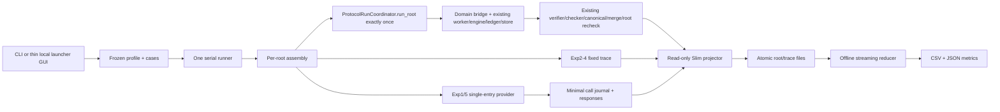

# TokenShare Slim V2 设计规格

## 0. 规格结论与权威顺序

Slim V2 采用一条独立、最小的论文实验路径：冻结 profile 生成普通 root inventory；每个 root 只调用一次现有 `ProtocolRunCoordinator.run_root()`；Experiment 1/5 通过 single-entry 薄 provider caller 取得真实回答，Experiment 2–4 只读 Experiment 1 的普通 per-unit traces；Slim-local projector 把同一次 run 的系统、插件、checker 和 hook 事实写成普通记录；离线 reducer 只读取该 run 目录并生成 CSV/JSON。旧 paper/formal runner、预算、receipt、digest/lineage、response-bank authority 和 publication gate 不在依赖图中。

本规格服从以下优先级：

1. `slim_v2_experiment_metrics_authority.md` 决定 Experiment 1–5、字段、公式、分母、价格、fault、ablation 和 timing；
2. `slim_v2_system_integration_contract.md` 决定公共系统接口和字段来源；
3. `slim_v2_design_charter.md` 第 0 节决定最快获得真实有效结果、受信本地边界和最小化；
4. `slim_v2_reuse_inventory.md` 只决定候选复用位置，不反向改变设计。

本次蓝图修订已由spec coverage与blueprint usability两路独立只读reviewer闭合，范围内Critical/Important均为0，状态为`approved_under_user_delegation`。这是开发文档状态，不是runtime gate或实验结果批准。

## 1. 目标、非目标和不可违反约束

### 1.1 目标

Slim V2 只交付以下能力：

1. 把冻结实验参数、case 和 profile 接入现有 TokenShare 系统本体；
2. 真实调用现有 Factorization/Lean plugin、parser、verifier、Lean checker 和 root recheck；
3. 只在 Experiment 1/5 发起必要真实 provider 请求；
4. 串行调度 Experiment 1–5 的冻结 roots，并让 `worker_count` 只控制当前 root 内 AI units；
5. 逐 attempt/root 增量保存计算全部必须指标的最小普通数据；
6. 从一个普通 run 目录离线生成 CSV/JSON；
7. 用普通文本主键 resume/skip，避免丢失已完成工作或重复真实调用；
8. 以同一管线运行 `representative` 与 `full`，二者只在 profile 数据和 condition 规模上不同。
9. 为本地人工运行提供一个Windows双击脚本和薄参数选择窗口；它只包装同一CLI，不形成第二个runner。

### 1.2 非目标和禁止依赖

下列设施不得设计、实现、读取或作为运行前提：

- budget authority、预算审批、余额检查、spend gate；
- receipt、hash/digest 防伪链、selection digest；
- lineage/evidence closure、publication gate、paper eligibility；
- response-bank authority、独立回答库、prepared identity、hard-deadline child gate；
- 旧 paper/formal runner、publication pipeline、历史 Rxx/TokenShareData 输出；
- 为证明本地数据无人伪造而增加的审计、签名、鉴权、sandbox 或权限系统；
- 人为伪造、手工篡改、路径/链接/SQL/JSON/prompt/命令注入、恶意 plugin/executor/provider、安全 fuzzing 和攻击者模型防护；
- 将 Experiment 3 fault、worker death 或 Experiment 4 challenge 扩张成通用故障/安全平台；
- 动态联网查价或因价格、成本、资格阻止实验。

系统本体内部现有 ArtifactStore/EventLedger 的 hash/ledger 行为属于既有公共系统实现细节。Slim 只用它们读取同一次 run 的事实，不把相关 ref、hash、digest 或 `ledger_binding` 投影到 Slim 输出，也不为其增加检查。

### 1.3 不可改变的运行语义

- roots 严格串行；Experiment 1、3、4、5 固定 `worker_count=10`，Experiment 2 固定 `{1,3,7,10,30,50}`；
- Experiment 1 每 root 是 `run_root()` 正常协议阶段后紧接 coverage tail，tail 完成前不能开始下一 root；
- `root_terminal_at_ms` 在协议 terminal（包括有效`no_final`）冻结，tail 不延长正文 runtime，tail wall/token/cost 单列；
- Experiment 2 完整继承 Experiment 1 的 split、unit、prompt 和依赖；
- Experiment 2–4 只按 `case_id × source_repeat_id=0 × planned_ai_unit_id` 取 trace；exact ordinal 缺失只回退同 trace 最后自然 attempt；
- Experiment 2–4 `provider_call_made=false`，出现 transport attempt 即 condition 接线失败；
- Experiment 3 只有五种 rate fault、冻结 worker-death 条件、ordinal 0 注入和 seed `20260820` 扰动；资源标为 `simulated_trace_attributed`；
- Experiment 4 只有 FULL、四个单机制、六个双机制共 11 modes；challenge mode-blind，组合 mode 必须真实运行；
- Experiment 4 不运行三机制、四机制或`ALL_OFF`，也不新增fault/error rate；
- Experiment 5 只使用三个冻结 SiliconFlow thinking endpoint、零重试、真实 usage；Exp1 Flash V4 只可进入独立历史参考表；
- 前向 Experiment 1 成本固定为 Flash `slim_v2.pricing.2026-08-23`，Experiment 5 保留 SiliconFlow `slim_v2.pricing.2026-08-20`；两者按每个实际 attempt 固定，`reasoning_tokens` 是 `completion_tokens` 子集，不重复计价；
- 单 root 失败、超时、未恢复、preflight block 或 infrastructure-invalid 均保留预注册身份和结果行；ratio 分母为 0 时写 `null + missing_reason=zero_denominator`，必需输入缺失或不适用时写 `null` 和对应原因，不写伪 0；数值写回必须清除同 metric 的模板旧原因。

## 2. 最小总体架构与模块树

```text
run_slim_v2.cmd                     # Windows双击打开Slim V2参数选择窗口

src/tokenshare/experiments/slim_v2/
├── __init__.py             # 包版本和少量稳定导出
├── schema.py               # inventory/root/trace/call 普通数据合同
├── case_source.py          # 当前 catalog 的 UTF-8 读取与显式 ID 选择
├── profiles.py             # full/representative inventory 与逐 root plan 派生
├── storage.py              # run 目录、原子 root/trace、terminal-call journal、resume 扫描
├── provider.py             # single-entry bounded call、usage/model 与冻结价格投影
├── execution.py            # provider/fixed answer 到 ExecutionSubmission 的薄适配
├── scenarios.py            # Exp2 scheduler、Exp3 hooks/death、Exp4 policy/challenge
├── runtime.py              # 每 root 公共对象装配、唯一 run_root 调用、Exp1 tail
├── projector.py            # event/store/plugin/hook 事实到 RootResultV2
├── reducer.py              # 单 run 目录流式统计与 Exp1–5 表
├── cli.py                  # plan/run/run-all/reduce/representative 原子入口
└── gui.py                  # Tkinter薄包装；窗口选择确定性映射为同一CLI argv

tests/experiments/slim_v2/
├── fixtures/               # 小型Factorization、Lean fixed-DAG、provider与golden run
├── test_schema.py
├── test_case_source.py
├── test_profiles.py
├── test_cli_plan.py
├── test_system_vertical.py
├── test_answer_paths.py
├── test_scenarios.py
├── test_reducer_golden.py
├── test_cli_e2e.py
└── test_gui_launcher.py
```

上述是最终责任边界，不是每个文件都要独立成实施Task。已有`schema.py`,`case_source.py`,`profiles.py`,`cli.py`成果先保留，再用真实两领域纵链校准；只有当前冻结运行确需的文件才创建。不建立额外 registry、service layer、repository layer、数据库 authority、第二个runner或representative runner。`cli.py` 是唯一 orchestration 入口；`gui.py`和`run_slim_v2.cmd`只在它之前包装参数，`representative` 只是 `run-all --profile representative` 的别名。package-level re-export只保留`SCHEMA_VERSION`；实施蓝图列出的稳定调用点以module-qualified名称调用，schema DTO与装配helper不自动升级为公共framework。

### 2.1 架构数据流



### 2.2 被否决的替代方案

| 方案 | 裁决 | 原因 |
|---|---|---|
| 裁剪旧 paper/formal runner | 拒绝 | 仍会继承 budget、evidence、response bank、publication 和复杂 checkpoint 形状 |
| 在 Slim 内复制协议状态机/plugin 语义 | 拒绝 | 形成第二套系统真值，无法证明真实接入系统本体 |
| 先建schema/provider/sink再接系统 | 拒绝 | 会让大量设施在真实纵链前自洽，存在搭出伪系统的风险 |
| 两领域纵链Gate + 薄 adapter + 普通文件 | 采用 | 第一阶段就证明真实接入，后续只补冻结实验缺口且shared默认只读 |

## 3. 组件合同

| 组件/所有者 | 输入 | 输出与持久化 | 调用顺序 | 失败行为 | focused test |
|---|---|---|---|---|---|
| `profiles.py` / runner | `profile_id`、实验选择、冻结 catalog | condition/root/challenge inventory；写 `inventory/*.jsonl` | 所有运行前 | 输入/profile 不符时不调用 provider并退出 | 规模、condition、case、repeat、provider-call 上限精确断言 |
| `case_source.py` / runner | catalog path、显式 case IDs | 一次一个 case object，不持久化副本 | inventory 解析时 | 缺 ID/schema 不匹配为普通输入错误 | UTF-8、缺 ID、重复 ID、分层字段 |
| `runtime.py` / root | root inventory、case、answer adapter、clock | 每 root 独占 store/ledger/engine/plugin/coordinator/result；Exp1 tail summary | root 串行循环内 | 构造/公共接口错误写 infrastructure-invalid；全局输入错则 fail-stop | 两领域真实`run_root`纵链、对象不跨 root、tail隔离 |
| `provider.py` / Exp1/5 executor | 单一 `ProviderEntryView`、prompt、request control、`ProviderCallContextV1`、注入的`RunStore` | `ProviderCallResultV1`；经同一store写attempt journal与 `responses/*.json` | plugin request 后一次调用 | 不内部重试或创建第二store；transport/HTTP/envelope/usage/model 错误显式返回 | fake transport覆盖 DeepSeek/SiliconFlow、usage、model、null content |
| `execution.py` / worker | `ExecutionRequest` + provider result或fixed trace | 公共 `ExecutionSubmission` | worker backend调用 | parser failure保留 raw；fixed path禁止 transport | 两领域成功/parse/provider/fixed失败 |
| `storage.py` / 全部 | inventory/root/trace/call object | 普通原子文件、committed key集合和terminal-call facts | 每个持久化边界 | 冲突主键或写失败立即安全停 | root/trace/call键、crash窗口、resume/unknown |
| `scenarios.py` / Exp2–4 | condition、plan、fixed source、seed、mechanism mode | scheduler/hooks/observations/reference projections | root adapter构造时 | 只执行冻结变换；mode不得进入challenge injector | 六worker、五fault、death、11 modes、四challenge |
| `projector.py` / root | result、同一 ledger/store、plugin、hook、attempt journals | `RootResultV2`；临时内存仅当前 root | protocol/tail后 | 缺公共事实写null+reason；接线缺失分类 infrastructure-invalid | 与指标权威第8节叶字段集合、嵌套结构和必填/可空规则精确相等，另验领域正确性与failure taxonomy |
| `provider.py` 的纯价格投影 / projector | provider family/model、usage、request UTC | attempt cost、version、tier；随attempt/root记录 | 实际/模拟usage之后 | 必需cache split/time缺失则cost null，不阻止调用 | 峰谷边界、三个Exp5 endpoint、reasoning不双算 |
| `reducer.py` / 离线 | 单个 run 目录 | `metrics/*.jsonl`、`*.csv`、`summary.json` | 单独命令或run-all末尾 | inventory-result缺口进入固定分母并标null/reason；绝不调用runtime/provider | 全指标、CI、pair/quadruple、流式内存边界 |
| `gui.py` / 人工入口 | profile、Exp1–5/all、run ID、output、必要source、resume | 同一CLI argv和一个CLI子进程exit code；自身不持久化 | CLI之前 | 无效选择不启动；运行中不再启动第二进程 | 12种核心选择、Exp2–4 source、all→run-all、provider=0 |
| `run_slim_v2.cmd` / Windows入口 | 脚本所在仓库、既有`tokenshare` conda环境 | 启动`python -m tokenshare.experiments.slim_v2.gui` | 用户双击时 | 缺conda/env/Tkinter时清晰退出，不安装或fallback | 静态目标与working-directory合同 |

每个新增组件都直接服务冻结实验、必需字段、恢复或资源上界；没有单独的tail、pricing、trace-source或sink实施Task。若实现发现这些职责只需少量函数，就留在表中已有owner；不存在“以后可能有用”的扩展点。

## 4. 公共系统接口与 Slim-local adapter 边界

### 4.1 每个 root 的唯一公共调用

`runtime.py` 对每个 root 依次创建：

1. root 独占 `ArtifactStore(<root-system-dir>)` 和 `EventLedger(<root-system-dir>/events.jsonl)`；
2. condition 对应 `ProtocolConfig`：Exp1、Exp2、Exp3（含无fault reference、rate-fault和worker-death）固定 `max_retries=2`；Exp4全部mode固定`max_retries=1`，含`NO_REQUEUE`的mode只令`replacement_attempts_allowed=false`；Exp5固定`max_retries=0,replacement_attempts_allowed=false`；禁止借公共默认值决定attempt上限；
3. `ProtocolEngine(event_ledger, protocol_config, artifact_store)`；
4. root 独占 `FactorizationRuntimeAdapter` 或 `LeanRuntimeAdapter`；Lean 始终注入真实 `check_lean_proof`，只有 focused test使用 fake checker；
5. provider 或 fixed-trace executor，再由 `FactorizationExecutionBridge`/`LeanExecutionBridge`连接；
6. worker backend；
7. `ProtocolRunCoordinator(engine, artifact_store, event_ledger, now, observation_clock)`；
8. `ProtocolRunRequest`，并且只调用一次 `run_root(request)`。

`ProtocolRunRequest.execution_scope` 恒为 `whole_root`。Exp1/5 使用 `trace_delay_policy="online_real_time"` 且 `logical_scheduler=None`；Exp2–4 使用 `logical_source_latency_1x` 与 `LogicalSourceLatencyScheduler`。`continue_after_terminal_child_failure` 必须由各 profile显式给出，不借默认值隐藏失败。

### 4.2 领域边界

- Factorization：case 保持完整 candidate domain；plugin 生成稳定 `range_<child_index>`、prompt 和 ranges；provider/fixed executor只执行 range unit；parser、`verify_range_result`、factor-witness/coverage merge 和独立 `target_n` 乘积检查决定结果。
- Lean：case 保持固定 lemma DAG；AI 不决定拆分；proof unit携带 `planned_ai_unit_id/lemma_node_id/dependency_path`；每个 candidate 使用真实 checker；最终正确性必须同时满足 `merge_result.accepted` 与 root checker `ACCEPTED`。
- `ProtocolRunResult.status=completed` 只表示协议终态，不替代领域正确性。

#### 4.2.1 Factorization B prompt v2（2026-08-22用户批准）

后续Slim V2 `representative`与`full`统一使用`factorization.bounded_range_prompt.v2`，不保留旧prompt的Slim运行入口。v2只修改`prompt_builder.py`生成的自然语言策略：用一个canonical JSON skeleton承载协议绑定值，删除候选整数枚举和found/no-factor双模板；加入不可变`N/L/U`、定量bounded Fermat路由、仅在`N % p != 0`时允许跳过`p`倍数的sound wheel规则、`no_factor_in_range`完备覆盖门，以及输出前从canonical输入重新加载目标并执行range/modulo/quotient/product/逐位比较。

`RangeResult`的14个字段、`factorization.range_result.v1`、result kinds、parser、verifier、merge、trace schema和指标口径均不变。`checked_divisor_count`仍机械写为no-factor时`U-L+1`、found-factor时`d-L+1`，但prompt明确其为protocol coverage value而非自然语言运算步数。Experiment 2–4继续重建并核对同一当前plugin plan/prompt；旧representative的v1 traces只可作诊断，不得与v2 representative/full或其下游实验混用。四份前置权威不需要修改，因为实验矩阵、指标、provider、任务切分、输出schema和Exp1→Exp2–4继承关系均未改变。

#### 4.2.2 跨域失败语义与 Lean 环境 pass（2026-08-22用户批准）

Lean prompt必须给出完整proof-candidate JSON skeleton，并显式冻结`schema_version="lean_proof.proof_candidate.v1"`。Factorization与Lean共享结构化retry终态：parser、正常verifier/checker rejection、provider-only或混合耗尽均投影为顶层`no_final`，细因只写`failure_origin`；不得再由普通`RuntimeError`投影为设施失败。有效`no_final/incorrect_final`及其他非设施 terminal 仍执行 Exp1 coverage tail，只有 condition/runtime wiring failure 或 infrastructure-invalid terminal 阻断。Lean checker的`environment_error/timeout/helper_error`首次出现即停止root，顶层为`infrastructure_invalid`、`failure_origin=checker_environment_error`；预注册worker-death耗尽仍是有效`no_final`，保留`child_execution/worker_death_exhausted`。

Lean环境验证是独立命令：覆盖全部checker-backed catalog nodes，全部accepted后才原子写持久pass。实验启动只校验pass、关键输入digest与`LemmaGraphCases.olean/LemmaGraphOracle.olean`哈希，不运行Lean/lake；pass缺失或失效时，只把全部pending Lean ordinary/reference roots在provider前写成`failure_stage=preflight`的infrastructure-invalid，Factorization继续且fixed-source closure排除这些Lean-invalid keys。Reducer保留固定预注册库存；任一cell含infrastructure-invalid时科学rate为null，任一配对端为infrastructure-invalid时pair不接纳。

### 4.3 projector读取边界

Projector只读取当前 root 已持有的：

- `result.summary.runtime_observation/units/attempts/runtime_hook_observations`；
- 同一 `EventLedger.read_all()` 中当前 `task_id` 的 submission、verification、recovery、canonical、merge events；
- submission/provenance/raw refs指向的同一 `ArtifactStore.read_bytes()`；
- Factorization最终 artifact与独立检查；
- Lean request checker report、merge result和root checker report；
- Slim-local provider/trace/fault/challenge journals。

Projector忽略 `event_refs`、`artifact_refs` 的防伪含义和 `ledger_binding`，不把它们写入输出。artifact ref只作为从公共系统取回本 root 数据的临时定位符。

### 4.4 worker backend冻结规则

- `worker_count=1` 使用 `SequentialWorkerBackend`；
- worker-death condition必须使用 `ProcessWorkerBackend` + `WorkerTerminationPolicy`；
- 其他 `worker_count>1` 先使用`ThreadWorkerBackend`做Factorization真实 k>1与Lean fake fixed-DAG事实完整性验证，检查unit/attempt/canonical/checker无丢失或错配；
- Thread尚未验证是验收缺口，不是已证明系统损坏。通过后同一领域的representative/full固定使用Thread；
- 只有出现可复现的Thread事实缺失，并证明现有`ProcessWorkerBackend`不能直接满足普通场景时，才允许把Slim-local bounded-process facade作为条件性补救提交接力协议审议；它不属于基础计划必建能力；
- 普通Thread与现有Process都不能闭合时才构成shared-interface强制停止，不得预先改shared code；
- provider in-flight由当前root worker capacity与冻结endpoint上限共同约束：DeepSeek有效上限10，SiliconFlow上限3；不为尚不存在的process facade预建manager、queue或跨进程permit层。

这个证据分支不改变实验语义，也不把backend变成profile维度。

## 5. Experiment 1–5 数据流、控制流和失败语义

### 5.1 Experiment 1：真实 DeepSeek、正常协议与 coverage tail

1. full profile展开Factorization 300和Lean 135 roots，`repeat_id=0,seed=1,worker_count=10`；representative使用第13节四个精确roots。
2. 前向 condition 在 root loop 前解析唯一 entry `deepseek_v4_flash_exp1_baseline`；caller 固定 `deepseek-v4-flash`、thinking enabled、`reasoning_effort=high`、600秒、300000 max tokens。配置的provider全局上限为50，但root内只有10 workers，故实际有效in-flight上限为10。2026-08-23 前已启动的 exact run 只按其持久化 Pro identity 恢复，不能因此反向覆盖该前向 entry。
3. runner记录`root_start_at_ms`后运行一次`run_root()`；每自然协议attempt立即写call intent、response/result和raw response；provider caller每次只调用一次，协议`max_retries=2`决定最多三个自然attempts。
4. coordinator terminal后立即冻结`root_terminal_at_ms`和`runtime_wall_clock_ms`，projector形成protocol结果和每个已执行unit的`trace_origin=protocol` trace。
5. runner计算`tail_targets=unscheduled_ai_unit_ids - protocol_trace_ids`，保持冻结runtime observation的原始顺序而不重新排序。Tail使用相同request、prompt、依赖、provider和控制；每unit从ordinal 0开始，首次accepted停止，最多三次；parser/checker只决定tail是否继续，不向已终止root提交。Lean依赖canonical不可用时不伪造依赖，而是写带真实`lemma_node_id/dependency_path`且`provider_call_made=false`的typed`pre_dispatch_failure`。
6. 所有target形成唯一trace后写tail summary和root result，随后才开始下一root。每个target由领域接受事实判定success：Factorization verifier accepted或Lean checker accepted；用尽三次或明确pre-dispatch/provider/parse/verifier/checker terminal failure且无领域接受事实算failure。coverage-tail attempt不创建协议canonical，其`canonical_accepted`固定为null/false并带`not_applicable`；tail provider count/token/cost只累计真实`provider_call_made=true`的attempt；`trace_tail_success_unit_count + trace_tail_failure_unit_count = |trace_tail_target_ai_unit_ids|`。

正常协议的completion/correctness/runtime/provider latency/token/cost不读取tail；tail资源只进入诊断字段。provider/parse/checker自然失败仍写trace/root；同键重复、tail target非法或tail写失败为接线错误并停止下一root。

### 5.2 Experiment 2：固定回答逻辑worker扩展

1. atomic命令必须显式给出已完成Exp1 source run；`run-all`只把同run Exp1目录显式传入，不隐式调用Exp1。
2. 每case从Exp1继承同一plan、ranges、IDs、prompt和依赖；full使用50 hard Factorization cases、workers `{1,3,7,10,30,50}`、repeats `{0,1}`；`max_retries=2`，每unit最多三个自然ordinals。
3. fixed executor按三元键命中；当前ordinal存在则exact选择，否则选择最大自然ordinal；核对range字段；所有source内容/usage/latency/cost/result kind保持原值。
4. 同一批source latency进入不同capacity的`LogicalSourceLatencyScheduler`；必须真实产生makespan、peak concurrency、utilization、早停和worker facts，禁止用总时间除worker数。
5. 当次actual provider/usage字段为null，`provider_call_made=false`；资源只写`source_*`和`trace_attributed`。

缺source、重复trace、unit语义错或transport attempt停止condition；协议自然失败仍保留root行和固定分母。

### 5.3 Experiment 3：fault、worker death和辅助reference

full固定3,726个论文root-runs：rate-fault 3,090，worker-death 636；`worker_count=10,max_retries=2`，provider calls=0。当前冻结inventory的planned first attempts为rate-fault 13,920、worker-death 2,808、合计16,728；协议execution-attempt hard upper按`3×13,920 + 4×2,808 = 52,992`逐root派生，其中worker-death保留一次被终止execution的额外headroom。Factorization rates固定`{1,5,10,25,50,100}%`，Lean rates固定`{10,50,100}%`。0%不形成Experiment 3 condition。为计算配对overhead，runner对每个`case_id × repeat_id`额外运行一次无fault辅助reference，同样`max_retries=2`，保存在`references/exp3/`，不进入3,726预注册root分母；相同case/repeat的所有fault type/rate复用该reference，因为扰动身份明确不含fault/type/rate/condition。

Rate-fault流程：

1. 以全部planned first-attempt IDs为分母，`target_count=ceil(rate×N)`；正rate且N>0至少1个；稳定排序后均匀选取；
2. 只对ordinal 0应用`false_positive/false_negative/no_return/late_submission/executor_error`之一；replacement不重复注入；
3. false positive进入真实Factorization verifier或Lean checker；false negative强制走rejected；no-return消费模拟资源后等lease expiry；late在deadline+1ms提交；executor error返回明确结果；
4. replacement读取同一source trace未变换回答；
5. 每模拟attempt用`case_id/planned_ai_unit_id/experiment_repeat_id/attempt_ordinal`和seed 20260820生成冻结token/network扰动，逻辑scheduler用`simulated_latency_ms`重新推进root；
6. source与simulated字段并存，模拟cost继承source价格版本、档位和prompt/cache，只替换完整completion，绝不重复加入reasoning。

Worker death使用Process backend，dead count `{1,3}`、progress `{25%,50%,75%}`、2 repeats；事实来自真实PID/exit/progress和公共recovery事件。上面第5步的token/network扰动、逻辑重新调度和同case/repeat reference配对同样作用于worker-death的original与replacement attempts；discarded token由`worker_death_observations[].original_attempt_id → attempts[].simulated_total_tokens → canonical_accepted=false`关联。模型/checker/未恢复是实验结果；missing trace、真实transport或worker backend接线错是infrastructure-invalid。

### 5.4 Experiment 4：mode-blind challenge和11-mode真实消融

1. full在mode展开前为195个`case_id × repeat_id` cells生成普通challenge plan，quota为Factorization `38/38/37/37`、Lean `11/11/11/12`；plan key不含mode。Factorization和Lean各自按`difficulty,topic_family,case_id,repeat_id`稳定排序；family循环固定`[INVALID_PARSED_CANDIDATE,PARSER_REQUIRED_CANONICAL_JSON,RECOVERABLE_NO_RETURN,REQUIRED_CHILD_DELAY]`，Factorization从第一个开始，Lean从`REQUIRED_CHILD_DELAY`开始；某family达到domain quota后轮转时跳过它，直到全部cells分配完；
2. injector只接收plan、unit/attempt和fixed response，不接收mode、disabled set或mechanism policy；
3. 四类注入严格位于权威边界：invalid parsed candidate在parser后checker前，canonical JSON在parser前，两个no-return在source usage记录后；
4. 每个plan在以下11个mode各真实运行一次：`FULL,NO_VERIFICATION,NO_PARSER_POLICY,NO_REQUEUE,NO_MERGE_GATE,NO_VERIFICATION__NO_PARSER_POLICY,NO_VERIFICATION__NO_REQUEUE,NO_VERIFICATION__NO_MERGE_GATE,NO_PARSER_POLICY__NO_REQUEUE,NO_PARSER_POLICY__NO_MERGE_GATE,NO_REQUEUE__NO_MERGE_GATE`；组合mode同时关闭两项，不能离线拼接；全部`max_retries=1`、`slot_integrity_enabled=true`；
5. 四类消融按`slim_v2_exp4_structural_bypass_design.md`在真实调用前换路：P在raw持久化后、`_parse_domain`前；Factorization V在`verify_submission`前、Lean V在`normalize_proof_submission`/child checker前；R在retry-allowed recovery后、replacement前；M在同一recovery边界的独立optional premerge seam；
6. `{R,M}`固定`RECOVERY_MERGE_FIRST`：M disabled且readiness=false时premature attempt抢先终止，R=`preempted_by_merge_first`、stuck=false；禁止同一run双阳性；
7. observations只由真实route/hook/event/artifact/plugin/checker事实产生，不能由mode名字、`processing`、`not verified_correct`或预期结果反填；checker未到达严格为`reached=false/pass=null`；
8. preflight blocked、plan mismatch、missed opportunity或本应到达却缺actual route evidence使相关cell科学指标为null；protocol启动后由真实证据形成的no-final/stuck/incorrect/plugin rejection/root checker rejection才是有效ablation结果。

Exp4 provider calls=0，source lookup和失败规则与Exp2–3一致。

### 5.5 Experiment 5：三endpoint真实比较与 Flash V4 补充参考

Full按三model×唯一`repeat0`×37 roots得到111 root-runs；37 roots为既有冻结有序清单中的Factorization hard前28和Lean hard每topic前3。roots串行，root内`worker_count=10`，SiliconFlow全局in-flight=3；Experiment 1–4、既有排序和题目语义不变。三个entry/model为：

| entry | model | reasoning |
|---|---|---|
| `glm_5_2_exp5_v3` | `zai-org/GLM-5.2` | thinking, budget 100000 |
| `qwen3_14b_exp5_v3` | `Qwen/Qwen3-14B` | thinking, budget 100000 |
| `minimax_m2_5_exp5_v3` | `MiniMaxAI/MiniMax-M2.5` | thinking, budget 100000 |

公共控制为timeout 600、max tokens 100000、零重试、`replacement_attempts_allowed=false`；三个thinking entry的`thinking_budget=100000`不能与response `max_tokens`混用。唯一model顺序固定`ABC`。每AI unit最多一个provider attempt，自然早停保留planned-but-unscheduled。configured/requested/resolved model不一致立即停止该model condition尚未执行roots，并为固定库存写infrastructure-invalid。provider自然失败、parse/checker rejection仍是结果。

Exp1 的`deepseek-v4-flash`不进入上述 live Exp5 inventory。三个实测模型发布后，独立 CLI `compare-exp5-v4-reference --run-dir <exp5-run> --source-run-dir <exp1-flash-run>`可只读相同 case 的 Exp1 committed Flash repeat0 结果，输出单独的 V4 provenance reference 行；该行仅携带质量、ordinal-0 实际 token/原始成本，所有 wall-clock 字段为`null + not_applicable_or_unavailable`。此命令不调用provider、不改变`reduce_run()`、正式 Exp5 表或`summary.json`，也不把 V4 标为 live Exp5 endpoint。

## 6. Provider caller、fixed executor、tail、scenario、projector、sink和reducer

### 6.1 single-entry provider caller

`ProviderEntryViewV1`只含：`provider_family,entry_id,base_url,endpoint,api_key_env,configured_model,request_overrides,supports_json_mode`。它从tracked config选定的一个entry构造，忽略旧`selection_policy/pricing/config_digest/tags`。`ProviderRequestControlV1`只含`timeout_seconds,max_tokens,require_json_mode`。

`provider.call_provider_once(entry,prompt,control,context,store)`输出`ProviderCallResultV1`，其中`ProviderCallContextV1`冻结`call_key,root_key,planned_ai_unit_id,attempt_ordinal`，`store`是当前run唯一注入的`RunStore`/journal writer：

```text
ok, content_text, reasoning_content, raw_response_json,
prompt_tokens, prompt_cache_hit_tokens, prompt_cache_miss_tokens,
completion_tokens, reasoning_tokens, total_tokens,
provider_request_started_at_utc, provider_latency_ms,
configured_model, requested_model, resolved_model,
provider_response_id, finish_reason, http_status,
error_kind, error_message, usage_status
```

Caller直接复用`ai_api_transport.py`的`build_deepseek_chat_body`,`build_siliconflow_chat_body`,`parse_deepseek_response`,`parse_siliconflow_response`，但不直接复用当前会无界`response.read()`的transport class。`provider.py`内的Slim-local bounded urllib transport在网络响应边界最多读取`response_max_bytes+1`；发现第16 MiB+1字节即关闭HTTP response，经注入的store写`provider_response_too_large` terminal journal且不进入parser。一次调用没有内部retry、selector、预算、价格、prepared identity、hard deadline child或第二store。非字符串/null content返回`provider_envelope_invalid`，不能转成字符串。请求前以context原子写call intent；返回或错误后以同一context原子写raw response与terminal。该读取上限只为全量内存/磁盘有界，不是输入安全检查。

### 6.2 fixed-response executor

输入为source run目录、三元键、当前attempt ordinal和当前普通unit语义。输出为选中trace attempt的raw/result/source usage/latency/cost/model和`source_attempt_fallback_used`。读取过程：唯一键→source provider/model核对→domain语义核对→exact ordinal或last ordinal→构造`ExecutionSubmission`。它从不创建provider caller，也没有transport fallback；`source_response_slot_id`只是普通trace-attempt文本ID，不代表response bank。

### 6.3 pricing projector

价格纯函数只接受usage、model和 provider request start，并按 attempt 的 experiment/provider 选择不可变版本：前向 Exp1 为`slim_v2.pricing.2026-08-23`，Exp5 为`slim_v2.pricing.2026-08-20`。CNY/1M tokens常量为：

| provider/model | cache hit | cache miss/input | output |
|---|---:|---:|---:|
| DeepSeek `deepseek-v4-flash` flat | 0.05 | 1.50 | 4.50 |
| SiliconFlow `zai-org/GLM-5.2` | 2.00 | 8.00 | 28.00 |
| SiliconFlow `Qwen/Qwen3-14B` | 无独立价 | 0.50 | 2.00 |
| SiliconFlow `MiniMaxAI/MiniMax-M2.5` | 0.21 | 2.10 | 8.40 |

前向 Flash 与 SiliconFlow 都为flat；Flash 的调用开始时间仍记录为事实，但不用于选取峰/谷价。Flash 与有cache价的SiliconFlow缺cache split则cost null；Qwen全部`prompt_tokens`按input 0.50。output只用完整`completion_tokens`；`reasoning_tokens`是其子集且绝不再加一次。价格错误或缺失不阻止运行，只产生null+reason。2026-08-23 前 exact run 已持久化的 Pro peak/off_peak 值只按同一 run 的事实读取，不适用于新 run。

### 6.4 reducer

Reducer流式枚举inventory与root JSON，按experiment/table/slice逐批形成小型observation，计算count/rate/median/pair/quadruple和bootstrap。raw responses、system events和完整artifacts永不载入reducer。最终JSONL/CSV/summary使用目标同目录temporary file后原子replace；中断的temporary输出可覆盖重算，不形成持久化`.work`状态或authority。

95%区间统一按authority：case-cluster、strata保持、10,000 replicates、seed 20260820、percentile 2.5/97.5；cluster<5或valid replicates<9500输出null+固定reason。Hyndman–Fan type 7、样本方差`n-1`和配对/四端不可拆规则固定在纯函数中。

## 7. CLI、配置schema、profile和依赖解析

### 7.1 冻结命令

所有命令使用同一入口：

```text
python -m tokenshare.experiments.slim_v2.cli plan --profile <representative|full> --run-id <id> [--output-root <dir>]
python -m tokenshare.experiments.slim_v2.cli run --experiment exp1 --profile <p> --run-id <id> [--output-root <dir>] [--resume]
python -m tokenshare.experiments.slim_v2.cli run --experiment exp2 --profile <p> --run-id <id> --source-run-dir <dir> [--output-root <dir>] [--resume]
python -m tokenshare.experiments.slim_v2.cli run --experiment exp3 --profile <p> --run-id <id> --source-run-dir <dir> [--output-root <dir>] [--resume]
python -m tokenshare.experiments.slim_v2.cli run --experiment exp4 --profile <p> --run-id <id> --source-run-dir <dir> [--output-root <dir>] [--resume]
python -m tokenshare.experiments.slim_v2.cli run --experiment exp5 --profile <p> --run-id <id> [--output-root <dir>] [--resume]
python -m tokenshare.experiments.slim_v2.cli run-all --profile <p> --run-id <id> [--output-root <dir>] [--resume]
python -m tokenshare.experiments.slim_v2.cli reduce --run-dir <dir>
python -m tokenshare.experiments.slim_v2.cli representative --run-id <id> [--output-root <dir>] [--resume]
python -m tokenshare.experiments.slim_v2.gui
# 或在Windows资源管理器中双击仓库根目录 run_slim_v2.cmd
```

`representative`严格等价于`run-all --profile representative`。默认输出根为`TokenShareData/outputs/slim_v2/<run_id>/`；可用`--output-root`改变父目录，但run目录仍以run_id为末级。已有run目录时不带`--resume`立即退出，绝不覆盖。失败root不在同一run内自动重跑；要取得独立重复结果必须使用新run_id。

`plan`只展开inventory、调用量和磁盘估计，不解析secret、不调用provider。`reduce`只需要run目录。不存在旧runner fallback或隐式source搜索。

图形入口不是新命令体系。`run_slim_v2.cmd`只在既有`tokenshare` conda环境中启动`gui.main`；Tkinter窗口只包含profile、Exp1–5/all、run ID、output root、Exp2–4单跑时的source目录、resume和一个“启动”按钮。run ID默认用本地时间生成并允许覆盖。`gui.build_cli_argv()`必须是无副作用纯映射：`all→run-all`，单实验→`run --experiment`，Exp2–4缺source则拒绝；点击启动后只执行`sys.executable -m tokenshare.experiments.slim_v2.cli <argv>`。窗口不提供计划看板、日志框架、偏好保存、任务队列、自动重试、provider fallback或额外审批，且同一时刻最多启动一个CLI子进程。

### 7.2 `SlimRunConfigV1`

| 字段 | 类型/值 | 规则 |
|---|---|---|
| `schema_version` | `tokenshare.slim_v2.run_config.v1` | 固定 |
| `run_id` | 非空普通文本 | 目录和主键前缀；不是digest |
| `profile_id` | `representative`或`full` | 仅允许两个冻结profile |
| `experiment_ids` | Exp1–5子序列 | `run-all`固定依赖序 |
| `source_run_dir` | path或null | Exp2–4 atomic命令必填；Exp1/5为null |
| `exp1_provider_config_path` | tracked path | 默认`benchmarks/paper/exp1_baseline_provider_config.v3.json`，只取唯一entry |
| `exp5_provider_config_path` | tracked path | 默认`benchmarks/paper/exp5_siliconflow_provider_config.v3.json`，按冻结entry显式取值 |
| `local_secret_config_path` | gitignored path | 默认`local/ai_api_smoke.local.json`；不复制到run config |
| `pricing_versions` | 前向 new-run safe config 的普通映射：`exp1=slim_v2.pricing.2026-08-23`、`exp5=slim_v2.pricing.2026-08-20` | 每个实际 attempt 仍写其单一 `pricing_version`；不得以单个 run 全局常量覆盖跨 provider 的事实。2026-08-23 前 exact run 的旧单值仅限窄恢复读取；不是 gate |
| `ordinary_parallel_backend_kind` | `thread` | Thread事实完整性Gate通过后冻结；不是实验维度 |
| `response_max_bytes` | 16 MiB | 资源边界，不是输入安全策略 |
| `reducer_workers` | 1 | 首版固定串行，profile不改变 |

运行时持久化safe config只含上述普通字段、单entry safe identity、request controls和时间；不含API key、旧pricing body、selection policy、digest或资格状态。

### 7.3 依赖解析

- Exp1、Exp5无实验上游；
- Exp2、Exp3、Exp4依赖一组已完成Exp1 traces，source profile必须包含当前命令全部case IDs；
- atomic Exp2–4缺source时在创建provider/runtime前返回普通输入错误；不会启动Exp1；
- `run-all`按`exp1 → exp2 → exp3 → exp4 → exp5 → reduce`执行，并把当前run的Exp1 trace目录显式传给Exp2–4；
- source完整性以三元普通键、provider/model文本和领域字段检查，不读取manifest authority或旧输出；
- representative/full均走相同解析器，只有`ProfileV1`内容不同。

### 7.4 Canonical condition inventory

`condition_id`直接由下表列出的文本维度按固定字段顺序编码；不含digest。分层字段进入condition是为了让一个condition内的报告分母同质，不新增研究变量。

| 实验 | condition维度与合法值 | repeats/seed | full condition数 | full root数 |
|---|---|---|---:|---:|
| Exp1 | Factorization：`domain=factorization × difficulty={easy,medium,hard}`；Lean：`domain=lean × difficulty={simple,medium,hard} × topic={pure_logic,function_set,induction}` | `repeat=0,seed=1` | 3+9=12 | 435 |
| Exp2 | `worker={1,3,7,10,30,50} × repeat={0,1} × position={early,middle,late,no_factor}`；只含该position的50 hard Factorization slice roots | source repeat固定0；实验repeat不进lookup | 6×2×4=48 | 600 |
| Exp3 rate | Factorization：`difficulty三层 × fault五类 × rate={1,5,10,25,50,100}% × repeat={0,1}`；Lean：`topic三层 × fault五类 × rate={10,50,100}% × repeat={0,1}` | perturbation seed 20260820 | 180+90=270 | 3,090 |
| Exp3 death | Factorization difficulty三层或Lean topic三层，共6 strata；`dead={1,3} × progress={25,50,75}% × repeat={0,1}` | perturbation seed 20260820 | 6×2×3×2=72 | 636 |
| Exp3 auxiliary reference | 与death相同的6 domain strata × `repeat={0,1}`，无fault/death | perturbation seed 20260820 | 12，非论文condition | 106，非论文root分母 |
| Exp4 | `mode=11个冻结mode × repeat={0,1,2}`；challenge family是同plan的root-level paired stratum，不进入mode-specific injector | source repeat固定0 | 33 | 2,145 |
| Exp5 | Factorization hard一个domain stratum + Lean hard三个topic strata，共4；`model={A,B,C} × repeat={0} × stratum` | model顺序ABC | 3×1×4=12 | 111 |

静态profile测试必须逐行断言condition/root总数、合法值和Exp3 `planned first-attempt=16,728, execution-attempt upper=52,992`，并验证plan值与逐root inventory公式相等；空分层不得静默删掉condition，必须暴露profile/catalog错误。

canonical `condition_id`只编码本表的condition维度：Exp1不编码repeat；Exp2不编码domain；Exp3先编码domain与difficulty/topic stratum，再编码fault或death维度；Exp4只编码mode×repeat；Exp5编码model×repeat×stratum。实现逻辑必须读取结构化condition字段，禁止解析`condition_id`子串决定retry、mode、fault、backend或attempt upper。

## 8. Run目录、普通主键和文件生命周期

```text
TokenShareData/outputs/slim_v2/<run_id>/
├── run.json                         # safe config、profile、普通状态摘要
├── inventory/
│   ├── conditions.jsonl             # 冻结condition库存
│   ├── roots.jsonl                  # 固定分母root库存
│   ├── exp3_references.jsonl        # 辅助reference库存，不进root分母
│   └── exp4_challenges.jsonl        # mode展开前的普通plan
├── system/<experiment>/<root_key>/
│   ├── events.jsonl                 # 现有系统内部文件，reducer不读
│   └── artifacts/                   # 现有系统内部文件，reducer不读
├── roots/<experiment>/<root_key>/
│   ├── protocol.json                # run_root返回后的不可变普通投影
│   └── result.json                  # tail/投影完成后的committed root
├── traces/exp1/<case>/0/<planned_ai_unit_id>.json
├── calls/<call_key>.intent.json
├── calls/<call_key>.terminal.json
├── responses/<call_key>.json
├── references/exp3/<root_key>.json
└── metrics/
    ├── tables/*.jsonl
    ├── tables/*.csv
    └── summary.json
```

### 8.1 普通主键

| 对象 | 唯一普通文本主键 |
|---|---|
| root result | `experiment_id × condition_id × case_id × repeat_id` |
| Exp1 source trace | `case_id × source_repeat_id=0 × planned_ai_unit_id` |
| provider/fixed attempt | root key × `planned_ai_unit_id × attempt_ordinal` |
| Exp3 reference | `case_id × repeat_id` |
| Exp4 challenge | `case_id × repeat_id` |
| Exp4 pair | `case_id × repeat_id × challenge_plan_id × mode` |
| Exp4 quadruple | `case_id × repeat_id × challenge_plan_id × {FULL,NO_i,NO_j,NO_i__NO_j}` |

路径段使用profile中已冻结的普通ID；不计算内容hash。每个root、trace和call terminal对象是一个原子JSON文件，避免JSONL尾部半行和跨文件提交协议。Inventory与最终metrics可用JSONL，因为它们可从profile和`roots/<experiment>/<root_key>/result.json`完整重建。`protocol.json`是`run_root`返回后的不可变普通投影：冻结protocol result/projection与全部protocol-origin trace素材；Exp1在tail material准备后还冻结确定性tail request snapshots及已知pre-dispatch `coverage_tail` failure traces，并要求它们与unscheduled集合闭合。resume以它幂等物化全部已知trace，再只执行剩余tail requests；最终 v2 result 的 attempts 从 snapshot protocol attempts 与全部已持久化 tail trace attempts 稳定合并，fresh/resume 投影相同。`protocol.json`不是协议checkpoint或第二个root状态。

### 8.2 写入和文件句柄

每次写入在目标同目录创建唯一临时文件，UTF-8写完、flush/关闭，再`replace`；目标已存在且普通主键/内容不一致时停止，不覆盖。每次provider call先写intent，response存在时先写response，再写terminal；每次`run_root`返回后先写上述`protocol.json`，再幂等物化其中的protocol与已知pre-dispatch traces，Exp1只运行剩余tail requests，tail完成后或非Exp1投影完成后写`result.json`。存在result即视为Slim调度已提交，resume跳过；它不重新解释协议状态。异常temporary file留在当前对象目录供人工检查，不递归删除、repair或形成abandoned-state系统。

## 9. Schema合同

### 9.1 `RootInventoryV1`

必须字段：`schema_version,experiment_id,condition_id,case_id,repeat_id,domain,difficulty,topic_family,position_stratum,worker_count,mode,disabled_mechanisms,fault_type,fault_rate,dead_worker_count,kill_progress_target_ratio,provider_entry_id,configured_model,planned_ai_unit_ids,challenge_plan_id`。不适用值为null或空数组。Inventory在任何root运行前完整写出，是reducer固定分母来源，不是资格gate。

### 9.2 `RootResultV2`

Root结果的 `schema_version` 固定为 `tokenshare.slim_v2.root_result.v2`，严格包含指标权威第8节全部叶字段，并按以下族组织；字段名不改名。`failure_origin` 必须出现但可为 `null`。reader、protocol projection 与 reducer 不兼容或迁移 v1；新的正式运行使用全新 run ID/目录。v2 的同 run crash/resume 仍按第11节支持。

| 字段族 | 字段 |
|---|---|
| identity | `experiment_id,condition_id,case_id,repeat_id,domain,difficulty,topic_family,position_stratum,mode,disabled_mechanisms,worker_count,fault_type,fault_rate,dead_worker_count,kill_progress_target_ratio` |
| challenge identity | `challenge_plan_id,challenge_family,challenge_target_planned_ai_unit_ids,challenge_attempt_ordinal_rule` |
| model | `provider_family,provider_entry_id,configured_model,requested_model,resolved_model,reasoning_mode` |
| lifecycle | `root_start_at_ms,root_terminal_at_ms,runtime_wall_clock_ms,preflight_status,protocol_started,root_status,final_result_present,verified_correct,failure_stage,failure_kind,failure_origin` |
| Exp1 tail | `trace_tail_started_at_ms,trace_tail_terminal_at_ms,trace_tail_wall_clock_ms,trace_tail_status,trace_tail_target_ai_unit_ids,trace_tail_recorded_ai_unit_ids,trace_tail_success_unit_count,trace_tail_failure_unit_count,trace_tail_provider_attempt_count,trace_tail_total_tokens,trace_tail_cost_estimate_cny` |
| units | `planned_ai_unit_ids,dispatched_ai_unit_ids,completed_ai_unit_ids,unscheduled_ai_unit_ids,in_flight_ai_unit_ids_at_witness,observed_peak_concurrency` |
| worker facts | `worker_execution_facts[].worker_id/started_at_ms/ended_at_ms/result_kind` |
| slots | `required_slot_count,recovered_valid_canonical_slot_count` |
| attempts | 第9.3节 |
| fault | `fault_target_planned_ai_unit_ids,fault_target_count,fault_observations[]` |
| recovery/death | `recovery_observations[],worker_death_observations[]` |
| ablation | `challenge_observations[],ablation_observations[]` |
| null reasons | `missing_reason,not_applicable_reason`；对象级字段可按字段名映射多个原因 |

时间全部为整数毫秒；真实UTC请求时间使用RFC3339字符串。`runtime_wall_clock_ms`必须等于terminal-start。Exp1无tail target时`trace_tail_started_at_ms/terminal_at_ms=null,trace_tail_wall_clock_ms=0,trace_tail_status=not_needed`且两个unit count和attempt/token/cost count为0。Exp2–4 actual provider usage字段为null，source字段保留。

### 9.3 `AttemptResultV1`

每个`attempts[]`和独立attempt journal共享字段：

```text
attempt_id, unit_id, planned_ai_unit_id, attempt_ordinal, trace_origin,
replacement_of_attempt_id, recovery_trigger, started_at_ms, ended_at_ms,
result_kind, provider_call_made, http_status, provider_latency_ms,
raw_response_present, raw_response_relative_path,
parse_result, verifier_result, checker_result, canonical_accepted,
prompt_tokens, prompt_cache_hit_tokens, prompt_cache_miss_tokens,
completion_tokens, reasoning_tokens, total_tokens,
provider_request_started_at_utc, pricing_version, pricing_tier,
cost_estimate_cny, usage_status,
source_response_slot_id, source_response_consumed,
source_attempt_ordinal, source_attempt_fallback_used,
source_trace_origin, source_result_kind,
source_case_id, source_repeat_id, source_planned_ai_unit_id,
source_unit_candidate_start, source_unit_candidate_end,
source_lemma_node_id, source_dependency_path,
source_latency_ms, source_total_tokens, source_cost_estimate_cny,
source_prompt_tokens, source_prompt_cache_hit_tokens,
source_prompt_cache_miss_tokens, source_completion_tokens,
source_reasoning_tokens, source_pricing_version, source_pricing_tier,
simulated_total_tokens, simulated_latency_ms,
token_perturbation_factor, network_perturbation_factor,
perturbation_seed, perturbation_version, missing_reason
```

`trace_origin=coverage_tail`时，接受/继续语义只读取Factorization verifier或Lean checker事实；`canonical_accepted`固定为null/false并以`not_applicable_reason`说明tail不创建协议canonical。正常protocol attempt才允许投影既有engine的canonical事实。

实际调用还保存`call_state=not_started|in_flight|terminal`。`in_flight`在进程消失且没有response时转成`unknown_transport_outcome`，该ordinal不再盲目调用；若协议允许，可创建下一自然ordinal replacement，但总ordinal仍受上限约束。

### 9.4 `UnitTraceV1`

```text
schema_version=tokenshare.slim_v2.unit_trace.v1
case_id, source_repeat_id=0, planned_ai_unit_id, domain, trace_origin
candidate_start, candidate_end | lemma_node_id, dependency_path
provider_family, provider_entry_id, configured_model, requested_model, resolved_model
attempts[]  # 自然ordinal严格递增，至少一条成功或失败记录
```

每个planned unit恰好一条trace。Prompt、request controls和dependency inputs不在trace重复保存：Exp2–4从同一冻结Slim profile、当前catalog和同一plugin plan重建当前`ExecutionRequest`，并用Factorization range或Lean node/dependency普通字段核对命中；focused test逐字断言重建prompt/依赖等于Exp1同一计划产物。Raw body保存在response文件，trace只含普通source attempt、相对路径和权威所需语义字段，不形成额外回答库。

### 9.5 fault/recovery/death/challenge/ablation数组

- `fault_observations[]`：权威要求的`attempt_id,fault_type,target_planned_ai_unit_id,injected,reached_verification,independently_wrong,verifier_intercepted,escaped_to_canonical_or_root,discarded_total_tokens`；
- `recovery_observations[]`：`original_attempt_id,replacement_attempt_id,replacement_started,replacement_succeeded,reassigned,fault_at_ms,replacement_started_at_ms,replacement_ended_at_ms`；
- `worker_death_observations[]`：`worker_id,pid,exit_code,target_progress_ratio,actual_progress_ratio,original_attempt_id,replacement_attempt_id`；
- `challenge_observations[]`：`challenge_plan_id,challenge_family,target_planned_ai_unit_id,attempt_ordinal,injection_boundary,opportunity,injected,source_semantics_preserved,candidate_independent_label,reached_verification,verifier_rejected,escaped_to_canonical_or_root,replacement_started,replacement_succeeded,valid_final_after_challenge`；
- `ablation_observations[]`：`disabled_mechanism,route_status,domain_parser_call_count,domain_child_checker_call_count,plugin_verify_submission_call_count,root_checker_call_count,candidate_independent_label,wrong_canonical_accepted,root_checker_reached,root_check_passed,root_checker_rejected_after_wrong_canonical,raw_only_exposed,raw_only_accepted,parse_result,recovery_attempt_id,recovery_retry_allowed,replacement_attempt_id,stuck_due_to_no_requeue,merge_gate_satisfied,required_child_unit_ids,canonical_child_unit_ids,missing_required_slot_ids,plugin_merge_attempted,plugin_outcome,plugin_error_kind,premature_merge_attempted,premature_merge_failed,final_result_present,failure_stage`。inventory只建立身份行；route/outcome字段必须来自实际Slim observation/event/artifact/plugin/checker evidence。

Schema集合测试把以上inner names规范化成指标权威第8节的完整路径（例如`attempts[].attempt_id`），要求集合相等、嵌套容器相同且必填/可空条件逐项相同；数量不是验收条件。

### 9.6 `RawResponseV1`

只保存`provider_family,entry_id,configured/requested/resolved_model,provider_response_id,content_text,reasoning_content,finish_reason,raw_response_json,http_status,error_kind,error_message`。不保存request header、API key、环境变量值、旧config body或prompt。受控prompt由同一冻结profile/plugin plan重建并可留在现有系统artifact中，不在Slim trace或raw response重复保存。

## 10. 指标到原始字段、组件和文件的追踪矩阵

本章表格中的`root result`统一指`roots/<experiment>/<root_key>/result.json`，不存在第二个`results/`目录。

### 10.1 所有实验公共root指标

| 必须指标 | 原始字段 | 产生组件 | 文件 |
|---|---|---|---|
| `preregistered_root_count` | inventory root key | profiles | `inventory/roots.jsonl` |
| `final_result_root_count` | `final_result_present` | projector | root result |
| `verified_correct_root_count` | `verified_correct` | domain projector/checker | root result |
| `completion_rate` | 上述两个count | reducer | `metrics/tables/*.jsonl/csv` |
| `end_to_end_verified_success_rate` | verified count / inventory count | reducer | metrics |
| `no_final_failure_count` | `failure_kind == no_final` | reducer直接分组 | root result→metrics |
| `incorrect_final_failure_count` | `failure_kind == incorrect_final` | reducer直接分组 | root result→metrics |
| `infra_invalid_failure_count` | `failure_kind == infrastructure_invalid` | reducer直接分组 | root result→metrics |
| `failure_root_count` | 三类互斥failure counts | reducer | metrics |

### 10.2 Experiment 1

| 必须指标/派生分布 | 原始字段 | 产生组件 | 文件 |
|---|---|---|---|
| `actual_end_to_end_wall_clock_ms` | 每root `runtime_wall_clock_ms`求和 | lifecycle/projector | root result→metrics |
| `actual_provider_latency_ms` | protocol attempts的`trace_origin,provider_call_made,provider_latency_ms` | caller/projector | protocol/root result→metrics |
| `actual_total_tokens` | protocol attempts的`total_tokens,usage_status` | caller | protocol/root result→metrics |
| `actual_cost_estimate_cny` | protocol attempts的`cost_estimate_cny,usage_status` | pricing | protocol/root result→metrics |
| `root_end_to_end_elapsed_ms` | `root_start_at_ms,root_terminal_at_ms` | runner | root result→metrics |
| `root_provider_latency_ms` | 每root protocol attempt latency | reducer | root result→metrics |
| `root_total_tokens` | 每root protocol tokens | reducer | root result→metrics |
| `root_cost_estimate_cny` | 每root protocol cost | reducer | root result→metrics |
| `trace_tail_wall_clock_ms` | tail terminal-start；无target为0 | coverage tail | root result→metrics diagnostics |
| `trace_tail_provider_attempt_count` | tail attempts中实际provider calls | coverage tail | traces/root result→metrics diagnostics |
| `trace_tail_total_tokens` | tail actual usage；缺失传播null | caller/coverage tail | traces/root result→metrics diagnostics |
| `trace_tail_cost_estimate_cny` | tail actual cost；缺失传播null | pricing/coverage tail | traces/root result→metrics diagnostics |
| `trace_tail_success_unit_count` | target中至少一个Factorization verifier或Lean checker接受事实的unit数；不读canonical | coverage tail | traces/root result→metrics diagnostics |
| `trace_tail_failure_unit_count` | target中无领域接受事实且已有终态失败记录的unit数 | coverage tail | traces/root result→metrics diagnostics |

### 10.3 Experiment 2

| 必须指标 | 原始字段 | 产生组件 | 文件 |
|---|---|---|---|
| `trace_replay_wall_clock_ms` | `runtime_wall_clock_ms` | logical scheduler/projector | root result→metrics |
| `bank_slot_consumption` | `source_response_slot_id,source_response_consumed` | fixed executor | root result→metrics |
| `trace_attributed_tokens` | `source_total_tokens` | fixed executor/reducer | root result→metrics |
| `trace_attributed_cost` | `source_cost_estimate_cny` | fixed executor/reducer | root result→metrics |
| `trace_replay_paired_speedup` | pair identity、`worker_count,verified_correct,runtime_wall_clock_ms` | reducer | metrics |
| `trace_replay_parallel_efficiency` | paired speedup、`worker_count` | reducer | metrics |
| `paired_trace_token_multiplier` | pair identity、source token sums | reducer | metrics |
| `paired_trace_cost_multiplier` | pair identity、source cost sums | reducer | metrics |
| `paired_speedup_planned_pair_count` | inventory case/repeat/worker arms | profiles/reducer | inventory→metrics |
| `paired_speedup_eligible_pair_count` | correctness/time完整pair | reducer | metrics |
| `paired_speedup_ineligible_pair_count` | planned-eligible + reasons | reducer | metrics |
| `trace_replay_paired_speedup_median` | eligible per-pair speedup | reducer | metrics |
| `trace_replay_paired_speedup_repeat_min` | repeat0/1 medians取min | reducer | metrics |
| `trace_replay_paired_speedup_repeat_max` | repeat0/1 medians取max | reducer | metrics |
| `trace_replay_paired_speedup_relative_difference` | 两repeat medians `(max-min)/mean` | reducer | metrics |
| `planned_ai_unit_count` | `planned_ai_unit_ids` | runtime observation | root result→metrics |
| `executed_ai_unit_count` | `dispatched_ai_unit_ids` | runtime observation | root result→metrics |
| `unscheduled_ai_unit_count` | `unscheduled_ai_unit_ids` | runtime observation | root result→metrics |
| `in_flight_at_witness` | `in_flight_ai_unit_ids_at_witness` | runtime observation | root result→metrics |
| `observed_peak_concurrency` | worker intervals/同名字段 | runtime observation | root result→metrics |
| `worker_utilization` | worker intervals、worker count、runtime | reducer | metrics |

`paired_trace_token_multiplier`和`paired_trace_cost_multiplier`分别输出自己的`<metric>_planned_pair_count,<metric>_eligible_pair_count,<metric>_ineligible_pair_count,<metric>_ineligible_reason_counts`；eligible要求两端资源完整且worker=1 baseline>0，不能复用speedup正确性/时间pair counts。

### 10.4 Experiment 3

| 必须指标 | 原始字段 | 产生组件 | 文件 |
|---|---|---|---|
| `injected_fault_target_count` | target plan + `fault_observations[].injected` | fault planner/hooks | root result→metrics |
| `controlled_wrong_candidate_count` | `injected,independently_wrong,reached_verification` | hooks/projector | root result→metrics |
| `controlled_wrong_candidate_interception_count` | `verifier_intercepted`与上述分母 | checker/projector | root result→metrics |
| `controlled_wrong_candidate_interception_rate` | interception/count；denominator=0为null | reducer | metrics |
| `controlled_wrong_candidate_escape_count` | `escaped_to_canonical_or_root`与同一分母 | projector | root result→metrics |
| `controlled_wrong_candidate_escape_rate` | escape/count；denominator=0为null | reducer | metrics |
| `started_replacement_attempt_count` | `replacement_started,replacement_attempt_id` | recovery join | root result→metrics |
| `successful_replacement_attempt_count` | `replacement_succeeded` | recovery join | root result→metrics |
| `replacement_attempt_success_rate` | successful/started | reducer | metrics |
| `reassignment_count` | original/replacement IDs、`reassigned` | recovery join | root result→metrics |
| `discarded_simulated_trace_tokens` | fault：`fault_observations[].discarded_total_tokens`；death：`worker_death_observations[].original_attempt_id`关联`attempts[].simulated_total_tokens`且未canonical accepted | hooks/Process/projector/reducer | root result→metrics |
| `simulated_wall_clock_overhead_ms` | fault root runtime - auxiliary reference runtime | logical scheduler/reducer | root result + `references/exp3`→metrics |
| `simulated_token_overhead` | fault simulated token sum - reference sum | perturbation/reducer | root result + references→metrics |
| `simulated_trace_attributed_cost_overhead` | fault simulated cost - reference cost | pricing/reducer | root result + references→metrics |
| `kill_progress_error_signed_mean_pp` | 每death observation的`100×(actual_progress_ratio-target_progress_ratio)`均值 | Process worker/projector/reducer | root result→metrics |
| `kill_progress_error_signed_max_pp` | 上述signed error最大值 | Process worker/projector/reducer | root result→metrics |
| `recovered_valid_canonical_required_slots` | `recovered_valid_canonical_slot_count` | plugin/projector | root result→metrics |
| `preregistered_required_slots` | `required_slot_count` | plan/projector | root result→metrics |
| `result_completeness_rate` | recovered/required slots | reducer | metrics |
| `unrecovered_root_count` | `verified_correct,failure_kind` | reducer | metrics |
| `discarded_simulated_trace_tokens_per_root` | 每root discarded sum | reducer | metrics |

Exp3正文所有resource表的metadata固定`resource_semantics=simulated_trace_attributed`。辅助reference复用同一RootResult字段子集，但明确`record_role=exp3_reference`且不进入`inventory/roots.jsonl`。

三项overhead各自输出`<metric>_planned_pair_count,<metric>_eligible_pair_count,<metric>_ineligible_pair_count,<metric>_ineligible_reason_counts`；eligible要求同case/repeat fault或death与reference两端对应资源完整，不能共用其他指标的pair分母。`kill_progress_error_signed_mean_pp`另从逐death observation输出`sample_variance,sample_stddev,ci95_low,ci95_high,bootstrap_variance,bootstrap_standard_error,case_cluster_count,valid_bootstrap_replicate_count`；按case cluster重采样并重算mean。`kill_progress_error_signed_max_pp`保持精确值，不加CI。

### 10.5 Experiment 4运行/挑战有效性

| 必须指标 | 原始字段 | 产生组件 | 文件 |
|---|---|---|---|
| `protocol_started_root_count` | `protocol_started` | runner/projector | root result→metrics |
| `preflight_blocked_root_count` | inventory、`preflight_status,protocol_started` | runner/reducer | metrics |
| `protocol_start_coverage` | started/inventory | reducer | metrics |
| `challenge_planned_root_count` | `challenge_plan_id,family` | profiles | challenge inventory→metrics |
| `challenge_target_opportunity_count` | observations `opportunity` | challenge collector | root result→metrics |
| `challenge_injection_count` | observations `injected` | challenge collector | root result→metrics |
| `missed_challenge_opportunity_count` | opportunity-injection | reducer | metrics |
| `challenge_applied_root_count` | root至少一次injected | reducer | metrics |
| `challenge_application_coverage` | injection/opportunity | reducer | metrics |
| `challenge_plan_mismatch_count` | 11 modes的plan文本字段比较 | reducer | metrics |

### 10.6 Experiment 4结果、pair和资源

| 必须指标 | 原始字段 | 产生组件 | 文件 |
|---|---|---|---|
| `no_final_rate` | `failure_kind` / inventory | reducer | metrics |
| `incorrect_final_rate` | `final_result_present,verified_correct` / inventory | reducer | metrics |
| `required_slot_completion_rate` | recovered/required slot sums | projector/reducer | metrics |
| `actual_execution_attempt_count` | `attempts[].attempt_id` | projector/reducer | metrics |
| `source_response_slot_consumption` | `source_response_consumed` | fixed executor/reducer | metrics |
| `planned_pair_count` | FULL/mode inventory pairs | profiles/reducer | metrics |
| `runtime_valid_pair_count` | protocol-start、plan一致、非infra | reducer | metrics |
| `runtime_invalid_pair_count` | planned-valid + reasons | reducer | metrics |
| `full_success_ablation_success` | pair `Y_FULL=1,Y_mode=1` | reducer | metrics |
| `full_success_ablation_failure` | pair `(1,0)` | reducer | metrics |
| `full_failure_ablation_success` | pair `(0,1)` | reducer | metrics |
| `full_failure_ablation_failure` | pair `(0,0)` | reducer | metrics |
| `ablation_failure_given_full_success_rate` | transition counts | reducer | metrics |
| `paired_end_to_end_success_loss_vs_full` | pair verified booleans | reducer | metrics |
| `paired_completion_loss_vs_full` | pair final-present booleans | reducer | metrics |
| `paired_required_slot_completion_loss_vs_full` | pair slot ratios | reducer | metrics |
| `trace_replay_wall_clock_delta_vs_full` | pair runtime delta | reducer | metrics |
| `execution_attempt_delta_vs_full` | pair attempt-count delta | reducer | metrics |
| `source_slot_consumption_delta_vs_full` | pair source-consumption delta | reducer | metrics |
| `trace_attributed_token_delta_vs_full` | pair source-token delta | reducer | metrics |
| `trace_attributed_cost_delta_vs_full` | pair source-cost delta | reducer | metrics |

每个paired delta独立输出自己的planned/eligible/ineligible counts与reason分布；五个正式delta ID不增加`_median`或`_ms`后缀。

### 10.7 Experiment 4 challenge专项

| 必须指标 | 原始字段 | 产生组件 | 文件 |
|---|---|---|---|
| `independently_labeled_invalid_candidate_count` | candidate label + injected | challenge/projector | root result→metrics |
| `invalid_candidate_verifier_rejection_count` | reached/rejected | checker/projector | metrics |
| `wrong_canonical_acceptance_count` | invalid + wrong canonical | canonical join | root result→metrics |
| `wrong_canonical_acceptance_rate` | wrong canonical/independently invalid | reducer | metrics |
| `root_checker_rejection_after_wrong_canonical_count` | wrong canonical/root checker link | projector | metrics |
| `parser_required_input_count` | canonical JSON injected | challenge collector | metrics |
| `raw_only_exposure_count` | `raw_only_exposed` | ablation observation | metrics |
| `raw_only_acceptance_count` | exposure + accepted | projector | root result→metrics |
| `raw_only_acceptance_rate` | accepted/exposure | reducer | metrics |
| `recoverable_no_return_count` | injected no-return roots | challenge collector | metrics |
| `replacement_started_after_challenge_count` | challenge/replacement link | projector | metrics |
| `valid_final_after_challenge_count` | injected roots + verified final | projector | root result→metrics |
| `valid_final_after_challenge_rate` | valid final/actually injected challenge roots | reducer | metrics |
| `stuck_task_count` | recovery allowed + no replacement + stuck | projector | root result→metrics |
| `stuck_task_rate` | stuck/actually injected RECOVERABLE_NO_RETURN roots | reducer | metrics |
| `merge_gate_unsatisfied_observation_count` | gate false + missing slots | merge hook | metrics |
| `premature_merge_attempt_count` | `premature_merge_attempted` | merge hook | metrics |
| `premature_merge_failure_count` | premature attempt result | projector | root result→metrics |
| `premature_merge_failure_rate` | failure/premature merge attempts | reducer | metrics |

不适用mode/challenge写null与`not_applicable`，不写0。

### 10.8 Experiment 4双机制交互

| 必须指标 | 原始字段 | 产生组件 | 文件 |
|---|---|---|---|
| `single_removal_success_loss_i` | matched FULL/NO_i verified booleans | reducer | metrics |
| `pair_removal_success_loss_ij` | matched FULL/NO_ij verified booleans | reducer | metrics |
| `pair_interaction_success_penalty_ij` | 四端`Y_i+Y_j-Y_FULL-Y_ij` | reducer | metrics |
| `pair_interaction_completion_penalty_ij` | 四端final-present | reducer | metrics |
| `pair_interaction_required_slot_penalty_ij` | 四端slot ratios | reducer | metrics |
| `planned_quadruple_count` | inventory四端 | profiles/reducer | inventory→metrics |
| `eligible_quadruple_count` | 四端runtime-valid、plan一致、字段完整 | reducer | metrics |
| `ineligible_quadruple_count` | planned-eligible及reason分布 | reducer | metrics |

四端按`case_id × repeat_id × challenge_plan_id`不可拆；任一preflight blocked或缺字段使quadruple ineligible并保留原因。

第10.6节每个paired effect和五个delta、以及本节五个interaction metric，先在`repeat_id=0,1,2`内独立计算，并冻结输出名`<metric>_repeat0,<metric>_repeat1,<metric>_repeat2,<metric>_repeat_median,<metric>_repeat_min,<metric>_repeat_max`。paired输出沿用该metric自己的pair eligibility；interaction输出沿用四端quadruple eligibility。全部由pair/quadruple identity和root字段经reducer写入metrics，不从三个repeat汇总值反算逐pair CI，也不计算relative range。

### 10.9 Experiment 5

| 必须指标 | 原始字段 | 产生组件 | 文件 |
|---|---|---|---|
| `actual_first_provider_attempt_count` | ordinal0 + `provider_call_made` | caller/projector | root result→metrics |
| `first_attempt_without_verifier_accepted_candidate_count` | ordinal0 transport/parse/verification结果，且全部实际调用均到达可评估verification边界 | projector/reducer | metrics |
| `first_attempt_nonpass_rate` | nonpass/actual first calls；出现已解析未提交事实时为`null + not_applicable_or_unavailable` | reducer | metrics |
| `first_attempt_provider_transport_failure_count` | first result kind/http，互斥优先1 | projector/reducer | metrics |
| `first_attempt_parse_schema_unusable_count` | parse unusable，未归transport | projector/reducer | metrics |
| `first_attempt_verification_checker_rejection_count` | checkable rejected | checker/projector | metrics |
| `first_attempt_checkable_candidate_count` | raw+parse+reached checker | projector | metrics |
| `first_attempt_explicitly_rejected_by_verifier_count` | checkable explicit reject | projector | metrics |
| `first_attempt_verification_rejection_rate` | rejected/checkable | reducer | metrics |
| `planned_first_attempt_ai_unit_count` | `planned_ai_unit_ids` | inventory/projector | metrics |
| `first_attempt_call_coverage` | actual/planned | reducer | metrics |
| `actual_total_tokens` | actual attempt usage | caller/reducer | metrics |
| `actual_cost_estimate_cny` | actual attempt price | pricing/reducer | metrics |
| `repeat0_wall_clock_ms` | repeat0 roots的max terminal-min start | runner/reducer | metrics |
| `repeat1_wall_clock_ms` | 不运行，固定`null + not_applicable_or_unavailable` | profile/reducer | metrics |
| `repeat2_wall_clock_ms` | 不运行，固定`null + not_applicable_or_unavailable` | profile/reducer | metrics |
| `model_wall_clock_median_ms` | 唯一repeat0值 | reducer | metrics |
| `model_wall_clock_min_ms` | 唯一repeat0值 | reducer | metrics |
| `model_wall_clock_max_ms` | 唯一repeat0值 | reducer | metrics |
| `model_wall_clock_range_ms` | max-min | reducer | metrics |
| `root_actual_total_tokens` | 每root ordinal0 token sum | reducer | metrics |
| `root_actual_cost_estimate_cny` | 每root ordinal0 cost sum | reducer | metrics |
| `repeat_wall_clock_ms` | 单元素`[repeat0_wall_clock_ms]` | reducer | metrics |
| `model_wall_clock_sample_stddev_ms` | 单观察值，`null + insufficient_observations_for_sample_variance` | reducer | metrics |

### 10.10 方差、CI和计数元数据

Authority各实验第“方差与置信区间”表点名的rate/median/paired/quadruple对象，均由对应原始行重新采样并输出：`<metric>_ci95_low,<metric>_ci95_high,<metric>_bootstrap_variance,<metric>_bootstrap_standard_error,case_cluster_count,valid_bootstrap_replicate_count`。连续逐root/pair/quadruple对象另输出`median,q25,q75,iqr,sample_variance,sample_stddev`。表metadata固定`ci_method=stratified_case_cluster_percentile_bootstrap,ci_level=0.95,bootstrap_replicates=10000,bootstrap_seed=20260820,quantile_method=hyndman_fan_type_7`。

精确库存/总量不加CI：所有planned/executed/unscheduled/call/slot/reassignment/transition/pair/quadruple counts、Exp1/5总token/cost、批次wall、repeat min/max/range和`kill_progress_error_signed_max_pp`。Reducer用逐root/pair派生分布表达波动。

## 11. 状态真值、最小journal与crash恢复边界

Slim不定义root、task、attempt、retry、recovery、canonical、merge或settlement状态机。唯一协议真值是当前`ProtocolEngine + EventLedger`；Factorization/Lean正确性真值来自各自runtime/plugin/checker；worker执行/death/liveness真值来自现有backend和runtime hooks。Slim只配置、调用、读取、投影。

### 11.1 三类最小持久化事实

| Slim-local事实 | 用途 | 不表示什么 |
|---|---|---|
| `roots/.../protocol.json`与`result.json` | 记录同一root的`run_root`普通投影，以及tail后最终ordinary row是否committed | 不定义协议root状态，不覆盖ledger |
| Exp1三元`UnitTraceV1` | 让Exp2–4离线取回答，让tail/resume跳过已取得unit | 不是response-bank authority，不是协议attempt表 |
| provider call intent/terminal | 避免对同一自然ordinal重复付费，诚实记录unknown transport | 不创建协议attempt/retry，不决定canonical |

没有`state/*.json`、generation状态机、checkpoint parent、repair、compaction或数据库authority。`call_state`只是terminal-call journal的普通枚举字段，不是通用workflow状态。

### 11.2 正常提交顺序

1. provider caller使用显式call context与注入的`RunStore`，send前写intent；response或错误后写terminal；
2. `run_root()`返回并产生现有协议终态后，projector写包含protocol result/projection、全部protocol-origin trace素材、确定性tail requests及已知pre-dispatch tail traces的不可变`protocol.json`；
3. Exp1先从snapshot幂等物化全部已知traces，再只执行剩余tail requests；有效`no_final`同样补tail，只有统一设施blocker阻断；其他实验直接投影最终result；
4. 所需trace/投影完整后，以 protocol projection attempts 加全部已持久化 tail trace attempts 按冻结 target/ordinal 顺序重建最终 v2 `attempts[]`，再写`result.json`；下一个root才能开始；
5. reducer只读取inventory、committed result和Exp3 reference，不读取system events作为报告输入。

### 11.3 Resume扫描与未知终态

- `result.json`存在：跳过整个root；这只是Slim调度完成键，不是Slim重新宣布协议终态；
- Exp1已有`protocol.json`但缺`result.json`：不重跑`run_root`；先按三元键从snapshot重建缺失的protocol-origin与已知pre-dispatch tail traces，再只执行snapshot中剩余tail request keys，最后从snapshot protocol attempts与所有已持久化tail attempts稳定重建 v2 result 并提交；
- trace存在：不再次取得该planned unit回答；
- terminal call存在：复用原结果，不再次调用；
- intent存在而terminal缺失：先检查当前进程和response。response存在时从已存response完成terminal；确认无活跃owner且无response时写`unknown_transport_outcome`，同一ordinal不重调；若现有engine后续请求replacement，只能使用下一自然ordinal；
- root已经进入`run_root`但进程死亡且没有`protocol.json`：不第二次运行同一论文root，写固定身份`infrastructure_invalid`结果并继续未开始roots；若要重做该样本，使用新run ID。

这样每个正常论文root精确调用一次`run_root`，而resume仍能完成已terminal的Exp1 tail和未开始roots，不通过重建第二套状态机假装恢复协议。

### 11.4 覆盖tail边界

coverage tail是唯一协议terminal后的Slim-local例外。它只能读取已经冻结的`ProtocolRunResult`、plan和`unscheduled_ai_unit_ids`，调用同一answer/parser/checker路径形成普通trace；不得向终止协议提交、创建protocol attempt/canonical/merge、改写root status/correctness/runtime，或把tail资源计入Experiment 1正文。

## 12. Full profile

| 实验 | full固定规模与condition |
|---|---|
| Exp1 | Factorization easy/medium/hard各100；Lean 3 difficulty×3 topic×15；435 roots，1 repeat，1,970 planned first-attempt units，最多5,910真实attempts |
| Exp2 | Exp1 hard plan中的50 Factorization；workers 1/3/7/10/30/50；2 repeats；`max_retries=2`；600 roots；planned units与execution-attempt ceiling从Exp1 plan精确求和 |
| Exp3 | Factorization 50×5 faults×6 rates×2 + Lean 3×5×3 rates×2 =3,090 fault roots；worker death 53×2 dead counts×3 progress×2=636；全部`max_retries=2`；合计3,726、16,728 planned first attempts（rate 13,920 + death 2,808）、52,992 execution-attempt hard upper（`3×rate + 4×death`）；另106辅助references不进分母，其planned/upper为468/1,404 |
| Exp4 | 65 cases×3 repeats×11 modes=2,145；195 challenge plans，quota 49/49/48/49；每mode/repeat 293 units，合计9,669 first-attempt units；execution attempt upper 15,822 |
| Exp5 | 37 roots（Factorization 28 + Lean 3×3）×3 models×repeat0=111；852 planned/attempt upper；model order ABC |

Full的全部有序case IDs已作为既有Slim-local只读profile成果固化；六Task实施的Task 2必须在Task 1真实纵链之后重新校准其数量、顺序、分层、catalog存在性和逐root planned units，但不得丢弃或按旧Task编号自动宣称整个新Task 2完成。其一次性来源只允许reuse inventory固定SHA、allowlist路径/符号的最小`git show`或当前权威catalog上的冻结选择规则；若历史资产含digest/eligibility，只提取普通有序case ID，不复制这些字段。Slim runtime只读自己的profile data和当前catalog case，绝不读取`paper_suite_scale_300_50_54.v1`、`exp5_parent_quarter_selection.v4`或任何旧selection/profile。ID生成不是运行时选择，也不形成selection authority。

Full全局硬规模：论文roots=`435+600+3,726+2,145+111=7,017`；加106个Exp3 references后root executions=`7,123`；真实provider-call hard cap=`5,910+852=6,762`。Exp3 references的冻结planned/upper为468/1,404；`plan`仍必须从固化inventory精确输出Exp2 planned/attempt ceilings、该reference ceiling，以及每实验和全局的protocol/simulated attempt ceilings，不得用摘要常量替代profile求和。

## 13. Representative profile：精确清单、调用上限和通过标准

Representative与Full使用同一CLI、runner、adapter、provider、schema、state machine、sink和reducer；以下是唯一差异。

### 13.1 Source roots和Experiment 1

前向 Exp1 固定四个roots，均`repeat_id=0,worker_count=10,entry=deepseek_v4_flash_exp1_baseline`：

| case_id | domain/stratum | planned AI units |
|---|---|---:|
| `factor_v2_hard_138` | Factorization hard, late | 8 |
| `factor_v2_hard_145` | Factorization hard, early | 8 |
| `lean_v2_simple_induction_direct_nat_01` | Lean simple/induction | 1 |
| `lean_v2_simple_pure_logic_direct_prop_01` | Lean simple/pure_logic | 2 |

四题均属于冻结Exp1 inventory；两个Factorization同时属于Exp2 hard、Exp3/4 shared hard slice和Exp5 hard selection。Exp1 planned units共19，每unit最多3自然attempts，因此真实provider-call上限57；coverage tail仍必须闭合全部19个trace keys。`2026-08-21`用户确认按当前catalog和公共fixed-plan事实执行本项一致性勘误；四个case IDs、数据集和实验语义均不改变。

### 13.2 Experiment 2

- cases：`factor_v2_hard_138`,`factor_v2_hard_145`；
- workers：`1,10,50`，覆盖baseline、正式默认和最大capacity；
- repeats：`0,1`；
- root-runs：`2×3×2=12`；provider calls=0；每repeat形成worker1到10/50的完整paired speedup。

### 13.3 Experiment 3

辅助references：`factor_v2_hard_145 × repeat0`、`lean_v2_simple_pure_logic_direct_prop_01 × repeat0`各一次，不进论文root分母。

论文roots：

- Factorization case `factor_v2_hard_145`, repeat0：五种fault各`rate=100%`，另worker death `(dead=1,progress=25%)`与`(dead=3,progress=75%)`；
- Lean case `lean_v2_simple_pure_logic_direct_prop_01`, repeat0：`false_positive,rate=100%`，验证真实checker拦截路径；
- 共8个论文roots、2个auxiliary references、provider calls=0。

逐root inventory派生的Representative Exp3 rate/death/planned/attempt upper固定为`42/16/58/190`；attempt upper按`3×rate + 4×death`计算，不能退化为`3×total`。

该清单覆盖五种fault、replacement、deterministic perturbation、Factorization与Lean verification、Process worker death的dead/progress两端。中间rate和50% progress由focused tests覆盖，不增加representative运行量。

### 13.4 Experiment 4

Representative challenge quota缩为每family一个，仍使用同一plan生成器；冻结四个plan：

| case_id × repeat | family | target rule |
|---|---|---|
| `factor_v2_hard_138 × 0` | `INVALID_PARSED_CANDIDATE` | 稳定第一个planned unit，ordinal0 |
| `factor_v2_hard_145 × 0` | `PARSER_REQUIRED_CANONICAL_JSON` | 稳定第一个planned unit，每attempt |
| `lean_v2_simple_induction_direct_nat_01 × 0` | `REQUIRED_CHILD_DELAY` | 最后required terminal slot，ordinal0 |
| `lean_v2_simple_pure_logic_direct_prop_01 × 0` | `RECOVERABLE_NO_RETURN` | 稳定第一个planned unit，ordinal0 |

每个plan真实运行全部11 modes，共44 root-runs，provider calls=0。这样每种challenge、每个single mode、每个pair mode和六组四端interaction都有真实路径；不另写representative mode。

当前四个challenge plans在全部11 modes中的逐root inventory合计209 planned units；7个允许requeue的modes最多2 attempts、4个含`NO_REQUEUE`的modes最多1 attempt，Representative Exp4 attempt upper为342。实现按结构化`disabled_mechanisms`逐root求和，不解析condition ID。

### 13.5 Experiment 5和总调用上限

Exp5只用`factor_v2_hard_145 × repeat0`，依次运行三个冻结thinking entry，`worker_count=10`、SiliconFlow in-flight=3、每unit零重试。8 planned units×3 endpoints，真实provider-call上限24。

整个representative的真实provider-call上限为`Exp1 57 + Exp5 24 = 81`；Exp2–4严格为0。自然首次accepted或协议早停可使实际值更低，不得用未发生调用填满上限。

### 13.6 Representative设施通过标准

- inventory精确为Exp1 4、Exp2 12、Exp3 8+2 auxiliary refs、Exp4 44、Exp5 3；
- 所有论文root均有结果文件，两个reference均有文件；模型错误/checker rejection允许；
- Exp1 19个planned source units各有唯一protocol/tail trace，tail不改变protocol runtime；
- Exp2–4所有attempt`provider_call_made=false`，source三元键和领域语义匹配；
- Exp3五fault、death两端和simulated字段完整；
- Exp4 4 plans跨11 modes相同，0 missed opportunity（未到达边界按authority不算missed），pair/quadruple可构造；
- Exp5三个thinking entry的configured/requested/resolved model匹配；
- reducer产生所有表；小cluster导致CI null必须带正确reason，不算设施失败；
- 人为中断一次后`--resume`不重复任何terminal真实attempt且能完成缺失root/tail；
- 同一 v2 run 在相同持久化事实下，fresh/resume 的 Exp1 `attempts[]`、tail summary、provider-call/token/cost 计数完全相同；
- secret未出现在run目录；缺行、schema不完整、trace错配、错误provider调用、resume重复付费是设施失败。

## 14. CPU、内存、磁盘、文件句柄和并发控制

### 14.1 并发上限

- roots并发恒为1；
- root worker capacity等于condition worker_count，最大50；不建立第二个外层root线程池；
- Exp1 provider in-flight为`min(10,50)=10`；Exp5为`min(10,3)=3`；
- worker-death Process数量最多10，每root `finally`等待/终止所有子进程；
- 普通k>1先用Thread；只有Thread事实测试产生明确失败证据时，才审议条件性bounded-process补救及其物理上限，不能预先把manager/queue/permit变成基础设施；
- reducer默认串行，按table/slice流式处理；首版不为报告并行预建process pool。

### 14.2 内存

- 单raw response上限16 MiB；在线并发缓冲上限由当前root真实in-flight 10/3乘以单响应上限逐次计算，不另复制硬编码总量；
- projector只保留当前root的events/attempt summaries；root结果写出后释放plugin/ledger对象；
- reducer只保留当前table/slice的root级observations；达到实现的分区阈值就继续细分，不加载全run或raw；
- bootstrap只保留当前slice的case clusters和10,000个标量估计，不保留10,000份复制数据。

### 14.3 磁盘估算和安全停止

`plan`同时计算运行估算与保守硬上界。运行估算为：

```text
B = max(64 KiB, min(16 MiB, 1.5 × representative raw-response p95))
    # 没有representative时保守取1 MiB
estimate = 1.25 × [
  online_attempt_upper × (2 × B + 24 KiB)
  + total_root_runs × 64 KiB
  + total_trace_or_simulated_attempt_upper × 12 KiB
]
```

保守硬场景使用同一公式但令`B=16 MiB`，并使用当前profile逐root精确求和的所有attempt ceilings；`plan`必须每次打印重新派生的最终整数bytes/GiB，不能把p95 estimate称为hard scenario，也不得复制旧inventory时代的硬常量。

`2×B`覆盖Slim raw response和系统artifact各一份。运行前报告estimate和hard scenario；每次新root前按该root planned units、response bound和一次原子写margin计算所需free space。磁盘不足只安全停止当前run并保留已committed文件供resume，不变成预算/价格/发布gate，也不要求一次预留完整full hard scenario。

### 14.4 文件句柄、临时文件和日志

- provider、trace、root文件每条写完立即关闭；当前root外不保留句柄；
- HTTP response在parse/持久化后关闭；线程/进程backend每root结束即shutdown；
- 图形窗口同一时刻最多持有一个CLI子进程句柄；子进程退出后释放，窗口不创建后台service、隐藏重试或第二条run路径；
- 临时文件只位于目标同目录，原子replace后消失；异常temp保留供人工检查，不自动递归删除或形成repair流程；
- 首版不建立独立日志框架；CLI错误摘要有界且不含raw/prompt/secret；
- raw responses只保留一份Slim response和系统必需artifact，不复制进root result或命令输出。

## 15. Secret、model identity和错误记录边界

- tracked配置只保存`api_key_env`；gitignored local JSON若含明文key，只注入当前进程环境并立刻从config对象移除；
- API key不进入request body dump、raw response、exception message、artifact metadata、event、log、run config或子Agent prompt；
- provider caller不记录Authorization header；错误只记录`error_kind,http_status,exception_type,bounded_message`；
- model identity每真实attempt保存configured/requested/resolved三值；resolved缺失/不匹配停止当前condition并写剩余固定rows；不自动换entry/model；
- 旧provider config内pricing值被忽略；前向 Exp1 成本常量来自`slim_v2.pricing.2026-08-23` Flash 表，Exp5 仍来自`slim_v2.pricing.2026-08-20` SiliconFlow 表。已启动 exact run 的已写入 Pro 成本事实不重算；
- 这里只实施最小secret卫生和正常错误记录，不引入鉴权、注入防护、恶意envelope校验或防伪审计。

## 16. 风险驱动的非Lean focused verification策略

验证只覆盖核心业务行为、复杂边界和已知缺陷；机械字段、配置、literal inventory、原型和生成数据不强制TDD。不得为内部helper或覆盖率预设测试数量，优先用参数化与golden fixture合并重复场景。默认不运行Lean专项suite、LeanAudit、全量catalog、`lake`或`lean`回归。

| 高风险 | 最小验证 |
|---|---|
| 绕过现有系统本体 | fake answer分别运行Factorization和Lean fixed-DAG完整`run_root`纵链，并读取真实verifier/checker/canonical/merge/root recheck事实 |
| schema/普通文件跨模块漂移 | authority leaf集合、root/trace/call原子键、conflict与resume扫描 |
| provider付费与资源失控 | single entry、一次call、16MiB+1提前关闭、response close、terminal/unknown journal、secret不落盘 |
| Exp2–4偷偷联网 | fixed exact/fallback与transport spy=0；缺source直接停止 |
| tail污染正文 | protocol/tail trace并集唯一；root status/runtime和正文token/cost不变 |
| 并发事实缺失 | Factorization真实k>1 + Lean fake fixed-DAG先测Thread；worker death直接测现有Process事实 |
| Exp3/4语义被Slim伪造 | 五fault/death/recovery与11-mode challenge均由hook + event + backend + checker join，不按condition ID反填 |
| 统计口径漂移 | 单一golden fixture覆盖153 formal IDs、固定分母、pair/quadruple、10k bootstrap和null传播；另校验三项mandatory inventory diagnostics恒等式 |
| CLI恢复重复工作 | 原子source、roots串行、unknown transport、防重复fake call、89-call preflight和全离线E2E |
| 启动脚本图形包装偏离CLI | 参数化覆盖2 profiles × Exp1–5/all、Exp2–4 source规则、all→run-all、单CLI子进程和launcher目标；打开窗口provider calls=0 |

review只在三个里程碑触发：现有系统本体闭环、全部实验场景闭环、最终representative readiness。每个里程碑至少有spec与implementation-quality两路只读检查；不要求每个内部步骤双review或双commit。

只有上述轻量方法无法定位Slim-local Lean接线时，才可在运行前于progress记录具体理由与不超过10分钟时间上限，运行一个最小Lean case smoke；禁止扩大成suite。Representative中的Lean roots属于后续真实实验样本，不属于附加verification。

## 17. 六个纵向实施阶段、依赖和验收标准

| Task | 可运行切片 | 主要文件 | 依赖 | 验收标准 |
|---|---|---|---|---|
| 1 现有系统本体纵向闭环 | test-local fake submission分别让Factorization + Lean fixed-DAG真实经过公共`run_root`纵链并投影普通结果 | `runtime.py,projector.py,test_system_vertical.py` | 当前公共runtime/plugin | 第一Gate；Task 1当时范围内两领域verifier/checker/canonical/merge/root recheck真实且未发现shared gap；该结论不覆盖Task 4后来证明并获批的结构性旁路缺口，当前口径见§19.1；生产execution adapter留到Task3 |
| 2 profile、最小schema与普通输出 | 保留并校准已完成schema/profile/case/plan；写Task1结果并resume扫描 | `schema.py,case_source.py,profiles.py,storage.py,cli.py` | Task1事实 | 153 formal metric IDs可由authority §8原始字段合同计算，三项额外mandatory inventory diagnostics闭合；没有第二状态机/通用framework |
| 3 Exp1/5回答路径 | fake transport通过同一caller/bridge，Exp1 protocol+tail trace闭合，Exp5三个thinking endpoint | `provider.py,execution.py,runtime.py,storage.py,projector.py` | Task2 | 16MiB/close/journal/unknown、tail隔离、fixed path无transport |
| 4 Exp2–4系统场景 | 六worker、五fault/death/reference、11-mode challenge全部真实进system/plugin | `scenarios.py,runtime.py,execution.py,projector.py` | Task3 traces | 0 provider calls；先证明Thread，death使用Process，Slim不生成系统真值 |
| 5 统一reducer | 一个统计内核生成Exp1–5全部153-ID表及三项mandatory inventory diagnostics；另可显式生成V4 provenance补充表 | `reducer.py` | Task4普通结果 | fixed denominator、pairs/quadruples/bootstrap/null、流式只读；补充表不改正式五表 |
| 6 CLI/启动脚本图形包装/resume/readiness | 原子命令、Windows双击参数窗口、preflight、串行roots、resume和全离线E2E | `cli.py,gui.py,run_slim_v2.cmd,runtime.py,storage.py,projector.py` | Tasks1–5 | 两profile与Exp1–5/all均映射同一CLI；Representative 71 roots/73 executions/cap81；独立V4比较命令不启动runner；通过后直接进入真实representative下一阶段 |

Task顺序冻结。golden fixture准备、文档核对和只读审计在单个Task内部逻辑上可并行，但实际实现仍保持单一focus。既有schema/profile/plan代码只是Task 2的候选输入；在Task 1两领域纵向金丝雀闭合前，不得以其已存在为由跳过Task 1或宣称新Task 2完成。

用户在Task 3完成、Task 4尚未进入实现写入时追加的只是启动脚本图形包装，因此Tasks 1–5无需返工，也不新增第七个Task：该窗口只消费Task 6本来就必须闭合的CLI参数。若实现发现CLI参数缺口，修正在Task 6内完成；不得因此给provider、scenario、reducer或run schema增加GUI专用合同。

## 18. 复用清单

### 18.1 直接复用

- `ProtocolConfig`,`ProtocolEngine`,`ArtifactStore`,`EventLedger`；
- `ProtocolRunRequest`,`NoOpRuntimeHooks`,`RuntimeHooks`,`ProtocolMechanismPolicy`,`WorkerTerminationPolicy`,`ProtocolRunResult`；
- `ProtocolRunCoordinator.run_root()`；
- `FactorizationRuntimeAdapter/ExecutionBridge`、`LeanRuntimeAdapter/ExecutionBridge`和领域parser/verifier/checker；
- `SequentialWorkerBackend`,`ThreadWorkerBackend`,`ProcessWorkerBackend`,`execute_worker_batch`；
- `LogicalSourceLatencyScheduler`和系统recovery语义；
- provider-specific body builders和response envelope parsers；当前urllib transport class不直接复用。

### 18.2 轻量适配

- `AIAPIProviderEntry`只投影成single-entry view，不加载selector/pricing/digest；
- `ProtocolRunResult`与同一ledger/store投影成RootResult；
- provider parser外包一层，拒绝null/non-string content并补齐usage/model字段；
- Slim-local bounded urllib transport只复用底层请求形状，在网络读取点实施16 MiB资源边界；
- 普通k>1优先直接使用现有Thread；只有可复现事实缺失且现有Process不能直接满足时，才把process facade作为需单独审议的条件性适配，不预先实现；
- runtime hooks只为冻结fault/challenge/mechanism观察返回窄directive；
- local secret loader只借“明文key移入进程env且不写出”的行为。

### 18.3 只借局部纯逻辑/结构

- 固定archive SHA `3489533e79cde05d6ae2a0c9f139785249f60f09`中reuse inventory点名的stable case selection形状、fault变换、简单JSON/CSV写法和纯metric公式；
- 实现时只允许清单路径+符号的`git show`最小上下文，不import legacy模块；
- deterministic Factorization result check、安全除法、quantile/pair方向由当前authority重写为小纯函数。

### 18.4 禁止复用

`paper_formal_runner.py`,`run_paper_pipeline.py`,`run_paper_experiments.py`,Factorization/Lean paper adapters, paper fault/ablation/worker整模块, paper metric contract/registry/observations, paper checkpoint/evidence/budget/response bank，以及`executors/response_bank.py,trace_backed.py,ai_api_replay.py,AIAPIExecutor,selector,prepared identity,hard deadline`。

## 19. 风险、强制停止和真实接口缺口

| 风险 | 影响 | 处理 |
|---|---|---|
| adapter普通k>1并发事实尚未由Slim验收 | full worker并发可能错配状态 | 第4.4节先测Thread；失败证据出现后才审议Process/条件性facade，两种现有backend都不闭合才请求shared批准 |
| crash处于provider未知终态 | 可能已计费但无response | intent journal + unknown outcome；不重调同ordinal，usage/cost null |
| full raw响应超出估算 | 磁盘耗尽 | representative p95估算、run前/每root空间检查、安全resume |
| reducer bootstrap CPU较长 | 报告延迟 | table分区、1–4 workers、固定10k；不改变统计口径 |
| Exp4 mode preflight blocked | 消融科学cell无效 | 如实null+reason，设施修复前representative不通过 |
| model自然错误/低正确率 | 论文结果差 | 如实记录，不当设施bug重试 |

Relay第7节强制停止条件全部保留：权威实质冲突、需要改变实验/指标/provider/价格/fault/ablation/timing、Slim-local无法解决且必须改shared、数据破坏/远端变更、archive SHA冲突、范围内Critical/Important未闭合、credential/model/disk/provider-call上限问题、三种修复仍不闭合、无法创建下一任务或heartbeat。

### 19.1 接口缺口结论

**当前已证明且获批的 shared接口缺口：Experiment 4 recovery-premerge timing seam。**

修正Factorization composite fixture为`all_true_divisor_ranges`后，fresh focused test得到`1 failed, 27 passed`；唯一失败证明现coordinator在deferred recovery后先retry/requeue/dispatch-drain replacement，直到replacement完成才进入normal merge readiness，所以`REQUIRED_CHILD_DELAY × NO_MERGE_GATE`只能看到`gate_satisfied=true`。Slim-local hook无法在replacement前取得真实merge context，`before_requeue.stop`又会把M偷换成R。用户已直接批准结构旁路；同三名reviewer第二轮以`3/3 RECOVERY_MERGE_FIRST + authorize=yes`批准精确方案。

获批shared范围仅为：coordinator中独立于normal`before_merge`的optional`RecoveryMergeContext` capability，logical/non-logical recovery记录后、replacement前共用helper；synthetic V provenance修正；`plugins/contracts.py`的通用`IncompleteMergeInputError(ValueError)`；Factorization/Lean adapter两个既有incomplete-required-input分支改抛subclass。没有capability的NoOp/Exp1/2/3/5与非Slim caller必须零新增调用、observation和event。P、Lean V alternate bridge、Exp4 mode/challenge、premature v2、route observer与projector均留在Slim-local；任何扩大重新三 Agent投票。

其他缺少的仍是获准在Slim目录实现的local能力：single-entry bounded caller、fixed trace adapter、coverage tail、scenario controller/route observer、projector、最小ordinary storage/resume和reducer。bounded-process facade不是已确认缺口或基础计划能力；普通k>1 backend仍是实施期必须验证的风险。

## 20. Charter requirement追踪与禁止设施absence检查

| Charter要求 | 本规格章节 |
|---|---|
| 指标优先、最小充分 | 0,1,3,10 |
| Slim薄适配、不复制系统 | 2,4,18 |
| 普通数据、不做防伪 | 1.2,8,11 |
| 原子实验 | 7.1–7.3 |
| 只为Exp1/5真实回答付费 | 5,6,13.5 |
| representative/full同管线 | 2,7,12,13 |
| 全量资源有界 | 6.4,8,14 |
| 失败也是数据 | 1.3,5,9,11 |
| 全部组件合同 | 3 |
| 指标→字段→组件→文件 | 10 |
| 接口缺口明确 | 19.1 |

Absence检查：runtime依赖图和schema中不存在`budget,receipt,selection_digest,lineage,evidence_closure,publication_gate,paper_eligibility,response_bank_authority,prepared_identity,hard_deadline_child`。`source_response_slot_id`是authority保留的普通metric字段，不对应response-bank组件。`challenge_plan_id`和普通主键是文本身份，不是digest。Agent reviewer审批只记录在本文，不进入runtime。

## 21. Stage 1审查记录

2026-08-21并行完成metrics、integration、slimness三个只读review；三者prompt均引用设计宪章第0节，并禁止基于人为伪造、恶意篡改、注入或其他范围外攻击者模型提出加固需求。统一裁决如下：

| reviewer | 初始Critical | 初始Important | 其他 | owner裁决/最终未解决 |
|---|---:|---:|---:|---|
| metrics | 0 | 7 | 2 Minor；0 out-of-scope | 全部接受并修复：condition库存、tail counts、death资源链、kill统计、Exp4分配/repeat输出、专属pair分母和精确metric IDs；最终0/0 |
| integration | 0 | 3 | 0 Minor；1 `out_of_scope_by_user` | 全部范围内项修复：bounded process/shared permit、bounded network read、首次root start跨generation；范围外攻击加固拒绝且不计数；最终0/0 |
| slimness | 1 | 3 | 1 Minor；0 out-of-scope | 全部修复：Exp2/3 retry、Slim-local full IDs、全局硬资源边界、删除字段魔数和缩减trace；最终0/0 |

Owner跨文档二审再次逐项对照设计宪章第0节、指标权威和接线合同：正式指标表first-cell ID为153/153；权威第8节及其closure标识经嵌套路径规范化为191/191；五实验condition、root、attempt/provider上界恒等式、四endpoint/model/价格、五fault、11 modes、四challenge、source key、tail timing和fixed-response零调用均闭合。禁止设施只出现在非目标、拒绝方案、禁止复用或absence说明，不在runtime依赖图、schema或CLI中。

Focused文档验证（2026-08-21，未运行Lean/provider/representative/full）：8份权威/规格文件严格UTF-8解码；正式metric ID `153/153`；Markdown fences `22`且成对；表格列问题`0`；实现语义占位符`0`；`git diff --check`通过；`conda run -n tokenshare python -m pytest tests/test_init_verification_profiles.py -q`为`25 passed in 0.86s`。

上表是重规划前Stage 1历史审查记录，不构成本次六Task蓝图复核结论。本次状态以frontmatter和后续“六Task蓝图修订审查”记录为准；在两路当前review闭合前不得声称`approved_under_user_delegation`。这是文档工作流结论，不是Slim runtime gate。

### 21.1 六Task蓝图修订审查

2026-08-21以指标权威、系统接线合同、当前实施蓝图和只读relay SHA256 `B7F6785957B0FD0EC5D35A4AE18A81715476A4DD6EFEDB1A78B8BD8B41FE0777`为输入完成两路fresh复核：

| reviewer | 最终结论 | 关键闭合 |
|---|---|---|
| spec coverage | `0 Critical / 0 Important / 0 Minor; PASS` | 11章/6Task、153 metric IDs、参数与condition IDs、真值owner、零调用、relay引用 |
| blueprint usability | `0 Critical / 0 Important; PASS` | tail不创建canonical、caller journal上下文、protocol trace恢复、backend条件分支、文件/API owner、唯一run路径 |

当前六Task规格未恢复第二状态机、第二runner、service或预建process facade；设计规格不复制Agent/heartbeat治理，具体每Task fresh owner与replan-aware交棒只由relay §5.1/§5.2定义。批准结论只覆盖文档架构和实施蓝图，不证明任何新Slim runtime Task已经实现。
