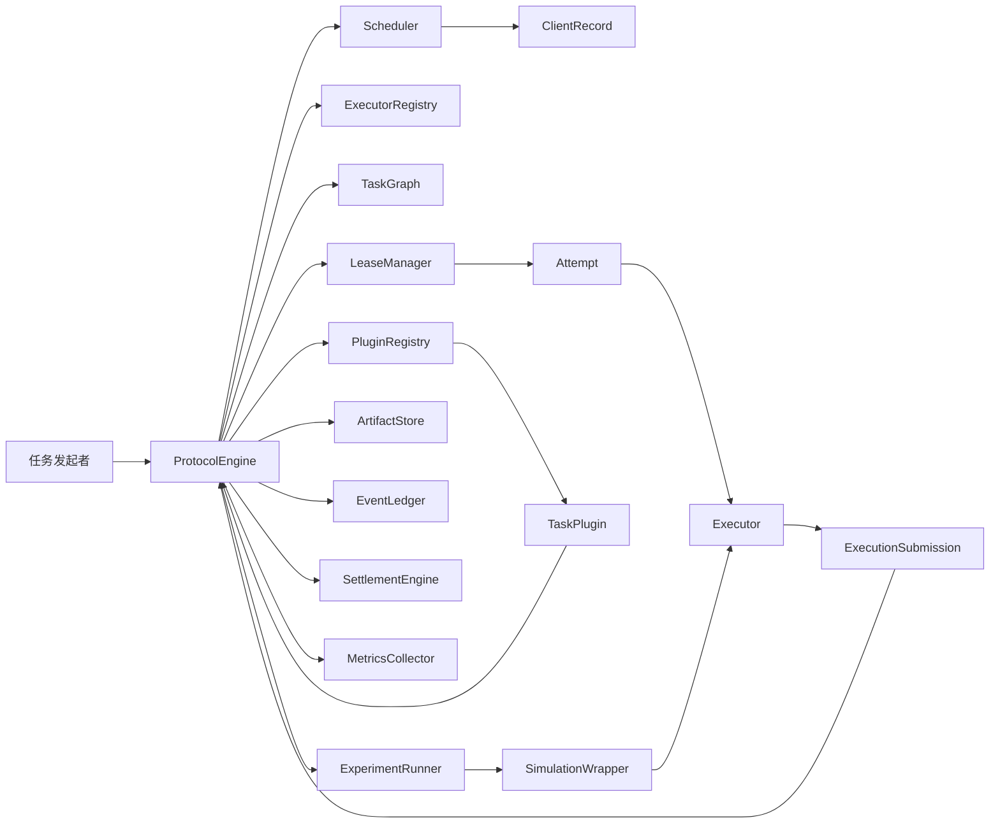
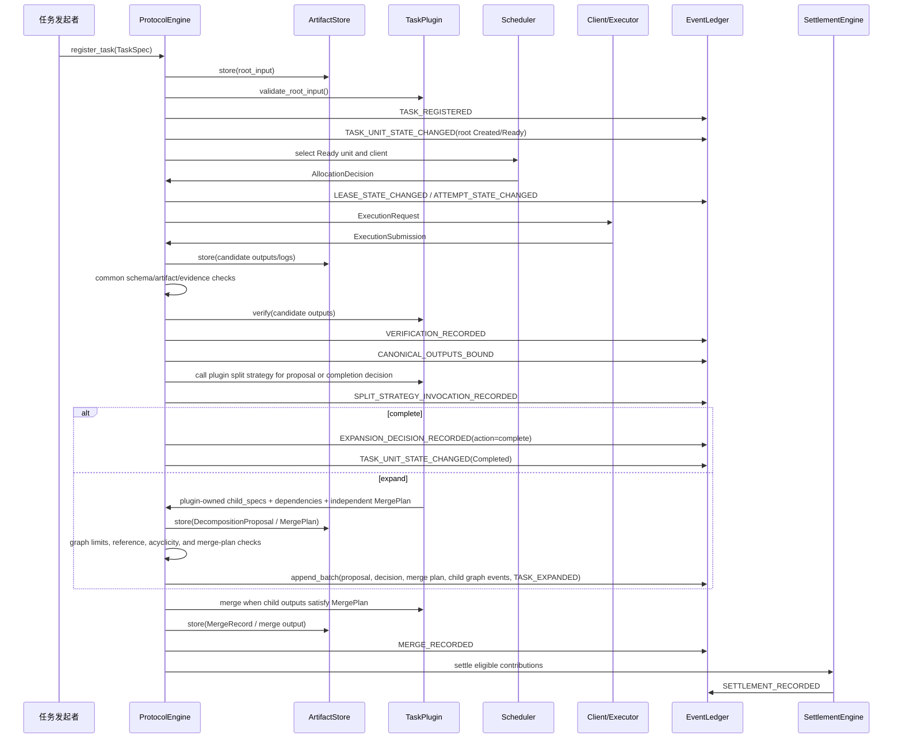

# TDD - TokenShare 协议框架 V1

| 字段 | 值 |
|---|---|
| 项目 | TokenShare 协议框架 V1 |
| 文档类型 | 技术设计文档 |
| 状态 | V1 指导稿（候选机制已整合） |
| 创建日期 | 2026-06-03 |
| 最后更新 | 2026-06-23 |
| Owner | TokenShare 研究项目负责人 |
| 适用阶段 | 本地可复现研究原型 |
| 关联设计稿 | `2026-06-02-tokenshare-protocol-kernel-revised-draft.md` |
| 机制整合记录 | `2026-06-22-p01-p12-tokenshare-candidate-mechanism-spec.md` 已整合为本文 V1 口径；原文件保留为研究来源与对照记录。 |

## 1. 背景

TokenShare 的第一阶段目标不是实现某一个具体任务程序，而是实现一个可运行、可审计、
可扩展的协议框架。整数分解、Lean stub 证明和结构化报告只是三类实验插件，用于验证
协议框架能否承载不同类型的任务。

协议需要把一个大型任务转化为可递归拆分、可分派、可验证、可合并、可结算、可重放
的任务图。第一版不追求真实分布式部署、链上结算或生产级安全，而是先在本地环境中
验证协议机制本身是否闭环。

当前讨论稿已经明确了三层结构：

- **协议框架**：负责所有任务共同遵守的生命周期、不变量、状态机、调度、验证编排、
  结算和事件重放。
- **任务插件**：负责特定任务领域的输入输出格式、拆分策略、验证规则、合并规则和
  能力要求。
- **执行器**：负责实际处理某个已经确定的 `TaskUnit`，可以是 AI、本地模型、确定性
  程序或未来的人类 worker。

本文档将讨论稿改写为实现导向的技术设计文档。重点是明确 V1 需要交付哪些模块、这些
模块之间如何通信、哪些数据必须持久化、如何测试闭环。

2026-06-23 起，本文吸收 P01-P22 候选机制规范中的 V1 取舍，成为后续 Phase 3 到 Phase 9
实现的主事实源。候选规范不再与本文并列为第二套设计权威；若候选规范、阶段规格或已
有代码出现冲突，应先以本文的协议边界和阶段计划为准，再在阶段规格中细化字段。

## 3. 范围

### 3.1 V1 范围内

V1 交付以下能力：

- 注册根任务，固定插件、插件版本、插件已声明的拆分策略引用、预算、截止时间和根输入。
- 将根任务创建为 `TaskUnit`，并维护递归拆分关系和执行依赖关系。
- 根据正式输出和依赖边判断任务是否 Ready。
- 注册本地插件和执行器，并在运行时固定版本。
- 使用本地 `ArtifactStore` 保存输入、候选输出、正式输出、日志和原始 AI 输出引用。
- 为 Ready 任务创建 `Lease` 和 `Attempt`。
- 通过执行器处理任务，并返回统一 `ExecutionSubmission`。
- 提供实验级 AI API executor，使 structured report / proof-like stub 等任务可以在真实模型输出上做效果验证；该 executor 仍走本地协议 envelope、artifact 持久化和固定环境身份，不提供生产 AI 平台能力。
- 在插件和执行器契约中区分 hard requirements、soft hints、能力快照、环境身份和
  action/observation provenance。
- 编排通用数据检查、插件领域验证和正式输出选择。
- 支持 `first_verified_bundle` 正式输出策略。
- 支持插件返回 `complete` 或 `expand`。
- 支持结果驱动递归展开，并将图更新写入事件日志。
- 支持自底向上的合并流程。
- 支持有界重试、租约过期、影子执行、迟到提交隔离和失败传播。
- 记录贡献并在根任务完成后执行 sandbox 结算。
- 通过 append-only JSONL 事件日志进行状态重放。
- 提供 factorization、Lean stub 和 structured report stub 三类插件作为实验对象。
- 提供模拟包装层，用于注入 offline、slow、executor_error、invalid_output 和
  late_submission；该能力属于独立实验基础设施部分，不再属于 Phase 6 插件实现范围。
- 输出实验指标报告；指标与报告生成属于独立实验基础设施部分，不再属于 Phase 6 插件实现范围。

### 3.2 V1 范围外

V1 不交付以下能力：

- 真实区块链、钱包、智能合约或真实代币支付。
- 真实多机器通信、HTTP worker pool 或 P2P 网络。
- 第三方动态上传插件。
- 生产级身份系统、权限系统、反女巫机制或拜占庭容错。
- 完整 Web UI。
- 通用工作流语言或用户上传任意拆分脚本。
- 生产级 AI API 平台、多租户 provider 管理、在线服务化调度或动态模型市场。
- 完整 Lean 证明搜索系统。
- 完整 Contract Net 广播/竞价/协商市场。
- 将 PBFT/Raft quorum 或多数投票直接用作任务答案正确性证明。
- Dawid-Skene、GLAD、MACE、CROWDLAB 等弱标签统计模型的 V1 通用验证器实现。
- 通用 Tree-of-Thoughts / ReAct 搜索引擎或隐藏 reasoning trace 审计要求。

### 3.3 后续版本考虑

后续版本可以扩展：

- 真实分布式 runtime。
- 插件包管理和第三方插件加载。
- `quorum_consensus` 或语义共识验证。
- 信誉向量、质押、惩罚和真实结算后端。
- 人类 worker 和远程服务执行器。
- 更完整的 LeanDojo / miniF2F 实验。

## 4. 设计目标与非目标

### 4.1 设计目标

- **协议优先**：协议核心不理解 factorization、Lean 或 structured report 的领域知识。
- **任务可递归**：任务图支持渐进式展开，且展开可依赖中间正式结果。
- **结果可验证**：候选输出必须经过插件领域验证和协议正式输出选择。
- **正式输出唯一**：同一 `TaskUnit` 的正式输出束只能绑定一次。
- **状态可恢复**：协议状态可由事件日志重放恢复。
- **非确定性隔离**：AI 输出不能在状态恢复时静默重新生成。
- **决策可解释**：分派、验证、正式选择、扩图、合并和结算都必须有可追踪的事件或
  artifact 依据。
- **贡献可追踪**：中间贡献可延迟结算，且结算恰好一次。
- **实验可复现**：故障模拟由 profile 和随机种子控制。

### 4.2 非目标

- 不追求第一版最优调度。
- 不追求第一版安全完备。
- 不追求第一版通用插件市场。
- 不追求第一版所有任务都能用 AI 解决。
- 不追求第一版协议对象字段一次性定死。

### 4.3 V1 机制整合原则

本文只把候选机制收束为 V1 设计原则，不在主 TDD 中冻结全部字段或数据库表。后续阶段
规格可以细化字段，但不得改变以下协议边界：

1. **任务图与输出解析分离**：`TaskRelation` 继续表达拆分树和执行依赖 DAG；
   `ExpectedOutputRef` / output resolution 用于描述父任务需要的命名输出如何由子图或
   合并任务满足。`ExpectedOutputRef` 是协议级 future / resolution 对象，第一版采用
   独立 dataclass 和可重建 SQLite projection；不得把权威 resolution 状态藏进
   `TaskUnit.plugin_payload` 或 `metadata`。端口 schema 是类型兼容的权威来源，edge
   上的 schema snapshot 只作审计。
2. **动态扩图只消费正式事实和插件规则**：V1 不做 speculative 子图。只有来源 attempt
   已验证并成为 canonical 后，插件版本化拆分策略才能基于该正式输出直接生成
   `DecompositionProposal`；AI、executor 或客户端不能提供 expansion 候选拆分，也不能在运行时临时发明协议级子任务。
   `VERIFICATION_RECORDED(status=passed|accepted)` 只提供候选资格，真正的 expansion gate
   是 `CANONICAL_OUTPUTS_BOUND` 绑定后的 canonical output bundle。
   child task、edge 和 expected output ID 从已保存 proposal artifact 的 canonical digest
   与逻辑位置确定性派生。
3. **执行授权一一对应**：一个 `Lease` 严格授权一个 `Attempt`。执行器或未来 actor/session
   的内存不是协议状态；影响恢复、验证或结算的内容必须进入 artifact 或 event。
4. **契约先分硬约束和偏好**：插件 descriptor 声明 typed ports、hard requirements、
   soft hints、validator policy、merge policy 和 split strategy；调度时保存 capability
   snapshot/digest 和 deterministic `AllocationDecision`，但 V1 不实现完整 Contract Net
   bidding。
5. **环境与证据可复查**：`ExecutionRequest`、`ExecutionSubmission`、验证记录和 audit
   replay 共享不可变 `EnvironmentRef` / digest。工具 action、observation、tool version、
   输入输出 digest 和错误必须可追踪；隐藏 reasoning trace 不是协议真值，也不是 replay 前置条件。
6. **验证与选择分开**：`verification_mode` 描述候选输出如何被检查，`selection_policy`
   描述哪个已验证 bundle 成为 canonical。`CANONICAL_OUTPUTS_BOUND` 是逻辑
   `CanonicalSelection` 记录；多数、PBFT quorum 或弱标签统计估计不得替代强 checker。
   后续 expansion、merge readiness 和结算只能消费 canonical selection 已绑定的 output bundle，
   不能直接消费单独的 verification report 或输掉选择的候选输出。
7. **重放不执行历史工作**：状态重放只读取 JSONL event 和 artifact，不调用 executor、
   AI、插件拆分、插件合并或验证器。缺失 artifact 使 replay 失败；repair 或 re-execution
   必须创建新的 run、lease、attempt 和 artifact 身份。
8. **合并走统一生命周期**：产生新父输出的 merge 在 V1 中建模为普通 `TaskUnit`，经过
   lease、attempt、candidate、validation 和 canonical；本地确定性 merge 可以由 local executor 快速完成。
9. **结算最终化**：V1 只在根任务完成后对符合条件的贡献执行一次最终 sandbox settlement；
   不支持结算后 invalidation，后续版本可增加 adjustment/reversal event。
10. **实验不外推生产性能**：`ExperimentRun` 固定 fixture、profile digest、seed、时钟语义、
    fault trigger、插件/执行器版本和实际随机决定；指标用于比较本地协议行为，不代表真实分布式性能。

## 5. 架构总览

### 5.1 组件图



### 5.2 组件职责

| 组件 | 层次 | 职责 |
|---|---|---|
| `ProtocolEngine` | 协议框架 | 协调主循环，推进状态机，调用其他组件。 |
| `TaskGraph` | 协议框架 | 保存 `TaskUnit` 和 `TaskRelation`，维护拆分树和执行依赖 DAG。 |
| `Scheduler` | 协议框架 | 扫描 Ready 任务，执行 hard eligibility filter、soft hint 排序和确定性 tie-break，生成可审计 `AllocationDecision`。 |
| `LeaseManager` | 协议框架 | 管理认领、租约、心跳、过期、释放、撤销和 fencing。 |
| `ArtifactStore` | 协议框架 | 保存和读取输入、输出、日志、原始执行结果，提供内容哈希校验。 |
| `EventLedger` | 协议框架 | 写入 append-only 事件，支持状态重放和审计重放。 |
| `VerificationOrchestrator` | 协议框架 | 先执行结构、schema、artifact 完整性等通用检查，再调用插件领域验证，并把验证报告写入事件。 |
| `ExpansionCoordinator` | 协议框架 | 接收插件返回的结构化拆分提案和展开判定，校验图约束后原子写入子节点与依赖边。 |
| `MergeCoordinator` | 协议框架 | 根据固定 `MergePlan` 收集正式子输出，检查覆盖率和来源 hash 后调用插件合并。 |
| `SettlementEngine` | 协议框架 | 根据贡献记录和预算策略生成 sandbox 结算。 |
| `PluginRegistry` | 协议框架 | 固定插件标识、版本、typed ports、requirements/hints、validator policy、merge policy 和本地实现。 |
| `ExecutorRegistry` | 协议框架 | 固定可用执行器类别、版本、能力、状态 epoch、环境约束和调用入口。 |
| `MetricsCollector` | 实验基础设施 | 从事件日志和实验配置生成 completion、work/span、retry/wasted work、shadow benefit 和 settlement 指标。 |
| `ExperimentRunner` | 实验基础设施 | 加载实验配置，运行基准任务，注入故障，输出报告。 |
| `TaskPlugin` | 任务插件 | 提供任务域 schema、拆分、验证、合并、执行说明和能力要求。 |
| `Executor` | 执行器 | 根据 `ExecutionRequest` 产生 `ExecutionSubmission`。 |
| `SimulationWrapper` | 执行器/实验边界 | 包装执行器并按 profile 注入离线、慢执行、错误和迟到提交。 |

### 5.3 三层边界

| 问题 | 协议框架 | 任务插件 | 执行器 |
|---|---|---|---|
| 谁能修改任务图 | 协议框架唯一修改 | 返回展开计划 | 不能修改 |
| 谁决定结果是否符合领域规则 | 编排验证 | 判断领域正确性 | 不能决定 |
| 谁绑定正式输出 | 执行正式输出选择 | 提供验证结论 | 不能绑定 |
| 谁负责实际执行 | 创建请求和租约 | 提供执行说明 | 执行任务 |
| 谁计算奖励 | 结算策略 | 可提供权重建议 | 只报告成本 |
| 谁处理重试 | 恢复策略 | 标注领域错误 | 只报告失败 |

## 6. 核心数据模型

本节描述架构契约，不规定最终代码类或数据库表。

### 6.1 协议框架对象

| 对象 | 作用 | 关键字段范畴 |
|---|---|---|
| `TaskSpec` | 根任务注册信息。 | 任务标识、插件版本、插件已声明的拆分策略引用、根输入、预算、截止时间、协议配置；不能携带用户、AI 或 executor 临时编写的拆分规则。 |
| `TaskUnit` | 任务图中的可调度节点。 | 节点标识、状态、输入引用、命名输出、expected outputs、能力要求、权重、局部限制。 |
| `TaskRelation` | 表达节点关系。 | `decomposition` 或 `dependency`、源节点、目标节点、源/目标 port、所需命名输出、审计用 schema snapshot。 |
| `ExpectedOutputRef` | 协议级 output future / resolution 对象，描述父节点需要的命名输出如何被直接 attempt、子图或 merge task 满足。 | 输出名、期望类型、owner task、resolution 状态、来源 canonical bundle 或 merge plan；第一版独立建模，并进入 Phase 4 SQLite index-only projection，不藏入 `TaskUnit.plugin_payload` 或 `metadata`。 |
| `ClientRecord` | 客户端调度信息。 | 客户端标识、能力声明、状态 epoch、可用状态、执行器类型、统计信息。 |
| `AllocationDecision` | 一次分派解释记录。 | ready task、候选客户端、eligibility/filter 原因、rank/tie-break 策略、capability snapshot、no-match reason 或获选客户端。 |
| `Lease` | 临时执行权。 | 租约标识、客户端、任务单元、attempt、状态、过期时间、fencing、allocation decision。 |
| `Attempt` | 一次执行尝试。 | attempt 标识、租约、客户端、状态、候选输出、日志、环境引用、action/observation provenance。 |
| `ArtifactRef` | 数据引用。 | artifact 标识、类型、URI、内容哈希、schema、来源、创建时间。 |
| `EnvironmentRef` | 执行或验证环境的不可变身份。 | 环境类型、digest、fixture/toolchain/library/config 引用、展示用摘要。 |
| `VerificationResult` | 验证记录。 | 判定、理由、证据、验证器信息、关联 attempt。 |
| `VerificationReport` | 多层验证报告。 | schema 检查、artifact 完整性、证据覆盖、领域验证和审计验证的分层结果。 |
| `CanonicalSelection` | 正式输出选择的逻辑记录。 | selection policy、policy version、bundle digest、validation IDs、绑定事件引用。 |
| `DecompositionProposal` | 插件版本化拆分策略基于 canonical output 直接生成的结构化拆分提案。 | 候选子任务、依赖、required outputs、merge slot、来源 canonical selection、split strategy、插件版本和提案生成证据。 |
| `ExpansionDecision` | 完成或展开判定。 | `complete` 或 `expand`、输入 artifact、已验证提案、插件拆分策略、子任务描述、依赖、合并计划引用。 |
| `MergePlan` | 父节点后续合并计划。 | 必需子输出、slot 映射、合并策略、验证要求、允许缺失策略。 |
| `MergeRecord` | 一次合并事实。 | 使用的 child canonical output hash、merge artifact、验证结果、失败原因。 |
| `ContributionRecord` | 贡献追踪。 | 贡献类型、关联 attempt、后续成功条件、结算状态。 |
| `SettlementRecord` | sandbox 结算事实。 | 奖励、惩罚、理由、幂等键、结算状态。 |
| `LedgerEvent` | append-only 事件。 | 事件类型、时间、对象引用、因果链路、幂等键、可选 batch identity、载荷、哈希链。Phase 4 起 expand batch 事件在 envelope 中携带 `batch_id`、`batch_index` 和 `batch_size`。 |

### 6.2 插件对象

| 对象 | 作用 |
|---|---|
| `PluginDescriptor` | 标识插件、版本、任务类型、typed ports、requirements/hints、validator/merge policy 和执行器类别。 |
| `DecompositionStrategy` | 表示用户注册任务时选择的版本化拆分逻辑和参数。 |
| `TaskSchema` | 声明根输入、子任务输入、命名输出和中间结果格式；端口 schema 是类型兼容的权威来源。 |
| `VerificationRule` | 描述任务域验证规则和验证环境要求。 |
| `MergeRule` | 描述父节点何时可合并、如何合并、合并输出格式。 |
| `OutputContract` | 描述 AI 或执行器输出必须满足的结构、证据、expected output 覆盖和引用要求。 |
| `TextValidationProfile` | 面向自然语言任务的弱验证配置，例如 checklist、引用完整性、覆盖率和禁止无来源断言。 |

### 6.3 执行器对象

| 对象 | 作用 |
|---|---|
| `ExecutionRequest` | 协议交给执行器的统一请求信封。 |
| `ExecutionSubmission` | 执行器返回协议的统一提交信封。 |
| `PromptPackage` | AI 执行路径使用的 prompt 封装。 |
| `RawModelOutput` | AI 执行路径的原始模型输出。 |
| `ParsedModelOutput` | 从原始 AI 文本中解析出的结构化候选输出。 |
| `ExecutionTrace` | 工具 action、observation、tool/version、输入输出 digest 和错误的审计日志。 |
| `SimulationProfile` | 本地实验的故障模拟配置。 |

### 6.4 新增闭环支撑对象

| 对象 | 原因 | 层次 |
|---|---|---|
| `ArtifactStore` | 因为正式输出、日志和根输入必须经过 staging、校验和 immutable publish 后才可保存、读取、引用。 | 协议框架 |
| `PluginRegistry` | 因为事件日志需要固定插件版本，并在运行和重放时找到同一实现。 | 协议框架 |
| `ExecutorRegistry` | 因为调度器需要知道哪些执行器可用、版本是什么、能力是什么。 | 协议框架 |
| `Scheduler` | 因为 Ready 任务必须被自动分派给满足能力要求的客户端。 | 协议框架 |
| `VerificationOrchestrator` | 因为 AI 文本、程序输出和 proof patch 都必须先通过统一结构检查，再进入插件领域验证。 | 协议框架 |
| `ExpansionCoordinator` | 因为拆分提案不能直接改图，必须先落为 artifact，再由协议检查规模、引用、无环和幂等边界。 | 协议框架 |
| `MergeCoordinator` | 因为合并必须证明所有 required slot 均由正式子输出填充，且 merge artifact 可追踪来源 hash。 | 协议框架 |
| `ExperimentRunner` | 因为 V1 要可复现实验，而不是只运行单次手工流程。 | 实验基础设施 |
| `MetricsCollector` | 因为研究原型必须输出 completion、replay、failure、settlement 指标。 | 协议框架/实验 |

## 7. 协议主流程

### 7.1 端到端数据流



### 7.2 主循环

协议主循环按以下顺序推进：

1. 读取 `TaskSpec`，通过 `PluginRegistry` 固定插件版本。
2. 将根输入写入 `ArtifactStore`。
3. 调用插件校验根输入并创建根 `TaskUnit`。
4. 将任务注册和根节点创建写入 `EventLedger`。
5. `Scheduler` 扫描 Ready 节点，基于 hard requirements、soft hints、能力快照和确定性
   tie-break 生成 `AllocationDecision`。
6. `LeaseManager` 基于分派决定创建一一对应的 `Lease` 和 `Attempt`。
7. `Executor` 接收带有 output contract、capability snapshot 和 `EnvironmentRef` 的
   `ExecutionRequest`，并返回 `ExecutionSubmission`。
8. 协议保存候选输出、原始输出、日志和解析后的结构化输出。
9. `VerificationOrchestrator` 执行通用数据检查，再调用插件领域验证。
10. 协议按 `first_verified_bundle` 绑定正式输出束：对同一 `TaskUnit`，以最早落账的
    eligible `VERIFICATION_RECORDED.event_seq` 为排序权威，submission time 和
    verification completed time 只做审计字段。`CANONICAL_OUTPUTS_BOUND` 作为逻辑
    `CanonicalSelection` 记录，是最终承诺事实。
11. 插件基于 `CANONICAL_OUTPUTS_BOUND` 绑定的正式输出、固定 `split_strategy_id` 和策略参数返回 `complete` 或结构化
    `DecompositionProposal`；`split_strategy_id` 必须引用插件 descriptor 中预声明的版本化策略，
    策略参数必须符合插件 schema，AI、executor、客户端或自然语言输入不能临时提出协议级拆分规则。
12. `ExpansionCoordinator` 将提案保存为 artifact，执行 schema、规模、引用、无环和 merge-plan 检查。
13. `complete` 节点进入完成或向上合并流程。
14. `expand` 节点根据已验证的 `DecompositionProposal` 写入确定性派生 ID 的子任务、
    expected outputs、依赖和 `MergePlan`，协议原子提交图更新。
15. `MergeCoordinator` 在正式子输出满足 `MergePlan` 后创建或推进普通 merge `TaskUnit`；
    merge output 仍需走 candidate、validation 和 canonical 生命周期。
16. 根任务完成后，协议生成贡献资格并执行一次最终 sandbox 结算。
17. `MetricsCollector` 从事件日志生成实验报告。

### 7.3 AI 文本任务的结构化边界

AI 生成的自然语言不能直接修改任务图、直接通过验证或直接合并为父节点结果。所有 AI
文本路径都必须经过以下边界：

1. `RawModelOutput` 保存原始文本、模型配置摘要、prompt hash 和环境摘要。
2. 插件解析原始文本，生成 `ParsedModelOutput` artifact；自然语言只能先作为候选输出进入验证和
   canonical 选择。拆分阶段只读取已经绑定的 canonical output，不能把 AI 文本或 executor 输出当作
   expansion 候选拆分方案。最终 proposal 必须由插件版本化拆分策略直接生成。
3. 协议先校验结构、schema、artifact 引用和内容 hash。
4. 插件执行领域验证；自然语言任务至少要产生 checklist、证据引用、覆盖率和无来源断言检查。
5. 只有通过验证的候选输出才能绑定为 canonical output。
6. 合并必须依据 `MergePlan`，并在 `MergeRecord` 中记录所有 child output hash。
7. 只有具备稳定 schema、typed I/O、可独立调度、明确 validator 和受控图关系的 durable
   subgoal/proof state 才能通过 proposal 晋升为 `TaskUnit`；普通 thought、value/vote、
   working memory 和隐藏 reasoning trace 保持为 attempt artifact 或执行器私有状态。

这种边界吸收了 Decomposed Prompting 的“子任务可替换为 prompt、模型或符号函数”、Tree of
Thoughts 的“候选思路可搜索和剪枝”、CrewAI guardrails 的“输出先验证再传递”、LlamaIndex
structured output 的“Pydantic/schema 化结果”和 Graph of Verification 的“按 DAG 粒度逐步验证”
思想，但不把这些外部框架作为 V1 runtime 依赖。

## 8. 关键接口契约

### 8.1 协议入口

| 操作 | 输入 | 输出 | 说明 |
|---|---|---|---|
| `register_task` | `TaskSpec` | 根 `TaskUnit` 引用 | 注册根任务并写入事件日志。 |
| `register_client` | 客户端能力声明 | `ClientRecord` | 注册本地模拟客户端。 |
| `run_until_terminal` | 根任务标识、实验配置 | 最终任务状态、指标报告 | 本地实验主入口。 |
| `replay_ledger` | 事件日志引用 | 重建后的协议状态 | 不重新调用 AI 或插件展开逻辑。 |

这些是本地协议 API，不要求 V1 暴露 HTTP endpoint。

### 8.2 插件契约

| 能力 | 输入 | 输出 | 约束 |
|---|---|---|---|
| 描述插件 | 无 | `PluginDescriptor` | 必须包含版本。 |
| 校验根输入 | 根输入 artifact | 判定 | 不写协议状态。 |
| 声明 schema | 任务类型 | `TaskSchema` | 命名输出和 typed ports 必须有 schema。 |
| 声明执行契约 | 任务类型、执行器类别 | requirements、hints、output contract、environment policy | hard requirements 用于 eligibility，soft hints 只能影响排序。 |
| 生成执行说明 | `TaskUnit`、上下文 | 执行说明 | 可按执行器类别不同而不同。 |
| 解析原始输出 | 原始输出引用 | 候选命名输出 | 只产生候选结果。 |
| 验证候选输出 | `TaskUnit`、候选输出 | `VerificationResult` / `VerificationReport` | 不绑定正式输出；必须区分 schema、证据、领域和审计层。 |
| 生成拆分提案 | `CANONICAL_OUTPUTS_BOUND` 绑定的正式输出束、策略参数 | `DecompositionProposal` artifact | 由插件版本化拆分策略直接生成；只描述候选 child、依赖和 merge slot，不直接改图；AI、executor 或客户端不能提供 expansion 候选拆分或临时发明协议级子任务。 |
| 判断完成或展开 | 正式输出束、已验证提案 | `ExpansionDecision` | 只能返回 `complete` 或 `expand`；`expand` 必须引用 `MergePlan`。 |
| 合并正式子输出 | 父节点、`MergePlan`、正式子输出集合 | 父节点候选输出 / `MergeRecord` | 由协议编排和记录；必须记录输入 hash 覆盖情况。 |

### 8.3 执行器契约

`ExecutionRequest` 至少包含：

- attempt 标识。
- 租约标识和 fencing 上下文。
- 内联 allocation decision 摘要和 capability snapshot/digest。
- `TaskUnit` 摘要。
- 输入 artifact 引用。
- 必需命名输出及 schema。
- output contract、hard requirements 和 soft hints 摘要。
- 资源、时间和环境限制。
- `EnvironmentRef` / digest。
- 插件提供的执行说明。
- 固定的 registry snapshot 标识，以及 plugin/executor descriptor ref/digest。

`ExecutionSubmission` 至少包含：

- attempt 标识。
- 租约标识和 fencing 上下文。
- 执行结果类别。
- 候选命名输出引用或原始输出引用。
- 结构化解析输出引用，或声明无法解析的错误。
- 日志引用。
- `EnvironmentRef` 回显和环境摘要。
- action、observation、tool/version、输入输出 digest 和错误的 provenance 引用。
- 用量与成本摘要。
- 结构化错误信息。
- `submitted_at`，以及迟到提交时用于审计但不推进状态的 submission 记录。

执行器不能创建任务、修改任务图、绑定正式输出、决定奖励或自行重试。执行器的进程内
状态、actor 内存或长驻 session 不能作为协议事实；如果它影响恢复、验证、合并或结算，
必须通过 artifact 或 event 暴露。隐藏 chain-of-thought 可以作为受策略控制的 raw artifact
保存，但不是验证通过、审计重放或状态恢复的必要条件。

## 9. 状态机设计

### 9.1 `TaskUnit`

核心状态：

```text
Created
Blocked
Ready
Processing
WaitingForChildren
MergeReady
Merging
Completed
MergeFailed
Failed
Cancelled
```

关键规则：

- `Ready` 只能由协议根据正式依赖输出推导。
- `Processing` 表示至少存在有效 attempt。
- `WaitingForChildren` 表示当前节点已经展开，等待子树。
- `MergeReady` 由协议根据正式子输出和固定插件合并规则推导。
- `Completed` 必须拥有完成条件所要求的正式输出。

### 9.2 `Lease`

核心状态：

```text
Active -> Released
Active -> Expired
Active -> Revoked
Active -> Active  [heartbeat]
```

租约终止后，旧 fencing 信息失效。迟到提交可记录为审计证据，但不能覆盖正式输出。
V1 中一个 `Lease` 只授权一个 `Attempt`；执行器失败后如需重试，协议必须创建新的
lease/attempt 身份，而不是让执行器在同一授权内自行重试并覆盖历史。

### 9.3 `Attempt`

核心状态：

```text
Created
Running
Submitted
Verifying
Verified
Canonical
Rejected
Failed
Superseded
```

关键规则：

- 一个 `TaskUnit` 可以有多个 attempt。
- 只有通过验证且成功绑定正式输出束的 attempt 进入 `Canonical`。
- 迟到或输掉正式输出选择的 attempt 进入 `Superseded` 或保留审计记录。
- attempt 必须绑定执行环境、候选 artifact、日志和必要的 action/observation provenance；
  它不能依赖执行器私有内存来解释历史结果。

### 9.4 `ContributionRecord`

核心状态：

```text
Pending
Eligible
Settled
Invalidated
```

关键规则：

- `complete` 贡献可在节点完成后进入 `Eligible`。
- `expand` 贡献在子树完成并向上合并前保持 `Pending`。
- 根任务最终失败或取消时，未结算贡献进入 `Invalidated`。
- V1 不支持已结算贡献的事后 invalidation；未来可通过 adjustment/reversal event 扩展。
- `SettlementRecord` 是不可变事实，不单独维护状态机。

## 10. Artifact 存储与重放

### 10.1 `ArtifactStore` 职责

`ArtifactStore` 是 V1 必需模块。它负责：

- 保存根输入。
- 保存候选命名输出。
- 保存正式输出。
- 保存日志和原始 AI 输出引用。
- 计算并校验内容哈希。
- 按 artifact 标识读取数据。
- 标记 artifact 来源 attempt 或来源任务。

### 10.2 存储约束

- 正式输出必须持久化。
- 所有参与正式输出选择、展开、合并和结算的 artifact 必须有内容哈希。
- 事件日志保存 artifact 引用和摘要，不默认内联大文件或完整 prompt。
- 只有经过 staging、hash/size 校验并 immutable publish 的文件才能形成 `ArtifactRef`。
- 状态重放不能重新生成 AI 输出，也不能重新执行确定性程序、插件拆分、插件合并或验证器来补历史事实。
- 状态重放遇到缺失 artifact 必须失败并报告缺失；repair 或 re-execution 必须创建新的 run、
  lease、attempt 和 artifact 身份，不能复用历史 ID。

## 11. 事件日志

### 11.1 最小事件集合

| 事件 | 作用 |
|---|---|
| `TASK_REGISTERED` | 保存根任务、插件、策略、预算和根输入引用。 |
| `CLIENT_STATE_CHANGED` | 保存客户端注册和能力变化。 |
| `REGISTRY_SNAPSHOT_RECORDED` | 保存本轮固定 plugin/executor registry snapshot 的 artifact 引用、digest 和最小查询摘要。 |
| `EXECUTION_REQUEST_RECORDED` | 保存完整 `ExecutionRequest` artifact 的引用、digest、关联 attempt/lease，以及内联的 allocation/capability 摘要。 |
| `TASK_UNIT_STATE_CHANGED` | 保存任务节点状态变化。 |
| `LEASE_STATE_CHANGED` | 保存租约签发、续期、释放、过期和撤销。 |
| `ATTEMPT_STATE_CHANGED` | 保存 attempt 生命周期变化。 |
| `EXECUTION_SUBMISSION_RECORDED` | 保存完整 `ExecutionSubmission` artifact 的引用、digest、`result_kind`、环境摘要和来源 attempt。 |
| `VERIFICATION_RECORDED` | 保存验证结论、证据和验证器信息。 |
| `CANONICAL_OUTPUTS_BOUND` | 原子记录正式输出束绑定。 |
| `DECOMPOSITION_PROPOSAL_RECORDED` | 保存插件版本化拆分策略直接生成的结构化拆分提案 artifact 引用。 |
| `EXPANSION_DECISION_RECORDED` | 保存 `complete` / `expand` 判定、插件版本、依据和幂等键。 |
| `MERGE_PLAN_RECORDED` | 保存父节点后续合并所需 slot、child output 要求和合并策略。 |
| `TASK_EXPANDED` | 作为 expand batch 的最后语义完成标记，引用 proposal、decision、merge plan 和图变更摘要；child unit / relation 由同批独立事件保存。 |
| `MERGE_RECORDED` | 保存合并输入 hash、插件版本、合并输出、验证结果和覆盖率。 |
| `RECOVERY_ACTION_RECORDED` | 保存重试、重新调度、影子执行和终止恢复原因。 |
| `CONTRIBUTION_STATE_CHANGED` | 保存贡献创建、具备资格和失效。 |
| `SETTLEMENT_RECORDED` | 保存恰好一次 sandbox 结算。 |

V1 使用单机单写者事件模型：全局 `event_seq` 与 hash chain 是事件顺序权威。对象状态转移
事件应携带 old/new state，并在写入时由单写者事务检查当前状态。V1 不增加 per-aggregate
sequence；真实并发写入或远程 coordinator 出现后，再在 EventLedger 提交边界设计 Raft/PBFT
等控制面复制层。

Phase 4 的 expand 路径在此模型上增加最小 `EventLedger.append_batch(events, batch_id)`
原语，用于把同一次扩图的 proposal、accepted decision、merge plan、child unit、child
relation 和最后的 `TASK_EXPANDED` 连续写入同一 hash chain。`append_batch()` 不把
SQLite 变成权威状态，也不引入分布式事务；它只保证扩图事实以一个本地账本提交边界接受或拒绝。
Projection / replay 只有看到 batch 最后的 `TASK_EXPANDED`，才把该 expansion 视为完整可见。
Phase 4 起，batch identity 是 `LedgerEvent` envelope 的显式字段，而不是只存在于 API 入参、
payload 摘要或 `correlation_id` 中。第一版 envelope 扩展为可选 `batch_id`、`batch_index`
和 `batch_size`：非 batch 事件这些字段为 `null`；expand batch 使用
`batch_id=expansion_batch:{expansion_decision_id}`；batch 内事件必须连续落账，且最后一条
语义事件是 `TASK_EXPANDED`。`correlation_id` 只做流程追踪，不承担 replay / projection 的
batch 完整性判断。

### 11.2 重放模式

| 模式 | 目标 | 约束 |
|---|---|---|
| 状态重放 | 重建任务图、租约、attempt、正式输出和结算状态。 | 只读取事件和 artifact；不重新调用 AI、executor、插件展开、插件合并或验证器。 |
| 审计重放 | 使用已保存 artifact、插件版本和 `EnvironmentRef` 重新执行验证器。 | 可产生新的审计报告，但不能改写历史事件、正式输出或结算。 |

## 12. 调度与恢复策略

### 12.1 最小调度策略

V1 使用保守调度策略：

1. 扫描所有 `Ready` 且未达到恢复终止条件的 `TaskUnit`。
2. 使用插件声明的 hard requirements 过滤满足条件的 `ClientRecord`。
3. 记录候选客户端的 capability snapshot/digest 和过滤原因。
4. 使用 soft hints、版本化排序策略和确定性 tie-break 选择客户端。
5. 固定本轮 registry snapshot，并将 `AllocationDecision` 内联进 `ExecutionRequest` artifact。
6. 写入 `EXECUTION_REQUEST_RECORDED`，再创建一个 `Lease` 和一个 `Attempt`。
7. 如果 `shadow_after` 到达且 profile 允许，创建新的 shadow lease/attempt。

V1 不实现复杂优先级、信誉向量、完整 Contract Net 协商或市场竞价。分派决定只说明“谁被
授权执行”，不说明结果可信；结果可信仍由验证和正式选择决定。

### 12.2 恢复规则

| 触发 | 行为 |
|---|---|
| 租约过期 | 终止租约，旧 attempt 不能成为正式输出来源，任务可重新进入 Ready。 |
| 执行器失败 | attempt 进入 `Failed`，按策略决定是否重试。 |
| 输出无效 | attempt 进入 `Rejected`，保留证据并有界重试。 |
| 验证通过但输掉 canonical selection | attempt 保持 `Verified`，不标记为 `Rejected`、`Failed` 或 `Superseded`；唯一 `CANONICAL_OUTPUTS_BOUND` 决定哪个 bundle 可被后续协议消费。 |
| 被正式输出选择选中 | 被选 attempt 进入 `Canonical`，后续 expansion / merge / contribution 只能消费该 canonical bundle。 |
| 重复 proposal 或重复 expansion | 不改变 Attempt；同 digest / 同 batch payload 走幂等返回，不同 digest / 不同 batch payload 按冲突处理，不能写第二个 accepted graph mutation。 |
| 迟到提交 | 记录审计证据，不覆盖正式输出。 |
| artifact 哈希不匹配 | 拒绝使用该 artifact，按恢复边界处理。 |
| 达到预算、截止时间或最大尝试次数 | 任务进入 `Failed`，失败传播。 |

### 12.3 递归规模限制

V1 必须增加以下限制，以保证任务图不会无限展开：

| 参数 | 作用 |
|---|---|
| `max_depth` | 限制递归拆分深度。 |
| `max_children_per_unit` | 限制单个节点一次展开产生的子节点数。 |
| `max_total_units` | 限制根任务下总节点数。 |
| `max_expansions_per_unit` | 限制同一节点展开次数，V1 默认为一次。 |

这些参数属于 `ProtocolConfig` 或 `TaskSpec` 中的运行限制。插件不能绕过它们。

插件或执行器内部可以使用 decomposition、search、repair、tool-use 或多候选策略，但只有
具备稳定 schema、typed I/O、可独立调度、明确 validator 和受控图关系的 durable subgoal
才能晋升为协议 `TaskUnit`。search policy 在 V1 属于版本化插件私有实现；协议核心只保留
budget/deadline、artifact、`DecompositionProposal` 和图约束边界。

### 12.4 子树剪枝

V1 需要支持父节点完成后取消不再需要的子树。例如整数分解中，一个子节点找到因数后，
其他搜索区间可能不再需要继续执行。

规则：

- 插件合并规则可以声明父节点完成后哪些子节点不再需要。
- 协议将未完成且不再需要的子节点转为 `Cancelled`。
- 已经完成的子节点不被回滚。
- 已经绑定的正式输出保留审计记录。
- 未完成或迟到的 attempt 默认不产生奖励。

## 13. 贡献与结算

V1 使用 sandbox 结算，不涉及真实代币。

### 13.1 贡献类型

| 类型 | 结算规则 |
|---|---|
| 完成贡献 | attempt 成为 `Canonical` 且插件返回 `complete` 后可进入 `Eligible`。 |
| 中间拆分贡献 | attempt 成为 `Canonical` 且插件返回 `expand` 后保持 `Pending`，直到子树成功合并。 |
| 协议请求的冗余验证贡献 | 影子 attempt 与正式输出一致时，可按低权重奖励。 |
| 未请求重复提交 | 默认不奖励。 |
| 迟到提交 | 默认不奖励。 |

### 13.2 奖励公式

V1 使用预算受限公式：

```text
provisional_reward(c) = base_rate[kind(c)] * weight(c)
scale = min(1, root_budget / sum(provisional_reward(c) for eligible contribution c))
reward(c) = provisional_reward(c) * scale
```

结算只针对根任务最终完成后仍为 `Eligible` 的贡献生成不可变 `SettlementRecord`。事件
重放不得重复生成相同结算。V1 不在中途发放可撤销奖励，也不支持结算后 invalidation；
后续版本如需补偿，应新增 adjustment/reversal event，而不是改写已存在的 settlement。

## 14. 实验插件

### 14.1 整数分解插件

目标：验证协议的递归拆分、调度、验证、提前合并、子树剪枝、失败恢复和结算。

V1 设计：

- 根输入包含待分解整数和搜索范围。
- 拆分策略将搜索范围分割为子区间。
- 执行器搜索候选因数。
- 验证器检查候选因数是否整除目标整数。
- 任一子节点找到有效因数时，父节点可以完成并取消不再需要的兄弟子树。
- 若所有区间都完成且未找到因数，合并为“未找到因数”结果。

### 14.2 Lean Stub 插件

目标：验证协议能承载 AI 风格任务、固定验证环境、proof patch 输出、错误日志和递归
子目标。

V1 设计：

- 根输入包含 theorem 标识、statement、上下文和固定环境摘要。
- `EnvironmentRef` 固定 checker fixture、toolchain/library/context 和展示用摘要。
- AI 执行路径生成 `PromptPackage`。
- `MockAIExecutor` 生成 `RawModelOutput`。
- 插件解析 proof patch 或 decomposition proposal。
- 验证器使用仓库内版本化 synthetic fixture 模拟 Lean 检查结果。
- 子目标展开为普通 `TaskUnit`。
- 合并规则模拟“子证明齐备后父证明通过”。

Lean V1 是 one-shot proof patch / candidate artifact stub，不要求真实 theorem proving 成功率，
不接入真实 LeanDojo、mathlib 或 miniF2F 子集。miniF2F 只借鉴 fixture 版本固定和题型/难度
分层方法，真实 benchmark 集成留到后续 Lean adapter。

### 14.3 结构化报告 Stub 插件

目标：专门验证大型自然语言任务的“插件规则拆分、AI 文本验证、合并”路径，弥补整数分解和
Lean stub 对普通文字任务覆盖不足的问题。

V1 设计：

- 根输入包含 report topic、目标 section 列表、证据来源 fixture 和输出 schema。
- 插件拆分策略将报告拆为 introduction、method、evidence、risk、conclusion 等 section
  `TaskUnit`，并为父节点生成 `MergePlan`。
- `MockAIExecutor` 使用 fixture 生成 section 草稿、缺失 section、伪造引用和格式错误等输出。
- 插件把原始文本解析为 `ParsedModelOutput`，要求每个 section 输出包含 `section_id`、
  `claims`、`evidence_refs`、`assumptions` 和 `open_questions`。
- 验证器执行 schema 检查、证据引用存在性、required section 覆盖率、禁止无来源断言和
  merge slot 完整性检查。
- 合并规则按 `MergePlan` 收集 canonical section outputs，生成 final report artifact，并记录所有
  child output hash。

Phase 6 中该插件仍使用本地 fixture / stub，先验证自然语言大型任务中最容易出错的拆分、
验证和合并边界。Phase 7 将在不改变插件和协议边界的前提下新增实验级 AI API executor，
让同一 structured report 流程可以使用真实模型输出验证效果。V1 不把该能力扩大为生产
AI 平台；API 调用结果必须作为 artifact 持久化，replay 不得重新调用模型。

## 15. 测试策略

### 15.1 单元测试

| 模块 | 测试重点 |
|---|---|
| `TaskGraph` | 依赖边、拆分边、无环检查、Ready 判断。 |
| `LeaseManager` | claim、heartbeat、expire、release、fencing。 |
| `ArtifactStore` | 写入、读取、哈希校验、缺失处理。 |
| `PluginRegistry` | 插件版本固定、schema 查询、策略查询。 |
| `ExecutorRegistry` | 执行器能力匹配、版本记录。 |
| `Scheduler` / allocation | hard eligibility、soft hint 排序、capability snapshot、no-match reason 和 deterministic tie-break。 |
| `VerificationOrchestrator` | schema 检查、证据引用检查、验证报告分层和失败留痕。 |
| `ExpansionCoordinator` | `DecompositionProposal` 校验、无环检查、规模限制和原子图更新。 |
| `MergeCoordinator` | `MergePlan` slot 覆盖、child output hash 绑定和合并失败留痕。 |
| `SettlementEngine` | 奖励公式、预算缩放、幂等结算。 |
| `EventLedger` | append-only、幂等键、事件哈希链。 |

### 15.2 集成测试

| 测试 | 目标 |
|---|---|
| 根任务到最终结果 | 验证完整主循环。 |
| 结果驱动展开 | 验证 `expand` 后原子创建子节点和依赖。 |
| 插件拆分提案验证 | 插件版本化拆分策略先生成 proposal artifact，结构化校验通过后才能写图；AI 文本不能直接定义协议子任务。 |
| 正式输出唯一 | 多 attempt 提交时只绑定一个正式输出束。 |
| 合并流程 | 子节点正式输出齐备后，按 `MergePlan` 合并为父节点候选输出。 |
| 合并覆盖率 | 检查所有 required slot 均由 canonical child output 填充且来源 hash 被记录。 |
| 状态重放 | 从 JSONL 重建最终状态。 |
| 审计重放 | 使用保存的 artifact 和插件版本复核验证结果。 |
| 缺失 artifact replay | 状态重放失败并报告缺失，不调用 executor 或验证器补历史事实。 |
| 结算幂等 | 重放不产生重复 `SettlementRecord`。 |

### 15.3 故障测试

| 故障 | 预期行为 |
|---|---|
| offline | 租约过期，任务重新 Ready。 |
| slow | 可触发影子 attempt。 |
| executor_error | attempt 失败并有界重试。 |
| invalid_output | 验证拒绝，保留证据。 |
| invalid_decomposition | 提案解析或图约束失败，保留 proposal 和验证报告，不写入非法图。 |
| incomplete_merge | 缺少 required child output 或 slot 覆盖不足，父节点不进入 Completed。 |
| hallucinated_evidence | 自然语言输出引用不存在 artifact 或未授权来源，验证拒绝。 |
| late_submission | 记录审计，不覆盖正式输出。 |
| missing artifact | 按恢复边界处理。 |
| plugin invalid expansion | 当前节点失败，不写入非法图。 |

### 15.4 验收测试

V1 通过条件：

- 整数分解实验能完成根任务并产生最终 artifact。
- Lean stub 实验能完成至少一条 direct proof 路径和一条 decomposition 路径。
- 结构化报告 stub 能完成 section 拆分、section 验证和 final report 合并，并拒绝缺失 section、
  伪造引用和格式错误输出。
- 事件日志能重放出相同最终任务状态。
- sandbox 结算无重复。
- 五类模拟故障均能产生预期恢复行为。
- 失败任务不会无限重试。
- 任务图不会超过配置的递归规模限制。

## 16. 指标与可观测性

### 16.1 实验指标

| 指标 | 含义 |
|---|---|
| `completion_time_ticks` | 根任务完成所需模拟时间。 |
| `unit_count` | 生成的任务节点数。 |
| `max_depth_observed` | 实际递归深度。 |
| `attempt_count` | 总 attempt 数。 |
| `duplicate_work_ratio` | 重复执行比例。 |
| `lease_expiration_count` | 租约过期次数。 |
| `invalid_submission_count` | 无效提交次数。 |
| `late_submission_count` | 迟到提交次数。 |
| `verification_count` | 验证调用次数。 |
| `merge_count` | 合并调用次数。 |
| `work_units` | 完成协议任务、merge task 和重试任务消耗的抽象工作量。 |
| `critical_path_ticks` | 按依赖和模拟时间估算的关键路径长度。 |
| `retry_work_units` | 重试导致的额外工作量。 |
| `wasted_work_units` | 迟到、失败、被剪枝或输掉选择的工作量。 |
| `shadow_benefit_ticks` | shadow attempt 对 completion time 的收益估算。 |
| `replay_success` | 状态重放是否成功。 |
| `settlement_total` | sandbox 总奖励。 |
| `no_double_settlement` | 是否无重复结算。 |

### 16.2 运行报告

每次实验应输出：

- 根任务摘要。
- 插件版本和执行器版本。
- ProtocolConfig 摘要。
- SimulationProfile 摘要、profile digest、seed、时钟语义、fixture/benchmark identity、
  fault trigger 和实际随机决定。
- 关键 `AllocationDecision`、`EnvironmentRef` 和 canonical selection 摘要。
- 最终任务状态。
- 关键指标表。
- 失败和恢复事件摘要。
- 结算摘要。

## 17. 回滚与恢复计划

V1 是本地研究原型，不涉及生产部署回滚。这里的“回滚”指实验运行失败后的恢复和复现。

### 17.1 实验失败后的恢复

- 保留事件日志和 artifact 目录。
- 使用状态重放重建失败前状态。
- 检查最后一个成功事件和最后一个未完成操作。
- 如果需要修复或重执行，使用相同实验配置和随机种子启动新的 run/attempt/artifact 身份。
- 如果 artifact 丢失且不可恢复，标记实验失败并保留失败报告。

### 17.2 设计变更后的兼容性

- 事件 schema 变更时必须记录事件版本。
- 插件版本变更不能改写已有实验日志。
- 新增字段应允许缺省读取旧日志。
- 移除字段前必须有迁移或兼容策略。

## 18. 风险与缓解

| 风险 | 影响 | 概率 | 缓解 |
|---|---|---|---|
| 插件接口过大 | 插件难以实现，协议与任务域重新耦合。 | 中 | V1 只要求最小能力，复杂能力作为插件内部代码。 |
| artifact 存储不完整 | 状态重放和审计重放失败。 | 高 | 将 `ArtifactStore` 作为 V1 必需模块。 |
| 任务图无限展开 | 实验无法终止。 | 中 | 增加 `max_depth`、`max_children_per_unit`、`max_total_units`。 |
| 正式输出选择过早 | 第一个有效结果可能不是最优结果。 | 中 | V1 接受 `first_verified_bundle`，未来扩展共识策略。 |
| Lean stub 过于简单 | 无法证明协议适合真实 formal proof。 | 中 | V1 只验证接口，后续接入真实 Lean checker。 |
| 调度器过度简化 | 性能指标不代表真实分布式系统。 | 中 | 明确 V1 只验证协议闭环，不评估生产性能。 |
| 事件日志 schema 混乱 | 重放困难。 | 中 | 每类事件定义固定最小载荷和版本。 |
| 过早引入外部工作流或分布式 runtime | 协议语义被外部系统遮蔽，难以验证 TokenShare 自身的 lease、canonical output、贡献和 replay 规则。 | 中 | V1 采用本地轻栈自建协议内核；Airflow、Argo、Temporal、Ray 等只作为设计参照和后续迁移候选。 |
| 把候选规范当成第二套权威 | 后续实现可能在主 TDD、候选文档和阶段规格之间来回摆动。 | 中 | 本文已吸收候选机制的 V1 取舍；候选规范保留为研究来源，不覆盖主 TDD。 |
| 弱统计验证被误用为强正确性 | 自然语言或 AI 多数一致可能被误判为事实正确。 | 中 | V1 只实现 deterministic/proof/structural 验证；Dawid-Skene/GLAD/MACE/CROWDLAB 保持未来离散弱验证扩展。 |

## 19. 备选方案

| 方案 | 优点 | 缺点 | 决策 |
|---|---|---|---|
| 先实现整数分解专用系统 | 快速得到 demo。 | 无法证明协议可扩展，Lean 接入会重写。 | 不采用。 |
| 先实现完整分布式 runtime | 更接近最终愿景。 | 范围过大，会掩盖协议设计问题。 | 不采用。 |
| 使用通用工作流系统表达任务 | 成熟 DAG 和调度能力。 | 难以表达贡献、结算、正式输出选择和非确定性恢复边界。 | 不采用。 |
| 本地协议内核 + 插件 + 执行器 | 范围可控，能验证核心闭环。 | 第一版不代表生产性能。 | 采用。 |

## 20. V1 技术栈决策

### 20.1 决策摘要

V1 采用 **Python 3.12+、SQLite、JSON、JSONL 和本地文件系统** 作为实现栈。该选择
与 README 和启动 harness 保持一致，并将“第一版实现语言”从开放问题收束为实现决策。

V1 不直接采用 Airflow、Argo Workflows、Temporal、Ray、Celery、Prefect、PostgreSQL、
Redis、Kubernetes 或消息队列作为运行时依赖。它们可以作为协议设计参照，但不能替代
TokenShare 自己需要验证的协议核心。

### 20.2 分层技术栈

| 层次 | V1 选择 | 用途 | 约束 |
|---|---|---|---|
| 实现语言 | Python 3.12+ | 协议对象、状态机、插件和执行器原型。 | 标准库优先；避免在 Phase 1 引入框架依赖。 |
| 对象模型 | `dataclasses`、`typing`、显式 `schema_version` | 表达 `TaskSpec`、`TaskUnit`、`LedgerEvent` 等协议对象。 | dataclass 是内存对象，不等同于持久化 schema；序列化必须走稳定 JSON。 |
| 事件账本 | JSONL append-only 文件 | `EventLedger` 的权威重放来源。 | 每行一个事件；UTF-8；稳定字段；事件哈希链；不可由 SQLite 替代。 |
| 索引与查询 | SQLite + `sqlite3` | 保存可重建索引、运行元数据、registry 快照和实验查询视图。 | SQLite 是 materialized view / index，不是 replay 的唯一事实源。 |
| Artifact 存储 | 本地文件系统 + 内容哈希 | 保存 root input、candidate output、canonical output、日志和原始模型输出。 | 大内容不内联进 event；事件只保存 `ArtifactRef` 和摘要。 |
| 数据格式 | JSON、JSONL、文本日志 | 插件 descriptor、executor descriptor、实验配置、报告。 | 所有协议相关格式必须显式版本化。 |
| 测试 | `pytest` + `python -m compileall` | 单元、集成、故障和 replay 验证。 | 启动脚本在 `PYTHONPATH=src` 下运行 `pytest tests`；`reference_repos/` 不参与 `compileall` 或 pytest discovery。 |
| Lean 实验 | fixture / stub | 模拟 Lean 环境、proof patch、error log 和 verifier。 | V1 不依赖真实 Lean theorem proving。 |

### 20.3 存储边界

V1 的持久化分成三类，避免把状态源混在一起：

| 存储 | 是否权威 | 内容 |
|---|---|---|
| `events/*.jsonl` | 是 | append-only `LedgerEvent`，用于状态重放、审计和指标。 |
| `artifacts/` | 是 | 带内容哈希的输入、候选输出、正式输出、日志和原始执行结果。 |
| `tokenshare.sqlite` | 否，可重建 | 查询索引、registry 快照、运行摘要、materialized state。 |

状态重放必须能在删除 SQLite 后，仅凭 JSONL event ledger 和 artifact 目录重建协议状态。
SQLite 可以提高查询和实验统计效率，但不能成为隐藏状态。

Phase 4 的 SQLite projection 一次加入本阶段一级事实索引：`verification_reports`、
`canonical_outputs`、`split_strategy_invocations`、`decomposition_proposals`、
`expansion_decisions`、`merge_plans` 和 `expected_output_refs`。这些表只保存查询字段、
artifact ref、digest、event sequence、policy / plugin identity 和短摘要；完整
`VerificationReport`、`DecompositionProposal`、`MergePlan` 等 body 仍从 artifact 读取。
Expansion-derived rows 只有在同一 batch 最终 `TASK_EXPANDED` 可见后，才对 replay /
projection 视为完整 expansion 的可消费索引。第一版不新增单独
`EXPECTED_OUTPUT_REF_CREATED` event，也不拆出 required slot / merge slot 细表；slot 高频查询
留到 Phase 5 merge readiness 再扩展。

### 20.4 Package Layout 决策

V1 采用 `src/` layout，将 TokenShare 自身源码放在 `src/tokenshare/` 下，测试放在
`tests/` 下。该选择来自对 Temporal Python SDK、Luigi、cwltool、Prefect 和 Dagster
源码结构的对比：TokenShare 不采用 Luigi 式扁平包，而采用更适合增长的分层包结构。

当前分层 package layout 与插件 / 实验基础设施目标目录：

```text
src/
  tokenshare/
    core/
    storage/
    plugins/
      factorization/
      lean_stub/
      structured_report_stub/
    executors/
    replay/
    experiments/

tests/
  core/
  storage/
  plugins/
    factorization/
    lean_stub/
    structured_report_stub/
  executors/
  replay/
  experiments/
```

| 包目录 | 归属层次 | 职责边界 |
|---|---|---|
| `tokenshare.core` | 协议框架 | 协议对象、状态机、任务图、协议不变量和运行配置。 |
| `tokenshare.storage` | 协议框架 | `ArtifactStore`、JSONL `EventLedger`、SQLite materialized index 和本地文件存储。 |
| `tokenshare.plugins` | 任务插件 | 插件契约、descriptor、factorization PoC、Lean stub PoC 和 structured report stub PoC。 |
| `tokenshare.executors` | 执行器 | 执行器契约、本地 mock executor、确定性执行器和后续 AI stub。 |
| `tokenshare.replay` | 协议框架 | 状态重放、审计重放、一致性检查和 no-double-settlement 检查。 |
| `tokenshare.experiments` | 实验基础设施 | 实验 runner、故障模拟、metrics 和报告生成。 |

Phase 1 已创建协议基础对象、存储实现和对应测试。后续新增实现文件应继续按
`Doc/agent-navigation.md`、阶段字段规格和 code map 延展，避免跨层放置协议、插件和执行器职责。

### 20.5 相似系统对技术栈的启发

| 系统 | 可借鉴点 | 不作为 V1 runtime 的原因 |
|---|---|---|
| Airflow Dynamic Task Mapping | 上游结果驱动运行时扩展和 mapped task 数量限制。 | Airflow 的 DAG、XCom 和 scheduler 语义会替代 TokenShare 自己的 `TaskGraph`、canonical output 和贡献规则。 |
| Argo Workflows | 命名 artifact、artifact repository、重试和 Kubernetes job 编排。 | 需要 Kubernetes 和 artifact repository；V1 明确不做真实分布式 runtime。 |
| Temporal | Event History、确定性 replay、失败恢复和工作流持久性。 | Temporal 要求工作流定义遵守 SDK 的确定性约束；V1 需要验证自己的 event schema 和非确定性 artifact 持久化边界。 |
| Ray | 动态任务、资源调度、失败重试和对象恢复。 | Ray 的自动重执行适合确定性任务；TokenShare 的 AI / 人类输出不能在恢复时重新生成来替代持久化结果。 |
| BOINC | 不稳定客户端、deadline、重复执行、canonical result 和 credit。 | BOINC 是志愿计算平台；V1 只本地模拟，不直接引入其服务端栈。 |
| SQLite | 单机嵌入式数据库、轻量查询、WAL 模式。 | 适合作为本地索引；不承担跨机器协调或网络文件系统上的分布式状态。 |
| LangGraph | 长生命周期 stateful agent、持久化 checkpoint、human-in-the-loop interrupt。 | V1 不引入 LangGraph runtime；借鉴其“每个暂停点必须有可恢复状态”的原则，落实到 JSONL event 和 artifact。 |
| AutoGen Group Chat | 多 agent 顺序协作、manager 选择下一发言者、可递归嵌套 group chat。 | V1 不用聊天线程作为状态源；借鉴其“复杂任务可动态拆给角色明确的子 agent”，但必须转成结构化 `TaskUnit`。 |
| CrewAI Task Guardrails | task output 可使用函数或 LLM guardrail 验证，失败后给反馈并重试。 | V1 不把 guardrail 结果当最终事实；借鉴“输出传递前验证”和“失败反馈”机制，落到 `VerificationReport`。 |
| LlamaIndex Structured Output | agent/workflow 可以使用 Pydantic schema 或 structured output function。 | V1 不依赖 LlamaIndex；借鉴 schema-first output，将 AI 文本解析为 `ParsedModelOutput`；协议级 proposal 仍由插件版本化拆分策略直接生成。 |
| DSPy Assertions | 在 LM pipeline 中声明计算约束并用于自我修正。 | V1 不引入 DSPy 编译器；借鉴“约束是程序对象”，将 checklist、证据覆盖和格式约束写入 `VerificationRule`。 |
| Decomposed Prompting / Tree of Thoughts / Graph of Verification | 任务可递归拆分为子任务、候选思路可搜索，验证可按 DAG 粒度执行。 | V1 不把 prompt technique 当协议；借鉴结构化拆分、DAG 验证和剪枝思想，但协议级拆分规则必须属于插件版本化策略。 |

### 20.6 未来迁移方向

当 V1 证明协议闭环后，可按目标选择迁移路线：

- 如果目标是长生命周期工作流服务，可评估 Temporal，但必须保留 TokenShare 的事件语义、
  artifact 持久化和 canonical output 规则。
- 如果目标是远程执行和资源调度，可评估 Ray 或 Kubernetes / Argo，但协议核心仍应拥有
  任务图修改权和验证编排权。
- 如果 SQLite 的并发或多用户查询成为瓶颈，可将 materialized index 迁移到 PostgreSQL；
  JSONL event ledger 仍应保持可导出、可重放。
- 如果接入真实 Lean 或人类 worker，应先扩展 executor 层和 artifact schema，
  不应改写协议核心状态机。

### 20.7 资料依据

本节列出的外部资料如果继续影响 TokenShare 的设计、代码或测试，后续必须按 `Doc/agent-navigation.md` 的外部参考资料落库规则补齐本地证据：论文/技术报告更新到 `Doc/TechnicalDocument/2026-06-04-tokenshare-paper-module-map.md` 和 `tokenshare-paper-tex/`，开源项目或版本化工程实现更新到 `reference_repos/` 和 `reference_repos/README.md`，普通在线文档至少记录来源、访问日期、本地摘要和影响范围。

- Temporal Workflow Execution 与 replay：<https://docs.temporal.io/workflow-execution>
- Temporal Workflow Definition 确定性约束：<https://docs.temporal.io/workflow-definition>
- Airflow Dynamic Task Mapping：<https://airflow.apache.org/docs/apache-airflow/stable/authoring-and-scheduling/dynamic-task-mapping.html>
- Argo Workflows Artifacts：<https://argo-workflows.readthedocs.io/en/stable/walk-through/artifacts/>
- Ray Task Fault Tolerance：<https://docs.ray.io/en/latest/ray-core/fault_tolerance/tasks.html>
- Python `sqlite3`：<https://docs.python.org/3/library/sqlite3.html>
- Python `dataclasses`：<https://docs.python.org/3/library/dataclasses.html>
- SQLite WAL：<https://www.sqlite.org/wal.html>
- SQLite JSON functions：<https://www.sqlite.org/json1.html>
- LangGraph overview：<https://docs.langchain.com/oss/python/langgraph/overview>
- LangGraph interrupts：<https://docs.langchain.com/oss/python/langgraph/interrupts>
- AutoGen Group Chat：<https://microsoft.github.io/autogen/stable/user-guide/core-user-guide/design-patterns/group-chat.html>
- CrewAI task guardrails：<https://docs.crewai.com/en/concepts/tasks>
- LlamaIndex structured output：<https://developers.llamaindex.ai/python/framework/understanding/agent/structured_output/>
- Decomposed Prompting：<https://arxiv.org/abs/2210.02406>
- Tree of Thoughts：<https://arxiv.org/abs/2305.10601>
- Graph of Verification：<https://arxiv.org/abs/2506.12509>
- DSPy Assertions：<https://arxiv.org/abs/2312.13382>

## 21. 实施计划

### Phase 1：协议基础对象与存储

交付：

- `TaskSpec`、`TaskUnit`、`TaskRelation`、`ClientRecord`。
- `ArtifactRef` 与 `ArtifactStore`。
- `LedgerEvent` 与 JSONL `EventLedger`。
- 基础 `ProtocolConfig`。

验收：

- 可注册根任务。
- 可保存根输入 artifact。
- 可写入和读取事件日志。

### Phase 2：任务图、状态机与调度

交付：

- `TaskGraph`。
- `TaskUnit` 状态机。
- `Lease` 与 `Attempt` 状态机。
- `Scheduler` 和 `LeaseManager`。

验收：

- Ready 节点能被调度。
- 租约过期后任务可重新进入 Ready。
- 状态转移全部写入事件日志。

### Phase 3：插件与执行器契约

交付：

- `PluginRegistry`。
- `ExecutorRegistry`。
- `ExecutionRequest` 与 `ExecutionSubmission`。
- `MockAIExecutor`。
- 确定性程序执行器接口。
- `PromptPackage`、`RawModelOutput` 和 `ParsedModelOutput` artifact 边界。
- `OutputContract` 和插件 schema 查询接口。
- hard requirements / soft hints、capability snapshot、`EnvironmentRef` 和 action/observation provenance。
- 本地 deterministic allocation envelope；完整 Contract Net 协商保持 V1 外。

验收：

- 插件版本固定。
- 执行器能接收统一请求并返回统一提交。
- AI 路径能生成 `PromptPackage` 和 `RawModelOutput`。
- AI 原始文本必须能解析为结构化候选输出，或生成可审计的解析失败报告。
- 分派记录能够解释 eligibility、排序、tie-break、capability snapshot 和 no-match reason。
- request、submission 和后续验证引用同一不可变环境身份。

### Phase 4：验证、正式输出和展开

交付：

- 通用数据检查。
- 插件领域验证编排。
- `VerificationReport`。
- `DecompositionProposal`。
- `ExpectedOutputRef` / output resolution。
- `first_verified_bundle`。
- `ExpansionDecision`。
- `MergePlan`。
- 原子图更新。

验收：

- 多 attempt 中只有一个正式输出束。
- `CANONICAL_OUTPUTS_BOUND` 作为 logical `CanonicalSelection` 记录 selection identity、policy/version、bundle digest 和 validation IDs。
- `expand` 必须由插件版本化拆分策略基于 canonical output 直接生成结构化 proposal，并通过 batch 记录 proposal、accepted expansion decision、merge plan、child graph events 和最后的 `TASK_EXPANDED`，再用已保存 proposal 的 canonical digest 派生子节点、expected outputs 和依赖 ID。
- 无效展开不会写入任务图。
- 只有 durable subgoal/proof state 可以晋升为 `TaskUnit`；thought、vote、working memory 保持 attempt artifact。
- 自然语言输出至少通过 schema、证据引用、required output 覆盖和插件领域验证。

### Phase 5：合并、贡献与结算

交付：

- 插件合并编排。
- `MergeCoordinator`。
- merge `TaskUnit` 生命周期。
- `MergeRecord`。
- `ContributionRecord` 状态机。
- `SettlementEngine`。
- sandbox 奖励公式。
- 子树剪枝。

验收：

- 子节点正式输出可通过普通 merge `TaskUnit` 合并为父节点输出。
- 合并必须按 `MergePlan` 检查 required slot 覆盖，并记录 child canonical output hash。
- 中间贡献可延迟结算。
- 根任务完成后生成恰好一次最终结算；V1 不支持结算后 invalidation。

### Phase 6：实验插件

交付：

- 整数分解插件。
- Lean stub 插件。
- 结构化报告 stub 插件。
- 三类插件的 descriptor、typed ports、root/child schema、execution contract、output contract、validator、split strategy、merge/pruning policy 和本地 fixture。

验收：

- 三类插件实验均能跑通：强验证计算、proof-like stub、自然语言结构化报告。
- Lean stub 使用仓库内 synthetic fixture 和 one-shot proof patch，不接入真实 LeanDojo、mathlib 或 miniF2F。
- 插件实现不包含实验 runner、故障注入 wrapper 或 metrics collector；这些进入独立实验基础设施部分。

### Phase 7：实验级 AI API 执行器

交付：

- `AIAPIExecutor` 或等价实验级 LLM executor。
- provider / model / sampling 参数 / prompt package / request id / latency / token usage / cost / error provenance 的 artifact-backed 记录。
- API key 和 endpoint 配置的本地环境变量读取规则；secret 不得写入 event、artifact、SQLite 或日志。
- `RawModelOutput`、`ParsedModelOutput`、`ParseFailureReport`、tool/action/observation provenance 与现有 `ExecutionSubmission` 的兼容路径。
- 针对 structured report stub 的最小真实模型 smoke flow；CI / baseline 不要求联网或真实 API key。

验收：

- 实验级 AI API executor 能接收统一 `ExecutionRequest` 并返回统一 `ExecutionSubmission`。
- 成功、timeout、rate limit、provider error、invalid JSON / parse failure 均有可审计 artifact 和错误摘要。
- 至少一个 Phase 6 自然语言插件 fixture 可以选择 mock 或真实 AI API executor 运行，且不让 executor 修改任务图、绑定 canonical output、决定奖励或自行重试。
- State replay 不重新调用 AI API；缺失 API 输出 artifact 时 replay 失败。

### Phase 8：实验基础设施、故障模拟与指标

交付：

- `SimulationProfile`。
- `SimulationWrapper`。
- `ExperimentRunner`。
- `MetricsCollector`。
- `ExperimentRun` 的 profile digest、seed、clock semantics、fixture identity、fault trigger 和实际随机决定。

验收：

- 五类故障模拟均通过。
- 指标报告可生成，并包含 work、critical path、retry/wasted work 和 shadow benefit。
- 三类 Phase 6 插件以及 Phase 7 AI API executor 路径可以被实验 runner 作为 fixture/benchmark case 运行，但实验基础设施不反向写入插件领域逻辑。

### Phase 9：重放与审计

交付：

- 状态重放。
- 审计重放。
- 重放一致性检查。
- missing artifact、repair/re-execution 和 no-double-settlement 边界检查。

验收：

- 从事件日志重建最终状态。
- 不重新调用 AI、executor、插件展开、插件合并或验证器来补历史事实。
- 缺失 artifact 时 state replay 失败；repair/re-execution 使用新身份。
- 重放后无重复结算。

## 22. 依赖

| 依赖 | 类型 | 用途 | V1 要求 |
|---|---|---|---|
| 本地文件系统 | 基础设施 | 保存 events、artifacts、reports。 | 必需。 |
| Python 3.12+ | 实现环境 | 协议内核、插件原型、执行器原型和实验 runner。 | 必需；标准库优先。 |
| SQLite + Python `sqlite3` | 本地索引与查询 | 保存可重建索引、registry 快照和实验查询视图。 | 必需；不得替代 JSONL event ledger 的权威重放职责。 |
| JSON / JSONL | 协议数据格式 | 保存事件、descriptor、实验配置和报告。 | 必需；协议相关对象必须显式 `schema_version`。 |
| Lean `EnvironmentRef` 或 fixture | 实验依赖 | Lean stub 验证。 | V1 使用仓库内版本化 synthetic fixture，不接入真实 LeanDojo、mathlib 或 miniF2F。 |
| 结构化报告 fixture | 实验依赖 | 自然语言 section 输出、证据引用、缺失 section 和伪造引用测试。 | Phase 6 使用本地 fixture；Phase 7 可通过实验级 AI API executor 运行真实模型输出。 |
| AI API SDK 或 HTTP client | 实验依赖 | 真实模型输出效果验证。 | Phase 7 引入实验级 executor；API key 只来自环境变量，baseline 测试不得要求联网，replay 不得重新调用 API。 |
| 参考论文归档 | 研究依据 | 审阅设计来源。 | 已归档或转写到 `Doc/TechnicalDocument/tokenshare-paper-tex/`，并由 `Doc/TechnicalDocument/2026-06-04-tokenshare-paper-module-map.md` 索引。 |

## 23. 开放问题

| 问题 | 当前决策 | 后续处理 |
|---|---|---|
| Phase 1 对象字段是否全部细化 | 已由 `2026-06-05-phase-1-minimal-object-field-spec.md` 固化，并由 Phase 1 代码实现。 | Phase 2 起只为新增对象补字段规格，避免回改已完成字段。 |
| SQLite 表结构与 JSONL event schema 的边界 | JSONL 是权威事实源，SQLite 是可重建索引；Phase 1 已有最小实现。 | 后续新增状态机、验证和合并事件时同步扩展可重建索引。 |
| 初始 Python package layout | 已确定并创建 `src/tokenshare` 与镜像 `tests` 骨架。 | 后续新增模块按 `Doc/agent-navigation.md` 路由，不重排包结构。 |
| P01-P22 候选机制如何进入实现 | 已在 2026-06-23 整合为本文第 4.3 节和各阶段边界。 | 候选规范保留为研究来源；后续实现按本文和阶段规格细化字段。 |
| 整数分解具体拆分策略 | V1 只要求版本化策略。 | 插件规格中确定。 |
| Lean stub 具体 fixture | V1 只要求能覆盖 direct 与 decomposition。 | 插件规格中确定。 |
| Structured report stub fixture | V1 要覆盖 section 拆分、证据引用、缺失 section、伪造引用和合并报告。 | 插件规格中确定 schema、fixture 和验证 checklist。 |
| 自然语言语义验证强度 | V1 不宣称能证明任意文本“绝对正确”。 | 使用结构化 schema、证据覆盖、引用完整性、领域 checklist 和 audit replay 降低风险。 |
| 是否实现真实 AI API | V1 实现实验级 AI API executor，用于论文效果验证；不实现生产级 AI API 平台。 | Phase 7 固化 provider/model/env/schema、secret 边界、错误映射和真实模型 smoke flow。 |

## 24. 术语表

| 术语 | 含义 |
|---|---|
| `TaskSpec` | 根任务注册对象。 |
| `TaskUnit` | 任务图中的可执行、可拆分或可合并节点。 |
| `TaskRelation` | 任务节点之间的拆分边或依赖边。 |
| `ExpectedOutputRef` | 父任务所需命名输出的协议级 future/resolution 引用，独立于插件私有 payload。 |
| `AllocationDecision` | 分派为何发生或为何无法分派的可审计决定。 |
| `ArtifactRef` | 输入、输出、日志或原始执行结果的数据引用。 |
| `ArtifactStore` | 保存和校验 artifact 的本地存储模块。 |
| `EnvironmentRef` | 执行或验证环境的不可变身份。 |
| `Lease` | 客户端对任务单元的临时执行权。 |
| `Attempt` | 客户端基于某个 lease 的一次执行尝试。 |
| `Canonical` | 某个 attempt 的输出束被协议选为正式输出。 |
| `CanonicalSelection` | `CANONICAL_OUTPUTS_BOUND` 所代表的正式输出选择记录。 |
| `VerificationReport` | 分层验证报告，区分 schema、artifact 完整性、证据覆盖、领域验证和审计验证。 |
| `DecompositionProposal` | 插件版本化拆分策略基于 canonical output 直接生成的结构化拆分提案，必须保存为 artifact 后再由协议检查。 |
| `ExpansionDecision` | 插件对正式输出返回的完成或展开判定。 |
| `MergePlan` | 父节点合并计划，声明 required slot、child output 要求、合并策略和验证要求。 |
| `MergeRecord` | 一次合并事实，记录输入 canonical output hash、合并输出和验证结果。 |
| `first_verified_bundle` | 对同一 `TaskUnit`，最早以 eligible `VERIFICATION_RECORDED.event_seq` 落账并成功绑定的输出束成为正式输出；submission time 和 verification completed time 只做审计字段。 |
| `EventLedger` | append-only 事件日志。 |
| `SimulationProfile` | 控制本地故障模拟的配置。 |

## 25. 成功标准

V1 技术设计成功的判定标准：

- 能从本文档直接拆出实现计划。
- 能解释每个模块存在的功能原因。
- 能区分协议框架、任务插件、执行器和实验基础设施。
- 能覆盖任务注册、artifact 存储、调度、执行、验证、展开、合并、恢复、结算和重放。
- 能指出 V1 不做真实分布式、真实链上结算和第三方插件市场。

V1 实现成功的判定标准：

- 整数分解、Lean stub 和 structured report stub 三类实验均能端到端完成。
- 事件日志可重放最终状态。
- 正式输出唯一。
- sandbox 结算恰好一次。
- 故障模拟结果符合预期。
- 实验报告包含核心指标。
