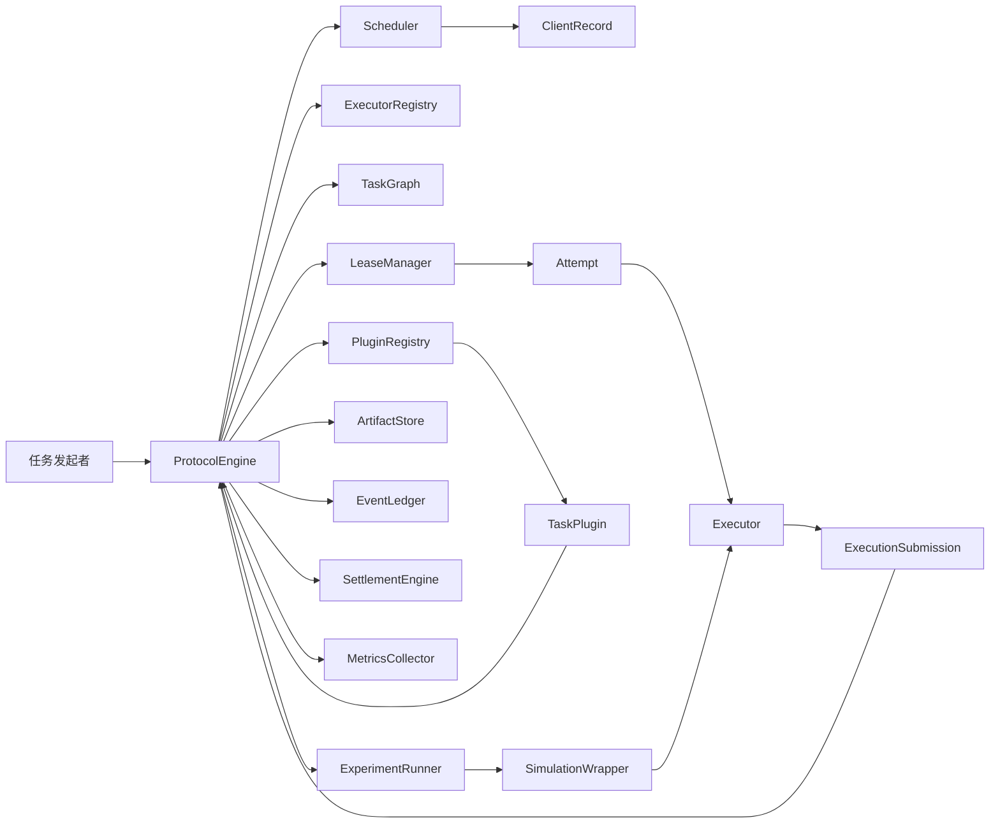
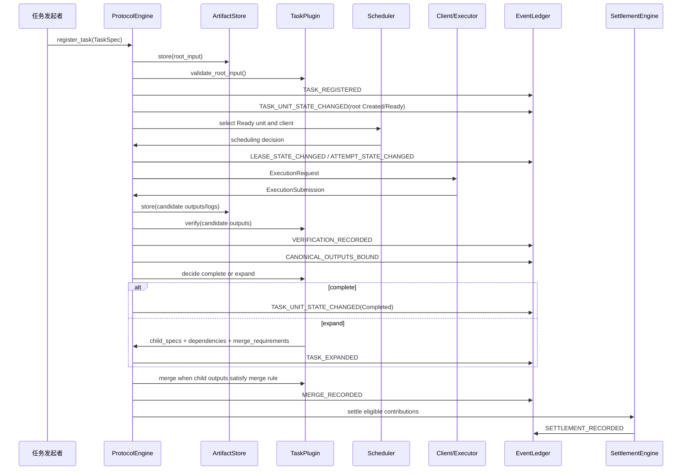

# TDD - TokenShare 协议框架 V1

| 字段 | 值 |
|---|---|
| 项目 | TokenShare 协议框架 V1 |
| 文档类型 | 技术设计文档 |
| 状态 | Draft |
| 创建日期 | 2026-06-03 |
| 最后更新 | 2026-06-03 |
| Owner | TokenShare 研究项目负责人 |
| 适用阶段 | 本地可复现研究原型 |
| 关联设计稿 | `2026-06-02-tokenshare-protocol-kernel-revised-draft.md` |

## 1. 背景

TokenShare 的第一阶段目标不是实现某一个具体任务程序，而是实现一个可运行、可审计、
可扩展的协议框架。整数分解和 Lean 证明只是两个实验插件，用于验证协议框架能否
承载不同类型的任务。

协议需要把一个大型任务转化为可递归拆分、可分派、可验证、可合并、可结算、可重放
的任务图。第一版不追求真实分布式部署、链上结算或生产级安全，而是先在本地环境中
验证协议机制本身是否闭环。

当前讨论稿已经明确了三层结构：

- **协议框架**：负责所有任务共同遵守的生命周期、不变量、状态机、调度、验证编排、
  结算和事件重放。
- **任务插件**：负责特定任务领域的输入输出格式、拆分策略、验证规则、合并规则和
  能力要求。
- **执行器**：负责实际处理某个已经确定的 `TaskUnit`，可以是 AI、本地模型、确定性
  程序或未来的人类 worker。

本文档将讨论稿改写为实现导向的技术设计文档。重点是明确 V1 需要交付哪些模块、这些
模块之间如何通信、哪些数据必须持久化、如何测试闭环。

## 2. 问题陈述与动机

### 2.1 当前要解决的问题

**问题一：任务拆分、执行、验证、合并和结算尚未形成可实现闭环。**

讨论稿已经描述了协议主循环，但如果直接实现，还缺少若干基础模块，例如 artifact
存储、插件注册、执行器注册、调度器、实验运行器和指标收集器。没有这些模块，协议
状态机虽然概念清楚，但无法端到端运行。

**问题二：任务领域逻辑和协议逻辑容易混在一起。**

整数分解、Lean 证明、AI prompt、程序执行、故障模拟都可能牵涉“任务处理”，但它们
不应该进入同一个模块。V1 必须把领域规则、执行方式和协议状态推进分开，否则后续
新增插件会迫使协议核心不断改写。

**问题三：非确定性执行使重放和恢复变得困难。**

AI 或未来的人类 worker 可能产生不可重现的输出。协议不能在状态恢复时重新调用非
确定性执行过程并假设结果一致。因此，正式输出、展开计划、合并输入和结算事实都必须
写入可重放事件日志，并且正式 artifact 必须持久化。

### 2.2 为什么现在要解决

如果不先完成协议闭环，整数分解和 Lean 实验会变成两个彼此割裂的 demo，无法证明
TokenShare 的核心主张：复杂任务可以通过统一协议被递归拆分、分派、验证、合并和
结算。

V1 的技术目标是形成一个最小但完整的本地协议内核。它应能跑通至少两个插件实验，并
通过事件日志重建最终状态。

## 3. 范围

### 3.1 V1 范围内

V1 交付以下能力：

- 注册根任务，固定插件、插件版本、拆分策略、预算、截止时间和根输入。
- 将根任务创建为 `TaskUnit`，并维护递归拆分关系和执行依赖关系。
- 根据正式输出和依赖边判断任务是否 Ready。
- 注册本地插件和执行器，并在运行时固定版本。
- 使用本地 `ArtifactStore` 保存输入、候选输出、正式输出、日志和原始 AI 输出引用。
- 为 Ready 任务创建 `Lease` 和 `Attempt`。
- 通过执行器处理任务，并返回统一 `ExecutionSubmission`。
- 编排通用数据检查、插件领域验证和正式输出选择。
- 支持 `first_verified_bundle` 正式输出策略。
- 支持插件返回 `complete` 或 `expand`。
- 支持结果驱动递归展开，并将图更新写入事件日志。
- 支持自底向上的合并流程。
- 支持有界重试、租约过期、影子执行、迟到提交隔离和失败传播。
- 记录贡献并在根任务完成后执行 sandbox 结算。
- 通过 append-only JSONL 事件日志进行状态重放。
- 提供整数分解插件和 Lean stub 插件作为实验对象。
- 提供模拟包装层，用于注入 offline、slow、executor_error、invalid_output 和
  late_submission。
- 输出实验指标报告。

### 3.2 V1 范围外

V1 不交付以下能力：

- 真实区块链、钱包、智能合约或真实代币支付。
- 真实多机器通信、HTTP worker pool 或 P2P 网络。
- 第三方动态上传插件。
- 生产级身份系统、权限系统、反女巫机制或拜占庭容错。
- 完整 Web UI。
- 通用工作流语言或用户上传任意拆分脚本。
- 生产级 AI API 集成。
- 完整 Lean 证明搜索系统。

### 3.3 后续版本考虑

后续版本可以扩展：

- 真实分布式 runtime。
- 插件包管理和第三方插件加载。
- `quorum_consensus` 或语义共识验证。
- 信誉向量、质押、惩罚和真实结算后端。
- 人类 worker 和远程服务执行器。
- 更完整的 LeanDojo / miniF2F 实验。

## 4. 设计目标与非目标

### 4.1 设计目标

- **协议优先**：协议核心不理解整数分解或 Lean 的内部知识。
- **任务可递归**：任务图支持渐进式展开，且展开可依赖中间正式结果。
- **结果可验证**：候选输出必须经过插件领域验证和协议正式输出选择。
- **正式输出唯一**：同一 `TaskUnit` 的正式输出束只能绑定一次。
- **状态可恢复**：协议状态可由事件日志重放恢复。
- **非确定性隔离**：AI 输出不能在状态恢复时静默重新生成。
- **贡献可追踪**：中间贡献可延迟结算，且结算恰好一次。
- **实验可复现**：故障模拟由 profile 和随机种子控制。

### 4.2 非目标

- 不追求第一版最优调度。
- 不追求第一版安全完备。
- 不追求第一版通用插件市场。
- 不追求第一版所有任务都能用 AI 解决。
- 不追求第一版协议对象字段一次性定死。

## 5. 架构总览

### 5.1 组件图



### 5.2 组件职责

| 组件 | 层次 | 职责 |
|---|---|---|
| `ProtocolEngine` | 协议框架 | 协调主循环，推进状态机，调用其他组件。 |
| `TaskGraph` | 协议框架 | 保存 `TaskUnit` 和 `TaskRelation`，维护拆分树和执行依赖 DAG。 |
| `Scheduler` | 协议框架 | 扫描 Ready 任务，匹配客户端能力，选择执行客户端。 |
| `LeaseManager` | 协议框架 | 管理认领、租约、心跳、过期、释放、撤销和 fencing。 |
| `ArtifactStore` | 协议框架 | 保存和读取输入、输出、日志、原始执行结果，提供内容哈希校验。 |
| `EventLedger` | 协议框架 | 写入 append-only 事件，支持状态重放和审计重放。 |
| `SettlementEngine` | 协议框架 | 根据贡献记录和预算策略生成 sandbox 结算。 |
| `PluginRegistry` | 协议框架 | 固定插件标识、版本、schema、策略和本地实现。 |
| `ExecutorRegistry` | 协议框架 | 固定可用执行器类别、版本、能力和调用入口。 |
| `MetricsCollector` | 协议框架 | 从事件日志和实验配置生成指标报告。 |
| `ExperimentRunner` | 实验基础设施 | 加载实验配置，运行基准任务，注入故障，输出报告。 |
| `TaskPlugin` | 任务插件 | 提供任务域 schema、拆分、验证、合并、执行说明和能力要求。 |
| `Executor` | 执行器 | 根据 `ExecutionRequest` 产生 `ExecutionSubmission`。 |
| `SimulationWrapper` | 执行器/实验边界 | 包装执行器并按 profile 注入离线、慢执行、错误和迟到提交。 |

### 5.3 三层边界

| 问题 | 协议框架 | 任务插件 | 执行器 |
|---|---|---|---|
| 谁能修改任务图 | 协议框架唯一修改 | 返回展开计划 | 不能修改 |
| 谁决定结果是否符合领域规则 | 编排验证 | 判断领域正确性 | 不能决定 |
| 谁绑定正式输出 | 执行正式输出选择 | 提供验证结论 | 不能绑定 |
| 谁负责实际执行 | 创建请求和租约 | 提供执行说明 | 执行任务 |
| 谁计算奖励 | 结算策略 | 可提供权重建议 | 只报告成本 |
| 谁处理重试 | 恢复策略 | 标注领域错误 | 只报告失败 |

## 6. 核心数据模型

本节描述架构契约，不规定最终代码类或数据库表。

### 6.1 协议框架对象

| 对象 | 作用 | 关键字段范畴 |
|---|---|---|
| `TaskSpec` | 根任务注册信息。 | 任务标识、插件版本、拆分策略、根输入、预算、截止时间、协议配置。 |
| `TaskUnit` | 任务图中的可调度节点。 | 节点标识、状态、输入引用、命名输出、能力要求、权重、局部限制。 |
| `TaskRelation` | 表达节点关系。 | `decomposition` 或 `dependency`、源节点、目标节点、所需命名输出。 |
| `ClientRecord` | 客户端调度信息。 | 客户端标识、能力声明、可用状态、执行器类型、统计信息。 |
| `Lease` | 临时执行权。 | 租约标识、客户端、任务单元、attempt、状态、过期时间、fencing。 |
| `Attempt` | 一次执行尝试。 | attempt 标识、租约、客户端、状态、候选输出、日志、环境摘要。 |
| `ArtifactRef` | 数据引用。 | artifact 标识、类型、URI、内容哈希、schema、来源、创建时间。 |
| `VerificationResult` | 验证记录。 | 判定、理由、证据、验证器信息、关联 attempt。 |
| `ExpansionDecision` | 完成或展开判定。 | `complete` 或 `expand`、输入 artifact、子任务描述、依赖、合并要求。 |
| `ContributionRecord` | 贡献追踪。 | 贡献类型、关联 attempt、后续成功条件、结算状态。 |
| `SettlementRecord` | sandbox 结算事实。 | 奖励、惩罚、理由、幂等键、结算状态。 |
| `LedgerEvent` | append-only 事件。 | 事件类型、时间、对象引用、因果链路、幂等键、载荷、哈希链。 |

### 6.2 插件对象

| 对象 | 作用 |
|---|---|
| `PluginDescriptor` | 标识插件、版本、任务类型、schema、支持策略和执行器类别。 |
| `DecompositionStrategy` | 表示用户注册任务时选择的版本化拆分逻辑和参数。 |
| `TaskSchema` | 声明根输入、子任务输入、命名输出和中间结果格式。 |
| `VerificationRule` | 描述任务域验证规则和验证环境要求。 |
| `MergeRule` | 描述父节点何时可合并、如何合并、合并输出格式。 |

### 6.3 执行器对象

| 对象 | 作用 |
|---|---|
| `ExecutionRequest` | 协议交给执行器的统一请求信封。 |
| `ExecutionSubmission` | 执行器返回协议的统一提交信封。 |
| `PromptPackage` | AI 执行路径使用的 prompt 封装。 |
| `RawModelOutput` | AI 执行路径的原始模型输出。 |
| `SimulationProfile` | 本地实验的故障模拟配置。 |

### 6.4 新增闭环支撑对象

| 对象 | 原因 | 层次 |
|---|---|---|
| `ArtifactStore` | 因为正式输出、日志和根输入必须可保存、可读取、可校验。 | 协议框架 |
| `PluginRegistry` | 因为事件日志需要固定插件版本，并在运行和重放时找到同一实现。 | 协议框架 |
| `ExecutorRegistry` | 因为调度器需要知道哪些执行器可用、版本是什么、能力是什么。 | 协议框架 |
| `Scheduler` | 因为 Ready 任务必须被自动分派给满足能力要求的客户端。 | 协议框架 |
| `ExperimentRunner` | 因为 V1 要可复现实验，而不是只运行单次手工流程。 | 实验基础设施 |
| `MetricsCollector` | 因为研究原型必须输出 completion、replay、failure、settlement 指标。 | 协议框架/实验 |

## 7. 协议主流程

### 7.1 端到端数据流



### 7.2 主循环

协议主循环按以下顺序推进：

1. 读取 `TaskSpec`，通过 `PluginRegistry` 固定插件版本。
2. 将根输入写入 `ArtifactStore`。
3. 调用插件校验根输入并创建根 `TaskUnit`。
4. 将任务注册和根节点创建写入 `EventLedger`。
5. `Scheduler` 扫描 Ready 节点并匹配客户端能力。
6. `LeaseManager` 创建 `Lease` 和 `Attempt`。
7. `Executor` 接收 `ExecutionRequest` 并返回 `ExecutionSubmission`。
8. 协议保存候选输出和日志。
9. 协议执行通用数据检查并调用插件领域验证。
10. 协议按 `first_verified_bundle` 绑定正式输出束。
11. 插件返回 `complete` 或 `expand`。
12. `complete` 节点进入完成或向上合并流程。
13. `expand` 节点生成子任务和依赖，协议原子写入图更新。
14. 根任务完成后，协议生成贡献资格并执行 sandbox 结算。
15. `MetricsCollector` 从事件日志生成实验报告。

## 8. 关键接口契约

### 8.1 协议入口

| 操作 | 输入 | 输出 | 说明 |
|---|---|---|---|
| `register_task` | `TaskSpec` | 根 `TaskUnit` 引用 | 注册根任务并写入事件日志。 |
| `register_client` | 客户端能力声明 | `ClientRecord` | 注册本地模拟客户端。 |
| `run_until_terminal` | 根任务标识、实验配置 | 最终任务状态、指标报告 | 本地实验主入口。 |
| `replay_ledger` | 事件日志引用 | 重建后的协议状态 | 不重新调用 AI 或插件展开逻辑。 |

这些是本地协议 API，不要求 V1 暴露 HTTP endpoint。

### 8.2 插件契约

| 能力 | 输入 | 输出 | 约束 |
|---|---|---|---|
| 描述插件 | 无 | `PluginDescriptor` | 必须包含版本。 |
| 校验根输入 | 根输入 artifact | 判定 | 不写协议状态。 |
| 声明 schema | 任务类型 | `TaskSchema` | 命名输出必须有 schema。 |
| 生成执行说明 | `TaskUnit`、上下文 | 执行说明 | 可按执行器类别不同而不同。 |
| 解析原始输出 | 原始输出引用 | 候选命名输出 | 只产生候选结果。 |
| 验证候选输出 | `TaskUnit`、候选输出 | `VerificationResult` | 不绑定正式输出。 |
| 判断完成或展开 | 正式输出束 | `ExpansionDecision` | 只能返回 `complete` 或 `expand`。 |
| 合并正式子输出 | 父节点、正式子输出集合 | 父节点候选输出 | 由协议编排和记录。 |

### 8.3 执行器契约

`ExecutionRequest` 至少包含：

- attempt 标识。
- 租约标识和 fencing 上下文。
- `TaskUnit` 摘要。
- 输入 artifact 引用。
- 必需命名输出及 schema。
- 资源、时间和环境限制。
- 插件提供的执行说明。

`ExecutionSubmission` 至少包含：

- attempt 标识。
- 租约标识和 fencing 上下文。
- 执行结果类别。
- 候选命名输出引用或原始输出引用。
- 日志引用。
- 环境摘要。
- 用量与成本摘要。
- 结构化错误信息。

执行器不能创建任务、修改任务图、绑定正式输出、决定奖励或自行重试。

## 9. 状态机设计

### 9.1 `TaskUnit`

核心状态：

```text
Created
Blocked
Ready
Processing
WaitingForChildren
MergeReady
Merging
Completed
MergeFailed
Failed
Cancelled
```

关键规则：

- `Ready` 只能由协议根据正式依赖输出推导。
- `Processing` 表示至少存在有效 attempt。
- `WaitingForChildren` 表示当前节点已经展开，等待子树。
- `MergeReady` 由协议根据正式子输出和固定插件合并规则推导。
- `Completed` 必须拥有完成条件所要求的正式输出。

### 9.2 `Lease`

核心状态：

```text
Active -> Released
Active -> Expired
Active -> Revoked
Active -> Active  [heartbeat]
```

租约终止后，旧 fencing 信息失效。迟到提交可记录为审计证据，但不能覆盖正式输出。

### 9.3 `Attempt`

核心状态：

```text
Created
Running
Submitted
Verifying
Verified
Canonical
Rejected
Failed
Superseded
```

关键规则：

- 一个 `TaskUnit` 可以有多个 attempt。
- 只有通过验证且成功绑定正式输出束的 attempt 进入 `Canonical`。
- 迟到或输掉正式输出选择的 attempt 进入 `Superseded` 或保留审计记录。

### 9.4 `ContributionRecord`

核心状态：

```text
Pending
Eligible
Settled
Invalidated
```

关键规则：

- `complete` 贡献可在节点完成后进入 `Eligible`。
- `expand` 贡献在子树完成并向上合并前保持 `Pending`。
- 根任务最终失败或取消时，未结算贡献进入 `Invalidated`。
- `SettlementRecord` 是不可变事实，不单独维护状态机。

## 10. Artifact 存储与重放

### 10.1 `ArtifactStore` 职责

`ArtifactStore` 是 V1 必需模块。它负责：

- 保存根输入。
- 保存候选命名输出。
- 保存正式输出。
- 保存日志和原始 AI 输出引用。
- 计算并校验内容哈希。
- 按 artifact 标识读取数据。
- 标记 artifact 来源 attempt 或来源任务。

### 10.2 存储约束

- 正式输出必须持久化。
- 所有参与正式输出选择、展开、合并和结算的 artifact 必须有内容哈希。
- 事件日志保存 artifact 引用和摘要，不默认内联大文件或完整 prompt。
- 状态重放不能重新生成 AI 输出。
- 确定性程序输出如果丢失，可按来源追踪重执行；AI 输出丢失时应报告不可恢复。

## 11. 事件日志

### 11.1 最小事件集合

| 事件 | 作用 |
|---|---|
| `TASK_REGISTERED` | 保存根任务、插件、策略、预算和根输入引用。 |
| `CLIENT_STATE_CHANGED` | 保存客户端注册和能力变化。 |
| `TASK_UNIT_STATE_CHANGED` | 保存任务节点状态变化。 |
| `LEASE_STATE_CHANGED` | 保存租约签发、续期、释放、过期和撤销。 |
| `ATTEMPT_STATE_CHANGED` | 保存 attempt 生命周期变化。 |
| `SUBMISSION_RECORDED` | 保存候选输出、日志、环境摘要和来源 attempt。 |
| `VERIFICATION_RECORDED` | 保存验证结论、证据和验证器信息。 |
| `CANONICAL_OUTPUTS_BOUND` | 原子记录正式输出束绑定。 |
| `TASK_EXPANDED` | 保存展开输入、插件版本、子节点和依赖关系。 |
| `MERGE_RECORDED` | 保存合并输入、插件版本、合并输出和验证结果。 |
| `RECOVERY_ACTION_RECORDED` | 保存重试、重新调度、影子执行和终止恢复原因。 |
| `CONTRIBUTION_STATE_CHANGED` | 保存贡献创建、具备资格和失效。 |
| `SETTLEMENT_RECORDED` | 保存恰好一次 sandbox 结算。 |

### 11.2 重放模式

| 模式 | 目标 | 约束 |
|---|---|---|
| 状态重放 | 重建任务图、租约、attempt、正式输出和结算状态。 | 不重新调用 AI，不重新调用插件展开。 |
| 审计重放 | 使用已保存 artifact 和插件版本重新执行验证器。 | 可重新验证结果，但不能改写历史事件。 |

## 12. 调度与恢复策略

### 12.1 最小调度策略

V1 使用保守调度策略：

1. 扫描所有 `Ready` 且未达到恢复终止条件的 `TaskUnit`。
2. 过滤满足硬能力要求的 `ClientRecord`。
3. 优先选择当前可用、未持有过多 active lease 的客户端。
4. 创建一个 `Lease` 和一个 `Attempt`。
5. 如果 `shadow_after` 到达且策略允许，创建影子 attempt。

V1 不实现复杂优先级、信誉向量或市场竞价。

### 12.2 恢复规则

| 触发 | 行为 |
|---|---|
| 租约过期 | 终止租约，旧 attempt 不能成为正式输出来源，任务可重新进入 Ready。 |
| 执行器失败 | attempt 进入 `Failed`，按策略决定是否重试。 |
| 输出无效 | attempt 进入 `Rejected`，保留证据并有界重试。 |
| 迟到提交 | 记录审计证据，不覆盖正式输出。 |
| artifact 哈希不匹配 | 拒绝使用该 artifact，按恢复边界处理。 |
| 达到预算、截止时间或最大尝试次数 | 任务进入 `Failed`，失败传播。 |

### 12.3 递归规模限制

V1 必须增加以下限制，以保证任务图不会无限展开：

| 参数 | 作用 |
|---|---|
| `max_depth` | 限制递归拆分深度。 |
| `max_children_per_unit` | 限制单个节点一次展开产生的子节点数。 |
| `max_total_units` | 限制根任务下总节点数。 |
| `max_expansions_per_unit` | 限制同一节点展开次数，V1 默认为一次。 |

这些参数属于 `ProtocolConfig` 或 `TaskSpec` 中的运行限制。插件不能绕过它们。

### 12.4 子树剪枝

V1 需要支持父节点完成后取消不再需要的子树。例如整数分解中，一个子节点找到因数后，
其他搜索区间可能不再需要继续执行。

规则：

- 插件合并规则可以声明父节点完成后哪些子节点不再需要。
- 协议将未完成且不再需要的子节点转为 `Cancelled`。
- 已经完成的子节点不被回滚。
- 已经绑定的正式输出保留审计记录。
- 未完成或迟到的 attempt 默认不产生奖励。

## 13. 贡献与结算

V1 使用 sandbox 结算，不涉及真实代币。

### 13.1 贡献类型

| 类型 | 结算规则 |
|---|---|
| 完成贡献 | attempt 成为 `Canonical` 且插件返回 `complete` 后可进入 `Eligible`。 |
| 中间拆分贡献 | attempt 成为 `Canonical` 且插件返回 `expand` 后保持 `Pending`，直到子树成功合并。 |
| 协议请求的冗余验证贡献 | 影子 attempt 与正式输出一致时，可按低权重奖励。 |
| 未请求重复提交 | 默认不奖励。 |
| 迟到提交 | 默认不奖励。 |

### 13.2 奖励公式

V1 使用预算受限公式：

```text
provisional_reward(c) = base_rate[kind(c)] * weight(c)
scale = min(1, root_budget / sum(provisional_reward(c) for eligible contribution c))
reward(c) = provisional_reward(c) * scale
```

结算只针对 `Eligible` 贡献生成不可变 `SettlementRecord`。事件重放不得重复生成相同
结算。

## 14. 实验插件

### 14.1 整数分解插件

目标：验证协议的递归拆分、调度、验证、提前合并、子树剪枝、失败恢复和结算。

V1 设计：

- 根输入包含待分解整数和搜索范围。
- 拆分策略将搜索范围分割为子区间。
- 执行器搜索候选因数。
- 验证器检查候选因数是否整除目标整数。
- 任一子节点找到有效因数时，父节点可以完成并取消不再需要的兄弟子树。
- 若所有区间都完成且未找到因数，合并为“未找到因数”结果。

### 14.2 Lean Stub 插件

目标：验证协议能承载 AI 风格任务、固定验证环境、proof patch 输出、错误日志和递归
子目标。

V1 设计：

- 根输入包含 theorem 标识、statement、上下文和固定环境摘要。
- AI 执行路径生成 `PromptPackage`。
- `MockAIExecutor` 生成 `RawModelOutput`。
- 插件解析 proof patch 或 decomposition proposal。
- 验证器使用 fixture 模拟 Lean 检查结果。
- 子目标展开为普通 `TaskUnit`。
- 合并规则模拟“子证明齐备后父证明通过”。

Lean V1 是 stub，不要求真实 theorem proving 成功率。

## 15. 测试策略

### 15.1 单元测试

| 模块 | 测试重点 |
|---|---|
| `TaskGraph` | 依赖边、拆分边、无环检查、Ready 判断。 |
| `LeaseManager` | claim、heartbeat、expire、release、fencing。 |
| `ArtifactStore` | 写入、读取、哈希校验、缺失处理。 |
| `PluginRegistry` | 插件版本固定、schema 查询、策略查询。 |
| `ExecutorRegistry` | 执行器能力匹配、版本记录。 |
| `SettlementEngine` | 奖励公式、预算缩放、幂等结算。 |
| `EventLedger` | append-only、幂等键、事件哈希链。 |

### 15.2 集成测试

| 测试 | 目标 |
|---|---|
| 根任务到最终结果 | 验证完整主循环。 |
| 结果驱动展开 | 验证 `expand` 后原子创建子节点和依赖。 |
| 正式输出唯一 | 多 attempt 提交时只绑定一个正式输出束。 |
| 合并流程 | 子节点正式输出齐备后父节点完成。 |
| 状态重放 | 从 JSONL 重建最终状态。 |
| 审计重放 | 使用保存的 artifact 和插件版本复核验证结果。 |
| 结算幂等 | 重放不产生重复 `SettlementRecord`。 |

### 15.3 故障测试

| 故障 | 预期行为 |
|---|---|
| offline | 租约过期，任务重新 Ready。 |
| slow | 可触发影子 attempt。 |
| executor_error | attempt 失败并有界重试。 |
| invalid_output | 验证拒绝，保留证据。 |
| late_submission | 记录审计，不覆盖正式输出。 |
| missing artifact | 按恢复边界处理。 |
| plugin invalid expansion | 当前节点失败，不写入非法图。 |

### 15.4 验收测试

V1 通过条件：

- 整数分解实验能完成根任务并产生最终 artifact。
- Lean stub 实验能完成至少一条 direct proof 路径和一条 decomposition 路径。
- 事件日志能重放出相同最终任务状态。
- sandbox 结算无重复。
- 五类模拟故障均能产生预期恢复行为。
- 失败任务不会无限重试。
- 任务图不会超过配置的递归规模限制。

## 16. 指标与可观测性

### 16.1 实验指标

| 指标 | 含义 |
|---|---|
| `completion_time_ticks` | 根任务完成所需模拟时间。 |
| `unit_count` | 生成的任务节点数。 |
| `max_depth_observed` | 实际递归深度。 |
| `attempt_count` | 总 attempt 数。 |
| `duplicate_work_ratio` | 重复执行比例。 |
| `lease_expiration_count` | 租约过期次数。 |
| `invalid_submission_count` | 无效提交次数。 |
| `late_submission_count` | 迟到提交次数。 |
| `verification_count` | 验证调用次数。 |
| `merge_count` | 合并调用次数。 |
| `replay_success` | 状态重放是否成功。 |
| `settlement_total` | sandbox 总奖励。 |
| `no_double_settlement` | 是否无重复结算。 |

### 16.2 运行报告

每次实验应输出：

- 根任务摘要。
- 插件版本和执行器版本。
- ProtocolConfig 摘要。
- SimulationProfile 摘要。
- 最终任务状态。
- 关键指标表。
- 失败和恢复事件摘要。
- 结算摘要。

## 17. 回滚与恢复计划

V1 是本地研究原型，不涉及生产部署回滚。这里的“回滚”指实验运行失败后的恢复和复现。

### 17.1 实验失败后的恢复

- 保留事件日志和 artifact 目录。
- 使用状态重放重建失败前状态。
- 检查最后一个成功事件和最后一个未完成操作。
- 使用相同实验配置和随机种子重新运行。
- 如果 artifact 丢失且不可恢复，标记实验失败并保留失败报告。

### 17.2 设计变更后的兼容性

- 事件 schema 变更时必须记录事件版本。
- 插件版本变更不能改写已有实验日志。
- 新增字段应允许缺省读取旧日志。
- 移除字段前必须有迁移或兼容策略。

## 18. 风险与缓解

| 风险 | 影响 | 概率 | 缓解 |
|---|---|---|---|
| 插件接口过大 | 插件难以实现，协议与任务域重新耦合。 | 中 | V1 只要求最小能力，复杂能力作为插件内部代码。 |
| artifact 存储不完整 | 状态重放和审计重放失败。 | 高 | 将 `ArtifactStore` 作为 V1 必需模块。 |
| 任务图无限展开 | 实验无法终止。 | 中 | 增加 `max_depth`、`max_children_per_unit`、`max_total_units`。 |
| 正式输出选择过早 | 第一个有效结果可能不是最优结果。 | 中 | V1 接受 `first_verified_bundle`，未来扩展共识策略。 |
| Lean stub 过于简单 | 无法证明协议适合真实 formal proof。 | 中 | V1 只验证接口，后续接入真实 Lean checker。 |
| 调度器过度简化 | 性能指标不代表真实分布式系统。 | 中 | 明确 V1 只验证协议闭环，不评估生产性能。 |
| 事件日志 schema 混乱 | 重放困难。 | 中 | 每类事件定义固定最小载荷和版本。 |

## 19. 备选方案

| 方案 | 优点 | 缺点 | 决策 |
|---|---|---|---|
| 先实现整数分解专用系统 | 快速得到 demo。 | 无法证明协议可扩展，Lean 接入会重写。 | 不采用。 |
| 先实现完整分布式 runtime | 更接近最终愿景。 | 范围过大，会掩盖协议设计问题。 | 不采用。 |
| 使用通用工作流系统表达任务 | 成熟 DAG 和调度能力。 | 难以表达贡献、结算、正式输出选择和非确定性恢复边界。 | 不采用。 |
| 本地协议内核 + 插件 + 执行器 | 范围可控，能验证核心闭环。 | 第一版不代表生产性能。 | 采用。 |

## 20. 实施计划

### Phase 1：协议基础对象与存储

交付：

- `TaskSpec`、`TaskUnit`、`TaskRelation`、`ClientRecord`。
- `ArtifactRef` 与 `ArtifactStore`。
- `LedgerEvent` 与 JSONL `EventLedger`。
- 基础 `ProtocolConfig`。

验收：

- 可注册根任务。
- 可保存根输入 artifact。
- 可写入和读取事件日志。

### Phase 2：任务图、状态机与调度

交付：

- `TaskGraph`。
- `TaskUnit` 状态机。
- `Lease` 与 `Attempt` 状态机。
- `Scheduler` 和 `LeaseManager`。

验收：

- Ready 节点能被调度。
- 租约过期后任务可重新进入 Ready。
- 状态转移全部写入事件日志。

### Phase 3：插件与执行器契约

交付：

- `PluginRegistry`。
- `ExecutorRegistry`。
- `ExecutionRequest` 与 `ExecutionSubmission`。
- `MockAIExecutor`。
- 确定性程序执行器接口。

验收：

- 插件版本固定。
- 执行器能接收统一请求并返回统一提交。
- AI 路径能生成 `PromptPackage` 和 `RawModelOutput`。

### Phase 4：验证、正式输出和展开

交付：

- 通用数据检查。
- 插件领域验证编排。
- `first_verified_bundle`。
- `ExpansionDecision`。
- 原子图更新。

验收：

- 多 attempt 中只有一个正式输出束。
- `expand` 能生成子节点和依赖。
- 无效展开不会写入任务图。

### Phase 5：合并、贡献与结算

交付：

- 插件合并编排。
- `ContributionRecord` 状态机。
- `SettlementEngine`。
- sandbox 奖励公式。
- 子树剪枝。

验收：

- 子节点正式输出可合并为父节点输出。
- 中间贡献可延迟结算。
- 根任务完成后生成恰好一次结算。

### Phase 6：实验插件与故障模拟

交付：

- 整数分解插件。
- Lean stub 插件。
- `SimulationProfile`。
- `SimulationWrapper`。
- `ExperimentRunner`。
- `MetricsCollector`。

验收：

- 两个插件实验均能跑通。
- 五类故障模拟均通过。
- 指标报告可生成。

### Phase 7：重放与审计

交付：

- 状态重放。
- 审计重放。
- 重放一致性检查。

验收：

- 从事件日志重建最终状态。
- 不重新调用 AI。
- 重放后无重复结算。

## 21. 依赖

| 依赖 | 类型 | 用途 | V1 要求 |
|---|---|---|---|
| 本地文件系统 | 基础设施 | 保存 events、artifacts、reports。 | 必需。 |
| Python 或等价运行时 | 实现环境 | 协议内核和插件原型。 | 必需，具体语言可在实现计划中定。 |
| Lean 环境摘要或 fixture | 实验依赖 | Lean stub 验证。 | V1 可用 fixture。 |
| 参考论文归档 | 研究依据 | 审阅设计来源。 | 已归档到 `source/Paper`。 |

## 22. 开放问题

| 问题 | 当前决策 | 后续处理 |
|---|---|---|
| 对象字段是否全部细化 | 本文只定义字段范畴，不定义最终字段清单。 | 下一步单独写对象字段规格。 |
| 第一版实现语言 | 未在本文强制规定。 | 实施计划阶段选择。 |
| 整数分解具体拆分策略 | V1 只要求版本化策略。 | 插件规格中确定。 |
| Lean stub 具体 fixture | V1 只要求能覆盖 direct 与 decomposition。 | 插件规格中确定。 |
| 是否实现真实 AI API | V1 不实现。 | 后续版本决定。 |

## 23. 术语表

| 术语 | 含义 |
|---|---|
| `TaskSpec` | 根任务注册对象。 |
| `TaskUnit` | 任务图中的可执行、可拆分或可合并节点。 |
| `TaskRelation` | 任务节点之间的拆分边或依赖边。 |
| `ArtifactRef` | 输入、输出、日志或原始执行结果的数据引用。 |
| `ArtifactStore` | 保存和校验 artifact 的本地存储模块。 |
| `Lease` | 客户端对任务单元的临时执行权。 |
| `Attempt` | 客户端基于某个 lease 的一次执行尝试。 |
| `Canonical` | 某个 attempt 的输出束被协议选为正式输出。 |
| `ExpansionDecision` | 插件对正式输出返回的完成或展开判定。 |
| `first_verified_bundle` | 第一个通过验证并成功原子绑定的输出束成为正式输出。 |
| `EventLedger` | append-only 事件日志。 |
| `SimulationProfile` | 控制本地故障模拟的配置。 |

## 24. 成功标准

V1 技术设计成功的判定标准：

- 能从本文档直接拆出实现计划。
- 能解释每个模块存在的功能原因。
- 能区分协议框架、任务插件、执行器和实验基础设施。
- 能覆盖任务注册、artifact 存储、调度、执行、验证、展开、合并、恢复、结算和重放。
- 能指出 V1 不做真实分布式、真实链上结算和第三方插件市场。

V1 实现成功的判定标准：

- 整数分解实验和 Lean stub 实验均能端到端完成。
- 事件日志可重放最终状态。
- 正式输出唯一。
- sandbox 结算恰好一次。
- 故障模拟结果符合预期。
- 实验报告包含核心指标。
