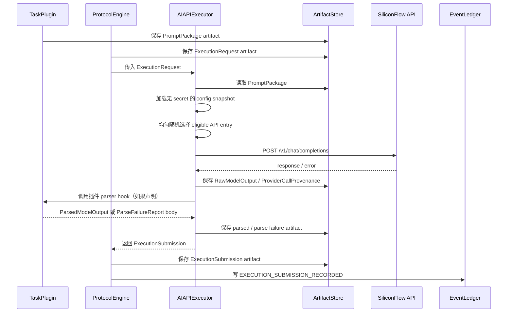

# Phase 7 实验级 AI API 执行器字段规格草案

## 元数据

| 项目 | 内容 |
|---|---|
| 日期 | 2026-06-28 |
| 状态 | Draft / design-only / implementation not started |
| 对应 feature | `feat-008` - Phase 7 - Experimental AI API Executor |
| 上游设计依据 | `Doc/TechnicalDocument/2026-06-03-tokenshare-protocol-technical-design.md` 第 3、4.3、5、8、12、20、21、23 节；`Doc/TechnicalDocument/2026-06-23-phase-3-plugin-executor-field-spec.md`；`Doc/TechnicalDocument/2026-06-23-phase-3-code-map.md` |
| 用户确认 | 2026-06-28：Phase 7 应按完整实验级真实 AI API executor 设计；当前真实 API 全部来自 SiliconFlow；模型/API entry 均匀随机；失败后自动换下一个 API entry；领域解析由插件拥有。 |
| 目的 | 固化 Phase 7 的 provider 配置、随机选择、自动换 API、artifact/provenance、secret、usage/cost、错误映射、插件解析和 replay 边界，供后续实现使用。 |

## 1. 背景与问题

TokenShare 已在 Phase 3 建立统一 `ExecutionRequest` / `ExecutionSubmission` 契约，并通过 `MockAIExecutor` 证明 prompt、raw output、parsed output 和 parse failure 可以 artifact 化。Phase 6 Factorization 第一切片进一步证明 prompt package 应由插件构造，executor 只消费 `ExecutionRequest.prompt_package_ref` 和插件声明的执行契约，不得发明任务图、输出 schema 或验证规则。

当前缺口是：论文实验不能只依赖 deterministic fixture 或 mock AI。V1 需要一个实验级真实 AI API executor，使 structured report stub 或其他自然语言插件可以在真实模型输出上运行，同时仍满足本地协议内核的 replay、artifact、secret 和审计边界。

Phase 7 只解决“通过本地 executor 调用真实 AI API 并记录可复查证据”的问题。它不是生产级 AI 平台，不负责动态 provider 市场、在线 worker pool、多租户密钥托管、模型质量仲裁、任务图修改、canonical output 绑定、结算或协议级重试。

## 2. 目标

Phase 7 的目标是实现 `AIAPIExecutor` 或等价组件：

- 接收现有 `ExecutionRequest`。
- 从 request 的 `PromptPackage` artifact 和插件 execution contract 构造 SiliconFlow chat completions 请求。
- 从本地 JSON 配置中加载多个 SiliconFlow API entry，并在符合能力要求的 entry 中均匀随机选择。
- 对 provider/transport 失败执行有界自动换 API entry，并把每次尝试记录为 provenance。
- 保存 raw response、provider call log、usage、latency、cost estimate、错误证据和插件解析结果或解析失败。
- 返回现有 `ExecutionSubmission`，并继续由 `ProtocolEngine.record_execution_submission()` 落账。
- 保证 API key 只来自环境变量，不进入 event、artifact、SQLite、日志或错误文本。
- 保证 replay 只读取历史 event/artifact，不重新调用 API。

## 3. 非目标

Phase 7 不做以下事项：

- 不支持 SiliconFlow 以外的 provider adapter；后续可以新增 adapter，但第一版固定为 SiliconFlow。
- 不实现生产级 provider 管理、多租户账号、在线控制台、动态模型市场或 HTTP worker pool。
- 不让 executor 生成 `DecompositionProposal`、修改 `TaskGraph`、绑定 canonical output、决定 reward 或 settlement。
- 不做无限重试、模型自我修复循环、prompt 自动改写或 hidden reasoning 审计。
- 不把 structured report、factorization、Lean proof 等插件领域解析规则写进 executor。
- 不要求 baseline / CI 拥有真实 API key 或联网；真实 API smoke test 必须可显式跳过。
- 不实现 Phase 8 `ExperimentRunner`、fault simulation、metrics report 或 Phase 9 replay engine 完整能力。

## 4. 总体方案

推荐方案是“完整实验级 executor，SiliconFlow-only adapter，插件拥有解析”。核心组件如下：

| 组件 | 归属 | 职责 |
|---|---|---|
| `AIAPIExecutorConfig` | `tokenshare.executors` | 从本地 JSON 读取 SiliconFlow entry、采样参数、timeout、local concurrency、pricing 和 secret env var 名；不包含明文 secret。 |
| `AIAPIExecutorDescriptor` | `ExecutorDescriptor` artifact | 在现有 executor registry 中声明 `executor_type=ai_api`、支持 request schema、provider family、output modes 和 JSON mode 能力。 |
| `SiliconFlowChatClient` | `tokenshare.executors` | 只封装 SiliconFlow OpenAI-compatible chat completions HTTP 调用；不理解插件领域。 |
| `AIProviderSelector` | `tokenshare.executors` | 对符合 request/plugin constraints 的 enabled entry 做均匀随机选择；一次 execution 内对剩余 entry 洗牌后有界 failover。 |
| `AIProviderCallProvenance` | artifact | 保存每次 provider attempt 的模型、endpoint、请求摘要、响应摘要、latency、usage、HTTP status、request/response id 和错误分类；不保存 API key。 |
| `AIOutputParserBridge` | executor 调用边界 / 插件拥有策略 | 如果插件提供 parser hook，executor 调用插件 parser 生成 `ParsedModelOutput` 或 `ParseFailureReport` artifact；否则返回 raw-only submission，后续验证流由插件解析 raw。 |
| `ExecutionSubmission` | 现有 Phase 3 contract | 统一返回 raw/parsed/candidate/parse_failure/log/provenance/usage/error refs，不新增 Phase 7 专用 submission event。 |

### 4.1 架构图

## 5. SiliconFlow 外部资料落库摘要

本设计使用以下普通在线文档；资料影响范围仅限 Phase 7 executor provider adapter、错误映射、rate-limit 处理和 JSON mode 能力声明。访问日期为 2026-06-28。

| 来源 | 本地摘要 | 影响范围 |
|---|---|---|
| <https://docs.siliconflow.cn/cn/api-reference/chat-completions/chat-completions> | SiliconFlow 提供 OpenAI 风格 `POST https://api.siliconflow.cn/v1/chat/completions`，请求使用 `Authorization: Bearer`，响应包含 `id`、`model`、`choices` 和 `usage`。 | 固定第一版 adapter 为 SiliconFlow chat completions；`RawModelOutput` 保存 response body，`usage_summary` 从 response usage 派生。 |
| <https://docs.siliconflow.cn/en/userguide/quickstart> | Quickstart 描述可创建 API key，并通过 OpenAI library / `base_url=https://api.siliconflow.cn/v1` 调用部分大语言模型。 | 配置中保存 `base_url` 和 `api_key_env`；secret 只从环境变量读取。 |
| <https://docs.siliconflow.com/cn/userguide/rate-limits/rate-limit-and-upgradation> | Rate Limits 按账户级定义，不按 API key；每个模型单独设置限制，一个模型超限不影响其他模型；超限返回 HTTP 429。 | 允许同一 request 内有界自动换不同 model entry；429 记录为 `rate_limited` provider attempt。 |
| <https://docs.siliconflow.cn/en/userguide/guides/json-mode> | SiliconFlow 默认生成非结构化文本；除部分 DeepSeek R1/V3 外，主要语言模型支持 JSON mode。 | entry 需要声明 `supports_json_mode`；只有 request/plugin 需要 JSON mode 时才筛选支持者；不假设所有模型都可强制 JSON。 |
| <https://docs.siliconflow.cn/en/api-reference/models/get-model-list> | SiliconFlow 提供 `GET /v1/models`，并列出 400/401/403/404/429/503/504 等响应状态。 | 可选实现 config 校验 / model list smoke；错误映射覆盖 auth、not found、rate limit、overloaded、timeout。 |

## 6. 配置文件字段

配置文件是本地 JSON，建议 artifact schema 为 `phase7.ai_api_executor_config.v1`。配置可以进入 descriptor 或 run 配置摘要，但不能包含明文 API key。

| 字段 | 类型 | 必填 | 说明 |
|---|---|---|---|
| `schema_version` | string | 是 | `phase7.ai_api_executor_config.v1`。 |
| `executor_id` | string | 是 | 与 `ExecutorDescriptor.executor_id` 对齐。 |
| `provider_family` | string | 是 | 第一版固定为 `siliconflow`。 |
| `selection_policy` | object | 是 | 第一版 `{"kind": "uniform_random_without_weights", "seed_source": "request_or_environment_seed"}`。 |
| `defaults` | object | 是 | `timeout_seconds`、`max_tokens`、`temperature`、`top_p`、`stream=false`、`max_provider_attempts`。 |
| `entries` | list[object] | 是 | 每个 SiliconFlow model/API entry。 |
| `local_concurrency` | object | 否 | 本地实验进程内的简单上限，例如 `max_in_flight_global`；不是生产级 rate limiter。 |
| `metadata` | object | 否 | 配置说明、实验名称、创建时间。 |

### 6.1 entry 字段

| 字段 | 类型 | 必填 | 说明 |
|---|---|---|---|
| `entry_id` | string | 是 | 本地稳定 ID；进入 provenance。 |
| `enabled` | bool | 是 | false entry 不参与选择。 |
| `base_url` | string | 是 | 默认 `https://api.siliconflow.cn/v1`。 |
| `api_key_env` | string | 是 | 环境变量名；明文 key 不得出现在配置中。 |
| `model` | string | 是 | SiliconFlow model id。 |
| `endpoint` | string | 是 | 第一版固定 `/chat/completions`。 |
| `supports_json_mode` | bool | 是 | 由用户配置或模型清单确认。 |
| `supports_streaming` | bool | 否 | 第一版 request 使用 non-stream；该字段只做能力摘要。 |
| `request_overrides` | object | 否 | 对该模型生效的 sampling 参数上限或默认值。 |
| `pricing` | object | 是 | 本地实验用价格快照：currency、input/output 单价、单位、observed_at、source_note。 |
| `tags` | list[string] | 否 | 例如 `free`、`pro`、`json_mode`、`structured_report`。 |

## 7. 选择与自动换 API 规则

### 7.1 eligible entry

一次 execution 先从配置中过滤 eligible entry：

1. `enabled=true`。
2. `provider_family=siliconflow`。
3. entry 支持 request schema 和 plugin execution contract 需要的 output mode。
4. 如果 `PromptPackage.constraints` 或 plugin parser policy 要求 JSON mode，则 `supports_json_mode=true`。
5. `api_key_env` 对应环境变量存在且非空；缺失 secret 记为 config/secret error，不把 env value 写入任何 artifact。

### 7.2 均匀随机

在 eligible entry 中执行均匀随机。随机选择必须记录：

- `selection_policy_id`
- `eligible_entry_ids`
- `selected_entry_id`
- `random_seed_material_digest`
- `selection_index`
- `selection_record_digest`

如果 `EnvironmentRef.seed` 存在，优先使用它派生本次选择；否则使用系统随机源，并把实际选择结果 artifact 化。Replay 不重新抽样，只读取历史 provenance。

### 7.3 自动换 API

自动换 API 是一次 `ExecutionRequest` 内的 provider failover，不是协议级 attempt retry。规则：

- 对 selected entry 先调用一次。
- 遇到 transport timeout、HTTP 429、HTTP 500/503/504、连接错误或 provider 返回不可用错误时，记录失败 attempt，并在剩余 eligible entry 中按预先洗牌顺序尝试下一个。
- 每个 entry 在同一 execution 中最多尝试一次。
- `max_provider_attempts` 默认为 eligible entry 数量，也可在 config 中设更小。
- 一旦获得可解析的 provider response envelope，即停止 failover；后续输出 JSON/插件解析失败不再换 API。
- 所有 entry 均失败时返回 `ExecutionSubmission.result_kind="executor_error"`，并保存完整 provenance 与 `error` 摘要。

## 8. 请求构造

`AIAPIExecutor` 从 `PromptPackage` 生成 SiliconFlow chat completions 请求。第一版请求为 non-stream。

| 请求字段 | 来源 | 说明 |
|---|---|---|
| `model` | selected entry | SiliconFlow model id。 |
| `messages` | `PromptPackage.prompt_text` 与可选 system instruction | 插件拥有 prompt 正文；executor 只封装为 chat messages。 |
| `temperature` / `top_p` / `max_tokens` | config defaults + request limits + plugin soft hints | 取交集或更保守值；实际值进入 provenance。 |
| `response_format` | plugin / prompt constraints + entry capability | 仅当插件要求且 entry 支持 JSON mode 时传入。 |
| `stream` | config | 第一版固定 false，避免流式 partial output 的 artifact 边界复杂化。 |

请求 body 原文不直接写入 event；可写入 provenance artifact，但必须先剔除 Authorization header 和其他 secret。

## 9. 输出与 artifact 类型

### 9.1 `RawModelOutput`

| 字段 | 类型 | 必填 | 说明 |
|---|---|---|---|
| `schema_version` | string | 是 | `phase7.raw_model_output.v1`。 |
| `submission_id` | string | 是 | 对应 submission。 |
| `request_id` | string | 是 | 对应 request。 |
| `provider_family` | string | 是 | `siliconflow`。 |
| `entry_id` | string | 是 | 实际成功返回的 entry；全部失败时可为空并由 error artifact 描述。 |
| `model` | string | 是 | provider response model 或 selected model。 |
| `provider_response_id` | string/null | 否 | SiliconFlow response `id`。 |
| `content_text` | string/null | 否 | assistant message content。 |
| `raw_response_json` | object/null | 否 | provider response body 的无 secret 版本。 |
| `finish_reason` | string/null | 否 | choice finish reason。 |
| `usage` | object/null | 否 | prompt/completion/total tokens。 |
| `created_at` | string | 是 | UTC ISO 8601。 |

### 9.2 `AIProviderCallProvenance`

| 字段 | 类型 | 必填 | 说明 |
|---|---|---|---|
| `schema_version` | string | 是 | `phase7.ai_provider_call_provenance.v1`。 |
| `submission_id` | string | 是 | 对应 submission。 |
| `config_digest` | string | 是 | 无 secret 配置 canonical digest。 |
| `selection_record` | object | 是 | eligible、selected、seed digest 和 selection index。 |
| `attempts` | list[object] | 是 | 每个 provider attempt 的开始/结束时间、entry、model、status、latency、HTTP code、error kind、usage 摘要和 response id。 |
| `final_entry_id` | string/null | 否 | 最终成功 entry。 |
| `final_result_kind` | string | 是 | 与 submission result kind 对齐。 |
| `secret_redaction` | object | 是 | 记录哪些字段已禁止持久化，例如 `authorization_header=false`、`api_key_value=false`。 |

### 9.3 `ParsedModelOutput` 与 `ParseFailureReport`

解析规则由插件拥有。Phase 7 只规定保存边界：

- 插件可以声明 `ai_output_parser_policy_id`、`parser_schema_version` 和 parser callable。
- executor 可调用该 parser，把 raw text/response 与 `PromptPackage.output_schema` 交给插件。
- parser 成功时保存 `ParsedModelOutput`，并按 `OutputContract.required_outputs` 填充 `candidate_output_refs`。
- parser 失败时保存 `ParseFailureReport`，`result_kind="parse_failed"`，不自动换 API，不自动重写 prompt。
- 插件未声明 parser 时，executor 返回 raw-only submission；后续 verification flow 可由插件读取 raw output 解析。

## 10. `ExecutionSubmission` 映射

Phase 7 复用现有 `ExecutionSubmission`，不新增 event type。

| `ExecutionSubmission` 字段 | Phase 7 映射 |
|---|---|
| `result_kind` | `succeeded`、`parse_failed`、`executor_error`、`timeout`、`rate_limited`、`provider_error`、`invalid_output`。 |
| `raw_output_ref` | 成功 provider response 的 `RawModelOutput`；全部失败时可为空或指向最后错误 response artifact。 |
| `parsed_output_ref` | 插件 parser 成功生成的 `ParsedModelOutput`；raw-only 模式为空。 |
| `candidate_output_refs` | 插件 parser 成功后按命名输出填充；raw-only 或 parse failed 为空。 |
| `parse_failure_ref` | 插件 parser 或 response envelope 解析失败时保存。 |
| `log_ref` | 可选短执行日志 artifact；长 provenance 使用 `provenance_ref`。 |
| `environment_summary` | runtime、provider family、config digest、selected model、latency summary；不含 secret。 |
| `provenance_ref` | `AIProviderCallProvenance` artifact。 |
| `usage_summary` | token usage、latency、provider entry、cost estimate 和 cost provenance。 |
| `error` | 结构化错误摘要；不含 prompt 全文、raw response 长正文或 secret。 |

## 11. cost 与 usage

SiliconFlow response 提供 token usage；成本估算由本地配置的 pricing snapshot 计算。

`usage_summary` 建议字段：

- `provider_family`
- `entry_id`
- `model`
- `prompt_tokens`
- `completion_tokens`
- `total_tokens`
- `latency_ms`
- `provider_attempt_count`
- `cost_estimate`
- `currency`
- `pricing_snapshot`
- `cost_estimate_status`

如果成功 response 没有 usage，`cost_estimate_status="usage_missing"`；如果配置缺少 pricing，entry 不应通过 config validation。这样 Phase 7 实验报告可以比较成本，但不把 SiliconFlow 实时价格作为 replay 前置条件。

## 12. 错误映射

| 场景 | submission result kind | 是否自动换 API | artifact 证据 |
|---|---|---|---|
| client timeout | `timeout` 或最终 `executor_error` | 是 | provenance attempt，error kind `client_timeout`。 |
| HTTP 429 | `rate_limited` 或最终 `executor_error` | 是 | HTTP status、entry/model、latency、provider body 摘要。 |
| HTTP 500/503/504 | `provider_error` 或最终 `executor_error` | 是 | HTTP status、error body 摘要。 |
| HTTP 401/403 | `provider_error` | 可换其他 entry；同 entry 不重试 | auth error 摘要，不保存 key。 |
| HTTP 400/404 | `provider_error` | 默认不换，除非 entry 明确 `allow_failover_on_client_error=true` | request digest、status、provider body 摘要。 |
| response 不是合法 JSON envelope | `invalid_output` | 不换 | raw/error artifact 与 parse failure。 |
| response JSON 缺少 `choices[0].message.content` | `invalid_output` | 不换 | parse failure。 |
| 插件 parser 失败 | `parse_failed` | 不换 | `ParseFailureReport`。 |
| 缺少 API key env | `executor_error` | entry 不 eligible，可尝试其他 entry | config/secret error provenance，只记录 env var 名。 |

## 13. Secret 与安全边界

- 配置文件只能保存 `api_key_env`，不得保存 API key 明文。
- HTTP `Authorization` header 不得保存到 artifact、event、SQLite、stdout/stderr 或异常字符串。
- 如果 provider error body 回显 request header 或 key，executor 必须先 redaction 再保存。
- event payload 只保存 artifact ref、digest 和最小查询摘要。
- SQLite projection 不保存完整 request/response body。
- `PromptPackage` 和 model raw output 可能包含用户输入或模型生成文本，必须继续走 artifact store 与 content hash，而不是 inline event。

## 14. Replay 边界

Phase 7 不实现完整 replay engine，但设计必须保证后续 Phase 9 可审计：

- Replay 读取 `EXECUTION_REQUEST_RECORDED`、`EXECUTION_SUBMISSION_RECORDED`、`ATTEMPT_STATE_CHANGED` 和 artifact refs。
- Replay 不实例化 `AIAPIExecutor`，不读取 API key env，不访问 SiliconFlow。
- 缺失 `RawModelOutput`、`ParsedModelOutput`、`ParseFailureReport`、`AIProviderCallProvenance` 或 `ExecutionSubmission` artifact 时，replay 必须失败。
- 非确定性随机选择、provider failover 顺序和实际响应只以已保存 provenance 为历史事实。
- repair 或 rerun 必须创建新的 run、lease、attempt、submission 和 artifact 身份。

## 15. SQLite projection

Phase 7 不需要新增权威表。可在现有 `execution_submissions` projection 增加或派生以下 index-only 字段，也可创建 `ai_api_submission_summaries` 查询表：

| 字段 | 来源 | 说明 |
|---|---|---|
| `submission_id` | `EXECUTION_SUBMISSION_RECORDED` | 主键。 |
| `request_id` | event payload | 对应 request。 |
| `executor_id` | submission artifact | 执行器。 |
| `provider_family` | submission usage/provenance | `siliconflow`。 |
| `entry_id` | usage/provenance | 成功 entry 或最终失败 entry。 |
| `model` | usage/provenance | 模型。 |
| `result_kind` | event payload | 查询失败/成功。 |
| `provider_attempt_count` | provenance | failover 次数。 |
| `latency_ms` | usage/provenance | 总耗时或成功 attempt 耗时。 |
| `total_tokens` | usage | token usage。 |
| `cost_estimate` | usage | 本地价格快照估算。 |
| `provenance_artifact_id` | provenance ref | 方便 audit。 |

完整 body 仍从 artifact store 读取；SQLite 只做可重建索引。

## 16. 测试策略

### 16.1 不联网测试

所有 baseline tests 使用 fake SiliconFlow transport，不要求真实 API key：

1. config validation：拒绝明文 key、缺 required fields、重复 entry id、缺 pricing、非法 provider family。
2. descriptor / registry：`ExecutorDescriptor` 声明 `ai_api` 能力并可被 `ExecutorRegistry` 匹配。
3. prompt request：从 `PromptPackage` 构造 non-stream SiliconFlow chat completions body。
4. uniform random：固定 `EnvironmentRef.seed` 时选择稳定；不同 seed 覆盖均匀候选逻辑。
5. failover：429 / 503 / timeout 后换下一个 entry，provenance 记录全部 attempts。
6. no retry on parse failure：provider 成功但插件 parser 失败时不换 API，保存 `ParseFailureReport`。
7. secret redaction：artifact、event payload、error 和 logs 不包含 API key value。
8. usage/cost：从 response usage 和 config pricing 生成 cost estimate。
9. raw-only mode：插件未声明 parser 时只返回 `raw_output_ref`。
10. replay guard：replay/audit helper 读取历史 artifacts 时不调用 transport；缺 artifact 失败。

### 16.2 真实 API smoke test

真实 SiliconFlow smoke test 必须满足：

- 默认跳过，只有显式环境变量启用。
- 使用用户本地环境变量中的 API key。
- 使用低成本模型和短 prompt。
- 成功或 provider error 都必须 artifact 化。
- 测试输出不得打印 key、完整 prompt 或长 raw response。

## 17. 实现计划

| Task | 范围 | 产物 | 验证 |
|---|---|---|---|
| Task 1 | 配置 schema / loader / validation | `AIAPIExecutorConfig`、entry model、config digest | config validation unit tests |
| Task 2 | Descriptor 与 registry 接入 | `ExecutorDescriptor` builder for `ai_api` | registry matching tests |
| Task 3 | SiliconFlow fake transport / client boundary | `SiliconFlowChatClient` interface + fake transport | request body / response envelope tests |
| Task 4 | 随机选择与有界 failover | `AIProviderSelector`、selection record、attempt order | seeded selection / failover tests |
| Task 5 | raw output、provenance、usage/cost artifact | `RawModelOutput`、`AIProviderCallProvenance` helpers | artifact hash / redaction / cost tests |
| Task 6 | 插件 parser bridge | parser policy contract、parsed/parse failure persistence | parser success / parse failure tests |
| Task 7 | `AIAPIExecutor.execute()` 端到端 | 统一 `ExecutionSubmission` | success、timeout、429、503、invalid envelope tests |
| Task 8 | ProtocolEngine / SQLite impact check | 复用 Phase 3 submission flow，必要时扩展 projection | Phase 3 regression + Phase 7 projection tests |
| Task 9 | replay no-call guard | audit helper 或 replay fixture | missing artifact failure / no transport call tests |
| Task 10 | 文档、状态和真实 API smoke gate | code map、progress、feature evidence | `.\init.ps1`、optional smoke test |

## 18. 风险与缓解

| 风险 | 影响 | 概率 | 缓解 |
|---|---|---|---|
| 自动换 API 被误认为协议级重试 | 破坏 attempt/lease/replay 边界 | 中 | 文档和测试固定：failover 只在一个 `ExecutionSubmission` 内发生，不创建新 attempt，不改 task graph。 |
| Secret 泄漏到 artifact 或日志 | 高 | 中 | 配置禁止明文 key；redaction 测试扫描 artifact/event/error/log；错误对象只保存 env var 名。 |
| JSON mode 支持不一致 | 解析失败率高 | 中 | entry 显式声明 `supports_json_mode`；插件要求 JSON mode 时只选支持 entry；parse failure artifact 化。 |
| SiliconFlow rate limit / 429 | 多任务并行时失败 | 高 | 按模型独立 failover；429 记录 provenance；Phase 8 再做系统级 experiment metrics。 |
| 成本估算不稳定 | 实验指标失真 | 中 | 成本只来自本地 pricing snapshot；记录 observed_at/source_note；不依赖 replay 时查询在线价格。 |
| 插件 parser 与 executor 边界混乱 | 领域规则进入 executor | 中 | parser policy 属于插件；executor 只调用 hook 和保存 artifact，不内置 structured report/factorization/Lean 规则。 |
| 真实 API smoke test 影响 baseline | 本地验证不可复现 | 低 | baseline 使用 fake transport；真实 API test 默认跳过且显式启用。 |

## 19. 成功指标

Phase 7 完成时应满足：

- 不联网测试覆盖成功、timeout、429、provider error、invalid response envelope、parse failure、secret redaction、usage/cost 和 replay no-call。
- 至少一个 Phase 6 自然语言插件 fixture 可在 `MockAIExecutor` 和 `AIAPIExecutor` 间切换；若 structured report stub 尚未完成，Phase 7 实现只能先保留 fake plugin/parser fixture，不能宣称三类插件实验完成。
- `AIAPIExecutor` 返回的 `ExecutionSubmission` 可由现有 `ProtocolEngine.record_execution_submission()` 记录，并保持 attempt `Running -> Submitted` 的 Phase 3 语义。
- 真实 SiliconFlow smoke test 可通过本地 env 显式启用，且不进入默认 baseline。
- `.\init.ps1` 在没有 API key、没有联网时仍通过。

## 20. 待后续实现时确认的开放问题

这些问题不阻塞设计稿，但实现前应在对应 task 中固定：

| 问题 | 当前设计决策 | 处理方式 |
|---|---|---|
| structured report stub 是否已完成 | 当前 `feat-007` 尚未完成 structured report stub | Phase 7 可先用 fake plugin/parser fixture 做 executor 测试，真实插件完成后补 smoke flow。 |
| JSON mode request 具体 `response_format` 结构 | SiliconFlow 支持 JSON mode，但不同模型支持范围不同 | entry capability + plugin parser policy 决定是否传入；测试覆盖支持/不支持两类。 |
| cost pricing 来源 | SiliconFlow 在线价格可能变化 | 使用本地 config pricing snapshot；记录观察日期和来源说明。 |
| local concurrency 上限 | 多任务并行存在，但 Phase 7 不做生产调度 | 第一版提供本地 semaphore；账号/模型限流由 429 + failover 处理。 |
| 是否保存完整 provider response JSON | 需要 audit，但 raw 可能很长 | 保存为 artifact；event/SQLite 只保存 ref/digest/summary。 |

## 21. 状态边界

本文是 Phase 7 设计稿，不表示实现已开始或完成。当前 `feature_list.json` 的 active feature 仍是 `feat-007`；如后续决定先实现 Phase 7，应显式记录对“一次只做一个 feature”的例外或先完成/暂停 Phase 6 未完成项。

## 22. 本轮设计验证

本轮只新增和同步设计文档，没有实现 executor 代码。已运行以下验证：

- Phase 7 字段规格占位符扫描：`phase7-field-spec-placeholder-scan-ok`。
- `feature_list.json` UTF-8 JSON 解析和 Phase 7 规格索引检查：`feature-list-json-ok`。
- Phase 7 设计相关路径审计：`phase7-design-paths-ok`。
- `git diff --check`：退出码 0，无 whitespace error；仅有既有 LF/CRLF 转换 warning。
- 完整启动验证：`powershell -ExecutionPolicy Bypass -File .\init.ps1` 通过，输出 `python-json-sqlite-ok`、`harness-files-ok`，pytest collected 255 items，结果 `255 passed in 28.80s`。
