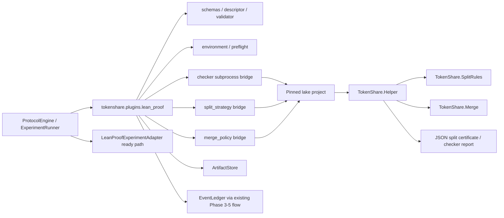

# Phase 6 真实 Lean proof 插件 TDD 设计稿

## 元数据

| 字段 | 值 |
|---|---|
| Feature | `feat-007` Phase 6 - Real Lean Formal Proof Plugin |
| 子范围 | 真实 `lean_proof` 插件本体、固定 Lean / lake 工具链、结构化 theorem 输入、Lean-side deterministic tactics、真实 checker artifact |
| 状态 | 历史 TDD 设计稿；Task 1-15 已实现并在 2026-06-29 完成审查硬化，当前实现映射以 `Doc/TechnicalDocument/2026-06-29-phase-6-lean-real-plugin-code-map.md` 为准 |
| 创建日期 | 2026-06-29 |
| 主要依据 | `AGENTS.md`、`Doc/agent-navigation.md`、`Doc/TechnicalDocument/tokenshare_latest_real_plugin_experiment_design.tex`、`Doc/TechnicalDocument/2026-06-28-phase-6-lean-real-plugin-scope-change.md`、`Doc/TechnicalDocument/lean_proof_decomposition_rules.tex`、Phase 6 factorization field spec / code map、Phase 8 experiment infrastructure TDD / code map |
| 用户确认 | 真实 Lean 插件接受任意 Lean theorem 输入目标；结构化输入解决 imports / namespace / context / variable boundary；拆分规则写成 Lean-side deterministic tactics 或等价 policy，尽量覆盖可工程化拆分情况；AI 不决定协议级拆分；缺失 Lean / lake / elan / fixture 环境由 Codex 后续单独联网下载并配置；后续实现已完成固定本地 toolchain / fixture project |

实现状态说明：本文保留为 `feat-007` 的原始 TDD / 红绿计划来源，不再表示当前未实现。当前代码已完成 direct proof、child proof、merge proof、unsupported decomposition、Phase 8 Lean adapter ready path 和 replay evidence guard；2026-06-29 审查硬化进一步要求 proof candidate schema/digest 绑定、拒绝 `sorry` / `admit`、split policy / parent elaboration gate、unsupported intro merge、child proof artifact merge、真实 preflight 和 environment digest 稳定性。具体文件和验证证据见 Lean code map。

## 1. 背景与问题

TokenShare 当前已经完成协议内核、factorization 真实插件、实验级 AI API executor 和 Phase 8 实验基础设施。最新实验设计要求 Experiment 4 使用 factorization 插件和真实 Lean proof 插件共同证明协议泛化能力。`lean_stub` 或 synthetic checker 不能作为论文通过证据。

创建本文时的仓库事实是：`src/tokenshare/plugins/lean_stub/` 仍只是历史占位；Phase 8 中的 `LeanProofExperimentAdapter` 只负责在真实插件缺失时输出 `pending_real_lean_plugin` blocked gate；本机尚未配置固定 Lean / lake / elan 工具链，仓库内也没有 `lean-toolchain`、`lakefile` 或 `.lean` fixture project。该状态已经被后续实现取代：真实 `src/tokenshare/plugins/lean_proof/`、`fixtures/lean_proof_project/`、固定 Lean toolchain、checker artifacts、split / merge flow 和 Phase 8 ready path 均已落地。

本 TDD 要解决的问题不是做一个生产级 theorem-proving 平台，而是在 V1 本地实验范围内交付一个可复现、可审计、可重放的真实 Lean proof 插件：输入是结构化 Lean theorem payload，拆分由 Lean-side deterministic policy 完成，proof artifact 由固定 Lean checker 验证，所有环境和 checker 证据进入 artifacts，并通过 Phase 8 Experiment 4 从 blocked 转为 runnable。

## 2. 目标

- 新增真实 `lean_proof@0.1.0` 插件，走现有通用 `PluginDescriptor`、`OutputContract`、`SplitStrategyContract`、`ExecutionRequest` / `ExecutionSubmission`、`VerificationReport`、`DecompositionProposal`、`MergePlan` 和 Phase 8 `PluginExperimentAdapter` 契约。
- 使用结构化 theorem payload 显式描述 imports、namespace、open namespaces、Lean options、theorem name、statement / theorem source、proof candidate、fixture / library context、decomposition policy 和资源限制。
- Python 侧不做 Lean theorem 语义文本解析，只负责 schema 校验、artifact 持久化、协议编排、subprocess checker/helper 调用和结果映射。
- Lean 侧 helper / metaprogram / tactic runner 在固定 lake project 中完成 elaboration、proof-state 获取、deterministic decomposition policy、split certificate 和 merge skeleton 生成。
- 拆分 policy 尽量覆盖 conjunction、implication、forall、exists、iff、equality/rewrite、cases/constructor、induction、上下文拆分、apply / simp / rw / rfl / contradiction 等可工程化情况。
- 每个 direct proof、child proof 和 merge proof 都由真实 Lean checker 重新检查；soundness 只来自 Lean checker artifact，不来自 Python 或 AI 自证。
- 后续实现时由 Codex 配置和下载 pinned Lean / lake / elan 工具链或等价固定本地工具链包，并记录来源、版本、校验信息、安装位置、PATH / 环境变量修改方式。
- 让 Experiment 4 的 `lean_direct_proof` 和 `lean_decomposition_merge` 从 `blocked/pending_real_lean_plugin` 转为真实 runnable / passed。

## 3. 非目标

- 不做生产级 theorem-proving 平台、动态 Lean 服务、LeanDojo 训练 / 检索平台或完整 best-first tactic search 系统。
- 不把 Lean tactic、kernel、checker、proof merge 或 theorem 语义写入 `tokenshare.core`。
- 不要求 AI 决定协议级子任务；AI 或其他 executor 只能提交 proof candidate。
- 不把一次临时 PATH 状态当作环境事实；所有 checker 使用的 executable、toolchain、lake project、imports、namespace、config digest 必须进入 `EnvironmentRef` 或 checker artifact。
- 不使用 `lean_stub`、toy checker、自然语言命题或 raw-only proof claim 作为通过证据。
- 不在 TDD 创建阶段联网下载 Lean；下载配置属于后续实现任务，且必须遵守外部参考资料落库规则。

## 4. 总体方案

采用“Python protocol bridge + pinned Lean helper project”的结构。



运行时分三条路径：

1. Direct proof path：结构化 theorem payload + proof candidate -> Lean checker -> `LeanCheckerReport` -> `VerificationReport` / canonical proof artifact。
2. Decomposition path：结构化 theorem payload -> Lean-side helper elaboration + deterministic split -> `LeanSplitCertificate` -> `DecompositionProposal` / `MergePlan`。
3. Merge path：子 proof artifacts -> Lean-side merge skeleton / proof assembly -> Lean checker -> root theorem proof artifact -> parent completion / Experiment 4 evidence。

## 5. 模块切分

### 5.1 Python 插件模块

建议新增 `src/tokenshare/plugins/lean_proof/`，保留 `src/tokenshare/plugins/lean_stub/` 为历史兼容壳，不把它作为真实插件入口。

| 文件 | 操作 | 职责 |
|---|---|---|
| `src/tokenshare/plugins/lean_proof/__init__.py` | 新增 | 导出真实 Lean 插件公共入口；可提供 `build_lean_proof_descriptor()`、schema 常量、checker / split / fixture helper。 |
| `src/tokenshare/plugins/lean_proof/schemas.py` | 新增 | schema version、unit type、output name、policy id、artifact schema id 常量。 |
| `src/tokenshare/plugins/lean_proof/models.py` | 新增 | 结构化 theorem payload、proof candidate、checker request/report、split certificate、merge input/result、fixture manifest 的纯对象和 canonical digest helper。 |
| `src/tokenshare/plugins/lean_proof/descriptor.py` | 新增 | 构造 `lean_proof@0.1.0` 的 `PluginDescriptor`、`OutputContract`、`SplitStrategyContract`、execution contracts 和 metadata。 |
| `src/tokenshare/plugins/lean_proof/environment.py` | 新增 | 固定 toolchain / lake project / import context / resource limits 的 `EnvironmentRef` 构造、digest 和摘要。 |
| `src/tokenshare/plugins/lean_proof/preflight.py` | 新增 | 检查 elan/lean/lake/toolchain/fixture project 是否可用；缺失时返回结构化 blocked，不误报 checker 成功。 |
| `src/tokenshare/plugins/lean_proof/checker.py` | 新增 | 调用固定 `lake env lean` 或等价命令，控制 cwd、timeout、UTF-8、stdout/stderr、exit code、diagnostics、proof digest 和 log artifact。 |
| `src/tokenshare/plugins/lean_proof/split_strategy.py` | 新增 | 调用 Lean-side helper，解析 split certificate，映射为 `DecompositionProposal` 和 `MergePlan`；不在 Python 中解释 Lean theorem 语义。 |
| `src/tokenshare/plugins/lean_proof/merge_policy.py` | 新增 | 根据 split certificate 和子 proof artifacts 调用 Lean-side merge helper，生成并检查 root merge proof。 |
| `src/tokenshare/plugins/lean_proof/prompt_builder.py` | 新增 | 为 AI / mock-AI executor 构造 proof candidate prompt package；prompt 只能要求 proof candidate，不允许 AI 输出 split plan。 |
| `src/tokenshare/plugins/lean_proof/validator.py` | 新增 | 将 checker report 映射为 Phase 4 `VerificationReport` 可消费的 validation summary；parse failure / checker failure 不进入 canonical。 |
| `src/tokenshare/plugins/lean_proof/fixtures.py` | 新增 | direct proof、decomposition / merge、unsupported decomposition、invalid proof、toolchain blocked fixture。 |

### 5.2 Lean-side fixture project

建议新增一个固定项目目录，例如 `fixtures/lean_proof_project/` 或 `src/tokenshare/plugins/lean_proof/lean_project/`。实现时须在 Lean 字段规格中固定最终路径，并同步 code map。

| 路径 | 职责 |
|---|---|
| `lean-toolchain` | 固定 Lean 版本。 |
| `lakefile.lean` 或 `lakefile.toml` | 固定 lake project、library/import context 和 helper target。 |
| `TokenShare/Helper.lean` | 读取结构化 theorem payload 或由 Python 生成的 temporary Lean file，执行 elaboration、proof-state 获取、checker command、split command。 |
| `TokenShare/SplitRules.lean` | Lean-side deterministic tactics / policy；根据 goal shape 和 context 生成 split certificate。 |
| `TokenShare/Merge.lean` | 根据 split rule 和 child proof refs / names 生成 merge skeleton 或 merge proof source。 |
| `TokenShare/Json.lean` | JSON 输出辅助；若最终使用 Lean 内置 JSON API，仍保持 helper 输出稳定 schema。 |
| `Fixtures/*.lean` | direct proof、conjunction、iff、forall/implication、exists、equality/rewrite、cases、induction、unsupported、invalid proof fixture。 |

## 6. Schema version 策略

| 对象 / Artifact | `schema_version` |
|---|---|
| Lean theorem payload | `lean_proof.theorem_payload.v1` |
| Lean proof candidate | `lean_proof.proof_candidate.v1` |
| Lean proof artifact | `lean_proof.proof_artifact.v1` |
| Lean checker request | `lean_proof.checker_request.v1` |
| Lean checker report | `lean_proof.checker_report.v1` |
| Lean split request | `lean_proof.split_request.v1` |
| Lean split certificate | `lean_proof.split_certificate.v1` |
| Lean child theorem payload | `lean_proof.child_theorem_payload.v1` |
| Lean merge request | `lean_proof.merge_request.v1` |
| Lean merge result | `lean_proof.merge_result.v1` |
| Lean fixture manifest | `lean_proof.fixture_manifest.v1` |
| Lean parse / helper failure | `lean_proof.failure_report.v1` |

策略：

- 所有 artifact body 都必须带完整 `schema_version`。
- `ArtifactRef.artifact_schema_id` 使用不带版本的稳定 id，例如 `lean_proof.checker_report`；`artifact_schema_version` 使用 `v1`。
- digest 使用 canonical JSON：`ensure_ascii=False`、`sort_keys=True`、紧凑 separator。
- theorem source / proof source 可以保存为字符串，但其语义只能由 Lean elaborator / checker 确认。
- Lean helper 输出 JSON 必须 versioned，Python 只解析 JSON schema 和 `rule_id` / refs，不解释 Lean core expression 语义。

## 7. 结构化输入契约

`LeanTheoremPayload` 第一版字段：

| 字段 | 类型 | 必填 | 说明 |
|---|---|---|---|
| `schema_version` | string | 是 | `lean_proof.theorem_payload.v1`。 |
| `theorem_id` | string | 是 | 本地稳定 ID，例如 `lean_theorem:{fixture}:{digest}`。 |
| `theorem_name` | string | 是 | Lean theorem name；必须可作为 fixture project 内名称使用。 |
| `imports` | list[string] | 是 | 固定 import 列表，例如 `["Init"]` 或 pinned library import。 |
| `namespace` | string/null | 否 | theorem 所在 namespace；空值表示顶层。 |
| `open_namespaces` | list[string] | 是 | 需要 open 的 namespaces。 |
| `options` | object | 是 | Lean options；必须 canonical 化并进入 digest。 |
| `parameters_source` | string | 否 | 受控 theorem 参数 / variables 源码片段。 |
| `statement_source` | string | 是 | theorem statement source。 |
| `theorem_source` | string | 否 | 完整 theorem source；若存在，必须和 name / statement 一致。 |
| `proof_candidate_ref` | object/null | 否 | 可选 proof candidate artifact ref。 |
| `library_context` | object | 是 | fixture project、library imports、namespace/context 摘要。 |
| `decomposition_policy` | object | 是 | max depth、allowed rules、unsupported policy、child limit。 |
| `resource_limits` | object | 是 | timeout、max helper output bytes、max children、max recursion depth。 |
| `payload_digest` | string | 是 | 排除自引用后的 canonical digest。 |

约束：

- Python 只校验字段类型、digest、必填项和受控字符串边界，不判断 theorem 是否成立。
- `imports`、`namespace`、`options`、`parameters_source`、`statement_source` 必须足够让 Lean helper 在固定 project 内重建 theorem context。
- 任意 theorem 都可作为输入目标；拆分 policy 对无法覆盖的情况返回 `unsupported_decomposition`，direct proof checker 仍可检查 proof candidate。

## 8. 插件 descriptor 契约

固定插件身份：

```text
plugin_id: lean_proof
plugin_version: 0.1.0
```

`supported_task_types`：

```text
root
lean_theorem
lean_proof_subgoal
lean_proof_merge
```

`OutputContract`：

| contract id | unit type | required outputs |
|---|---|---|
| `lean_proof.root_theorem.contract.v1` | `root` / `lean_theorem` | `lean_theorem_payload` |
| `lean_proof.proof_artifact.contract.v1` | `lean_theorem` / `lean_proof_subgoal` | `lean_proof_artifact` |
| `lean_proof.merge_result.contract.v1` | `lean_proof_merge` | `lean_merge_result` |

`SplitStrategyContract`：

| 字段 | 值 |
|---|---|
| `split_strategy_id` | `lean_proof.deterministic_tactic_split.v1` |
| `allowed_unit_types` | `lean_proof_subgoal` |
| `validator_policy_id` | `lean_proof.checker.validator.v1` |
| `merge_policy_id` | `lean_proof.verified_merge.v1` |
| `durable_subgoal_policy` | 只允许 Lean helper 输出的 child theorem payload 晋升为 child `TaskUnit`。 |
| `candidate_artifact_policy` | proof candidate 必须作为 artifact；raw text 不能绕过 checker。 |
| `max_children_per_expansion` | 由 payload policy、Lean helper 输出和 `ProtocolConfig.max_children_per_unit` 共同约束。 |

`execution_contracts`：

- `deterministic_lean_checker`: 本地固定 Lean / lake checker，不访问网络。
- `lean_helper_split`: 本地固定 Lean helper，输出 split certificate。
- `mock_ai_proof_candidate`: 只生成 proof candidate source；必须使用插件生成的 prompt package。
- `ai_api_proof_candidate`: 可接 Phase 7 AI API executor；API output 的解释权仍属于 Lean 插件 parser / checker。

metadata 必须声明：

- `real_checker_required=true`。
- `lean_stub_allowed_as_success=false`。
- `ai_may_decide_decomposition=false`。
- `python_semantic_text_parse=false`。
- `structured_theorem_payload_required=true`。
- `environment_ref_required=true`。
- `checker_logs_required=true`。
- `phase8_ready_capabilities`：descriptor、fixture manifest、fixed environment ref、checker logs、proof artifact refs、direct proof fixture、decomposition merge fixture。

## 9. Toolchain / EnvironmentRef / preflight

后续实现必须由 Codex 单独配置固定 Lean / lake / elan 工具链或等价固定本地工具链包。配置过程使用联网资料时，必须按 `Doc/agent-navigation.md` 的外部参考资料落库规则保存可复查来源或本地摘要并同步索引。

`EnvironmentRef.tool_versions` 至少记录：

| 字段 | 说明 |
|---|---|
| `elan_version` | 如果使用 elan，记录版本和 executable path。 |
| `lean_version` | `lean --version` 或等价输出。 |
| `lake_version` | `lake --version` 或等价输出。 |
| `lean_executable` | checker 实际执行文件绝对路径。 |
| `lake_executable` | lake 实际执行文件绝对路径。 |
| `toolchain_file_ref` | `lean-toolchain` artifact 或文件 digest。 |
| `lake_project_root` | 固定 project root 绝对路径或 repo-relative path。 |
| `lakefile_digest` | `lakefile.lean` / `.toml` digest。 |
| `import_set_digest` | imports canonical digest。 |
| `helper_sources_digest` | `TokenShare/*.lean` helper source digest。 |

Preflight 结果：

- `ready`: pinned toolchain、lake project、helper target、direct fixture 和 writeable artifact output 都可用。
- `blocked_missing_toolchain`: Lean / lake / elan 或等价 executable 缺失。
- `blocked_missing_fixture_project`: 缺少 `lean-toolchain`、lakefile 或 helper sources。
- `blocked_helper_compile_failure`: helper project 无法 build / check。
- `blocked_environment_digest_mismatch`: lockfile、helper source 或 config digest 与 manifest 不一致。

Baseline 不得在缺失 Lean 时误报通过真实 checker；缺失时只能针对 preflight blocked 行为通过测试。真实 Lean targeted tests 在 toolchain 配置完成后必须通过。

## 10. Checker adapter

`LeanCheckerRequest`：

- theorem payload ref。
- proof candidate ref。
- environment ref。
- checker mode：`direct_proof`、`child_proof`、`merge_proof`。
- timeout / memory / output byte limits。
- generated Lean file ref 或 source digest。

`LeanCheckerReport`：

| 字段 | 说明 |
|---|---|
| `status` | `accepted`、`rejected`、`timeout`、`environment_error`、`helper_error`。 |
| `exit_code` | subprocess exit code。 |
| `stdout_ref` / `stderr_ref` | 原始 checker 输出 artifact refs。 |
| `diagnostics` | Lean error / warning 摘要，不能替代原始日志。 |
| `normalized_theorem_digest` | helper 生成的 theorem/context 摘要。 |
| `proof_artifact_ref` | accepted proof source artifact ref。 |
| `proof_digest` | proof source / normalized proof digest。 |
| `environment_ref` | 与 request 一致的 `EnvironmentRef`。 |
| `command_summary` | 可审计命令摘要；不得包含 secret。 |
| `duration_ms` | wall-clock duration。 |

Checker 成功只表示 Lean 接受 proof artifact。进入 protocol canonical 仍必须经过 Phase 4 verification / canonical flow。

## 11. Decomposition policy

Lean-side helper 负责把 theorem elaboration 成 proof state，并按 deterministic policy 尝试拆分。输出 `LeanSplitCertificate`，Python 按证书生成 `DecompositionProposal` / `MergePlan`。

第一版 policy 分层：

| 层级 | 规则族 | 说明 |
|---|---|---|
| Goal-introduction | implication / forall | `intro` 后产生单 child goal；适合推进 context，不是并行 required slots。 |
| Required-branch | conjunction / iff / constructor / multi-premise apply | 产生多个 required child goals，适合并行证明和 all-required merge。 |
| Witness / choice | exists / disjunction | 如果 payload 或 policy 提供 deterministic witness / branch，则生成 child；否则返回 `unsupported_decomposition` 或 `requires_witness_policy`。 |
| Context decomposition | hypothesis conjunction / exists / disjunction cases | 在 helper 内拆上下文，产生新的 child context 或 case branches。 |
| Rewrite / simplification | equality / rw / simp / unfold / rfl | 可作为 split 前 normalization 或 leaf-close attempt；必须记录 rule id 和 before/after digest。 |
| Structural cases | cases / induction | 只对 policy 明确允许的变量执行；生成 base / step / cases child goals，并保存 induction variable 和 motive 摘要。 |
| Leaf close | exact / assumption / rfl / simp / contradiction | 若 helper 可直接关闭目标，可返回 `complete`，不生成 child task。 |

`LeanSplitCertificate` 字段：

- `split_certificate_id`。
- `parent_theorem_payload_ref`。
- `normalized_parent_goal_digest`。
- `policy_id = lean_proof.deterministic_tactic_split.v1`。
- `rule_id` 和 `rule_trace`。
- `split_kind`: `complete`、`single_child`、`all_required_children`、`one_success_children`、`unsupported`。
- `child_goals`: child logical key、child theorem payload body/ref、context digest、required output name。
- `merge_skeleton`: Lean source template digest、required child proof names、merge rule id。
- `unsupported_reason`。
- `helper_stdout_ref` / `helper_stderr_ref` / diagnostics。

第一版协议接入优先支持 `complete`、`single_child` 和 `all_required_children`。`one_success_children` 可以在 certificate 中出现为 future capability，但不得在协议中当成完成能力，除非 Phase 5/merge 语义已明确支持。

## 12. `DecompositionProposal` / `MergePlan` 映射

`DecompositionProposal`：

- `plugin_id = lean_proof`。
- `plugin_version = 0.1.0`。
- `split_strategy_id = lean_proof.deterministic_tactic_split.v1`。
- child specs 只来自 `LeanSplitCertificate.child_goals`。
- child unit type 为 `lean_proof_subgoal`。
- child input artifact schema 为 `lean_proof.child_theorem_payload.v1`。
- required output 为 `lean_proof_artifact`。
- validator policy 为 `lean_proof.checker.validator.v1`。
- `promotion_guard_evidence.lean_split_certificate_ref` 指向 split certificate artifact。

`MergePlan`：

- `merge_policy_id = lean_proof.verified_merge.v1`。
- required slots 来自 certificate 中的 required child goals。
- parent output mapping 为 `lean_proof_artifact`。
- merge validation requirements 包括：
  - all required child proofs canonical。
  - child proof artifact digest 与 certificate 对齐。
  - environment ref / import context compatible。
  - merge proof source accepted by Lean checker。
  - root theorem proof artifact accepted by Lean checker。

Python 不生成 proof 语义，只把 Lean helper 输出的 merge skeleton 和 child proof refs 传回 Lean-side merge helper。

## 13. AI / executor 边界

Lean 插件可以使用 Phase 7 AI API executor 生成 proof candidate，但必须满足：

- Prompt package 由 `lean_proof.prompt_builder` 生成。
- Prompt 明确输入 theorem payload、allowed output schema、只允许输出 proof candidate，不允许输出 child task plan、merge plan、canonical decision 或 settlement claim。
- AI raw output 总是 artifact 化。
- Parse success 只生成 `lean_proof.proof_candidate.v1` artifact，不代表 proof 正确。
- Parse failure 或 raw-only 输出不进入 checker / canonical。
- Checker rejected proof 不进入 canonical，可记录为 invalid output / proof rejected evidence。
- Replay 不重新调用 AI 或 Lean checker。

## 14. Phase 8 接入

当前 `LeanProofExperimentAdapter` 是 blocked gate。真实插件实现后需要扩展为 ready path：

- `preflight()` 检查真实 descriptor、fixture manifest、fixed environment ref、checker logs capability、proof artifact output root。
- `run_case(lean_direct_proof)` 执行 direct proof fixture，输出真实 event log、artifacts、metrics。
- `run_case(lean_decomposition_merge)` 执行 split -> child proof -> merge proof fixture。
- blocked path 仍保留，用于 toolchain 缺失或 digest mismatch。
- `default_experiment_cases()` 不需要更改 case id；同一 `lean_direct_proof` 和 `lean_decomposition_merge` 从 blocked 变为 runnable。

Experiment 4 通过条件：

- factorization semiprime lifecycle passed。
- Lean direct proof passed，且 `real_checker_evidence=true`。
- Lean decomposition / merge passed，且 `lean_decomposition_lifecycle_coverage=1.0`。
- shared lifecycle events 覆盖 registry、execution request/submission、verification、canonical、split/proposal/merge plan、merge、expected output resolution、settlement 或明确记录与 Lean fixture 对应的最小生命周期。
- `tokenshare.core` 中无 Lean domain 规则。

## 15. Replay 与 artifact 边界

- checker stdout/stderr、diagnostics、generated Lean file、proof source、split certificate、merge skeleton、merge proof、environment ref 都必须持久化。
- replay / metrics 阶段只能读取 event log 和 artifacts，不重新运行 Lean / AI / executor。
- SQLite projection 仍是 index-only；Lean-specific authority 在 artifacts 和 events 中。
- checker report 的 `environment_ref` 必须能和 execution request / submission 中的 `EnvironmentRef` 对齐。
- event 中不得保存大段 proof source；事件保存 artifact ref、digest、summary 和 schema version。

## 16. 测试策略与 TDD 任务

### Task 1: toolchain setup manifest 与 preflight gate

文件：

- `src/tokenshare/plugins/lean_proof/environment.py`
- `src/tokenshare/plugins/lean_proof/preflight.py`
- `tests/plugins/lean_proof/test_lean_preflight.py`

红灯测试：

1. `test_lean_preflight_reports_blocked_when_toolchain_missing`
2. `test_lean_environment_ref_records_executables_toolchain_lake_project_and_digests`
3. `test_lean_preflight_rejects_environment_digest_mismatch`

绿灯要求：

- 当前缺失 Lean 环境时输出结构化 blocked，不误报 success。
- 后续 toolchain 下载完成后，同一 preflight 可转 ready。
- `EnvironmentRef` 中记录 executable、toolchain、lake project、import set、helper source digest 和 resource limits。

### Task 2: schemas、models 和 descriptor

文件：

- `src/tokenshare/plugins/lean_proof/schemas.py`
- `src/tokenshare/plugins/lean_proof/models.py`
- `src/tokenshare/plugins/lean_proof/descriptor.py`
- `tests/plugins/lean_proof/test_lean_descriptor_and_schemas.py`

红灯测试：

1. `test_lean_descriptor_declares_real_checker_and_no_stub_success`
2. `test_lean_theorem_payload_requires_structured_context_fields`
3. `test_lean_payload_digest_is_stable_and_includes_imports_namespace_options`
4. `test_lean_descriptor_declares_split_strategy_validator_and_merge_policy`

绿灯要求：

- `lean_proof@0.1.0` descriptor digest 稳定。
- `lean_stub_allowed_as_success=false`。
- schema version 全部显式。

### Task 3: fixture project 和 helper source manifest

文件：

- 固定 Lean project 路径。
- `tests/plugins/lean_proof/test_lean_fixture_project_manifest.py`

红灯测试：

1. `test_lean_fixture_project_contains_toolchain_lakefile_and_helper_sources`
2. `test_lean_fixture_manifest_lists_direct_decomposition_merge_and_unsupported_cases`
3. `test_lean_helper_source_digest_changes_when_helper_changes`

绿灯要求：

- manifest 可以在不运行 Lean 的情况下校验文件存在和 digest。
- 真实 helper build 留给 toolchain ready targeted test。

### Task 4: direct proof checker adapter

文件：

- `src/tokenshare/plugins/lean_proof/checker.py`
- `tests/plugins/lean_proof/test_lean_checker_direct.py`

红灯测试：

1. `test_lean_checker_accepts_valid_direct_proof_with_real_environment`
2. `test_lean_checker_rejects_invalid_proof_and_persists_logs`
3. `test_lean_checker_timeout_returns_timeout_report_without_canonical_candidate`

绿灯要求：

- accepted / rejected / timeout 都有 `LeanCheckerReport`。
- stdout/stderr/logs/proof artifact/environment ref 都进入 artifact。
- 真实 checker targeted test 在 toolchain ready 后运行；缺失时只允许 preflight blocked test 通过。

### Task 5: validator bridge

文件：

- `src/tokenshare/plugins/lean_proof/validator.py`
- `tests/plugins/lean_proof/test_lean_validator.py`

红灯测试：

1. `test_lean_validator_maps_accepted_checker_report_to_passed_verification`
2. `test_lean_validator_maps_rejected_checker_report_to_invalid_output`
3. `test_lean_validator_requires_environment_ref_and_checker_log_refs`

绿灯要求：

- checker accepted 才能进入 candidate canonical path。
- checker missing log / environment evidence 必须 rejected。

### Task 6: Lean-side split helper JSON certificate

文件：

- Lean helper project `TokenShare/Helper.lean`
- Lean helper project `TokenShare/SplitRules.lean`
- `tests/plugins/lean_proof/test_lean_split_helper.py`

红灯测试：

1. `test_lean_split_helper_outputs_certificate_for_conjunction_goal`
2. `test_lean_split_helper_outputs_certificate_for_iff_goal`
3. `test_lean_split_helper_handles_intro_for_implication_and_forall`
4. `test_lean_split_helper_returns_unsupported_for_uncovered_goal_shape`

绿灯要求：

- helper 输出 versioned JSON。
- certificate 记录 rule id、child goals、context digest、merge skeleton 或 unsupported reason。

### Task 7: Python split strategy bridge

文件：

- `src/tokenshare/plugins/lean_proof/split_strategy.py`
- `tests/plugins/lean_proof/test_lean_split_strategy.py`

红灯测试：

1. `test_lean_split_strategy_maps_certificate_children_to_decomposition_proposal`
2. `test_lean_split_strategy_maps_merge_skeleton_to_merge_plan`
3. `test_lean_split_strategy_never_uses_ai_output_as_decomposition_authority`
4. `test_lean_split_strategy_rejects_certificate_with_missing_child_payload_digest`

绿灯要求：

- Python 只信任 Lean helper certificate schema 和 digests。
- `DecompositionProposal` / `MergePlan` 可被现有 Phase 4 dataclasses 接受。

### Task 8: prompt builder 和 AI output parser

文件：

- `src/tokenshare/plugins/lean_proof/prompt_builder.py`
- `tests/plugins/lean_proof/test_lean_prompt_and_parse_policy.py`

红灯测试：

1. `test_lean_prompt_package_requests_only_proof_candidate_not_split_plan`
2. `test_lean_parse_policy_maps_valid_json_to_proof_candidate`
3. `test_lean_parse_policy_records_parse_failure_for_freeform_or_split_plan_output`
4. `test_lean_ai_output_never_creates_decomposition_proposal`

绿灯要求：

- AI executor 可以参与 proof candidate generation。
- AI 不能决定 protocol-level split / merge。

### Task 9: child proof checker flow

文件：

- `src/tokenshare/plugins/lean_proof/fixtures.py`
- `tests/plugins/lean_proof/test_lean_child_proof_flow.py`

红灯测试：

1. `test_lean_child_goal_payload_can_be_checked_independently`
2. `test_lean_child_proof_context_digest_must_match_split_certificate`
3. `test_lean_child_proof_rejection_blocks_merge`

绿灯要求：

- child proof artifact 与 split certificate context 对齐。
- rejected child 不进入 canonical，不触发 merge。

### Task 10: merge policy 和 root proof recheck

文件：

- `src/tokenshare/plugins/lean_proof/merge_policy.py`
- Lean helper project `TokenShare/Merge.lean`
- `tests/plugins/lean_proof/test_lean_merge_policy.py`

红灯测试：

1. `test_lean_merge_policy_builds_and_checks_conjunction_merge_proof`
2. `test_lean_merge_policy_builds_and_checks_iff_merge_proof`
3. `test_lean_merge_policy_rejects_missing_required_child_proof`
4. `test_lean_merge_policy_rejects_child_proof_from_different_environment_or_context`

绿灯要求：

- merge proof 被 Lean checker 接受后才生成 root proof artifact。
- merge result 保存 child proof refs、merge skeleton digest、root checker report ref。

### Task 11: direct proof end-to-end fixture

文件：

- `src/tokenshare/plugins/lean_proof/fixtures.py`
- `tests/test_phase6_lean_proof_flow.py`

红灯测试：

1. `test_lean_direct_proof_fixture_verifies_canonicalizes_completes_and_settles`
2. `test_lean_direct_proof_invalid_candidate_does_not_pollute_canonical`

绿灯要求：

- 真实 Lean checker 验证 direct proof。
- event flow 覆盖 execution request/submission、verification、canonical、completion、settlement。

### Task 12: decomposition / merge end-to-end fixture

文件：

- `src/tokenshare/plugins/lean_proof/fixtures.py`
- `tests/test_phase6_lean_proof_flow.py`

红灯测试：

1. `test_lean_decomposition_fixture_splits_child_goals_checks_children_merges_and_settles`
2. `test_lean_decomposition_fixture_blocks_merge_until_all_required_child_proofs_canonical`
3. `test_lean_unsupported_decomposition_returns_structured_unsupported_without_false_success`

绿灯要求：

- split invocation、proposal、merge plan、task expansion、child canonical、merge record 和 expected output resolution 全部有 evidence。
- unsupported decomposition 不冒充通过；direct proof checker 仍可独立运行。

### Task 13: Phase 8 Lean adapter ready path

文件：

- `src/tokenshare/experiments/lean_adapter.py`
- `tests/experiments/test_phase8_runner_reports.py`
- `tests/experiments/test_phase8_default_suite.py`

红灯测试：

1. `test_runner_runs_lean_direct_proof_when_real_checker_ready`
2. `test_runner_runs_lean_decomposition_merge_when_real_checker_ready`
3. `test_runner_keeps_blocked_status_when_preflight_missing_toolchain`

绿灯要求：

- 真实环境 ready 时 `lean_direct_proof` / `lean_decomposition_merge` 不再 blocked。
- 缺失环境时 blocked path 保留。
- Phase 8 metrics 中 `real_checker_evidence=true`、`environment_ref_complete=true`、`lean_decomposition_lifecycle_coverage=1.0`。

### Task 14: replay / evidence guard

文件：

- `tests/plugins/lean_proof/test_lean_replay_evidence.py`
- `tests/experiments/test_phase8_runner_reports.py`

红灯测试：

1. `test_lean_metrics_replay_reads_checker_artifacts_without_invoking_lean`
2. `test_lean_replay_fails_on_missing_checker_log_artifact`
3. `test_lean_replay_fails_on_environment_digest_mismatch`

绿灯要求：

- replay / metrics 阶段不调用 Lean。
- 缺失 artifact 或 digest mismatch 是 evidence failure。

### Task 15: code map、状态同步和文档二次审查

文件：

- `Doc/TechnicalDocument/2026-06-29-phase-6-lean-real-plugin-code-map.md`
- `Doc/agent-navigation.md`
- `feature_list.json`
- `progress.md`
- `session-handoff.md`

绿灯要求：

- code map 覆盖 Python source、Lean helper source、tests、fixture project、schema 和验证证据。
- `feat-007` 只有 direct proof、decomposition / merge、Phase 8 ready path 和完整验证完成后才能标记 done。
- 二次扫描旧文档中 `lean_stub` / synthetic success / pending wording，确保旧表述只作为 deprecated / blocked provenance。

## 17. 风险与缓解

| 风险 | 影响 | 缓解 |
|---|---|---|
| 任意 theorem 拆分覆盖不足 | 某些输入只能 unsupported，影响演示范围 | 插件接受任意 theorem 输入，但 deterministic policy 对不可覆盖情况返回 `unsupported_decomposition`；fixture 选择覆盖代表性规则族并记录支持矩阵。 |
| Python 文本解析 Lean theorem 语义 | context / implicit / namespace 错误，生成不可复原子任务 | Python 只解析结构化 payload 和 Lean helper JSON；theorem elaboration、goal extraction 和 split policy 放在 Lean-side helper。 |
| toolchain 下载不可复现 | checker 结果无法审计 | 固定 toolchain、lake project、helper source digest、install path、校验信息和环境变量；使用联网资料时落库。 |
| helper 输出 JSON schema 漂移 | Python bridge 和实验报告断裂 | versioned helper output schema + regression tests + code map。 |
| AI 输出 split plan | 破坏协议拆分 authority | prompt / parser policy 明确禁止；测试断言 AI output 不会创建 `DecompositionProposal`。 |
| merge proof 未重新检查 | 子 proof 拼接不 sound | merge result 必须包含 root merge proof checker report；缺失则 rejected。 |
| baseline 依赖本机全局 Lean | 其他机器无法启动 | preflight blocked gate 与真实 Lean targeted tests 分离；仓库管理 pinned environment，不能依赖偶然 PATH。 |

## 18. 可观测性与审计

每次 Lean checker / helper 调用必须留下：

- request artifact。
- generated Lean source artifact。
- stdout / stderr artifact。
- checker report artifact。
- environment ref artifact 或 request/submission 中的完整 `EnvironmentRef`。
- proof artifact ref / digest。
- split certificate / merge skeleton / merge result artifact。
- event refs：execution request、submission、verification、canonical、split invocation、proposal、merge plan、merge、expected output resolution、settlement。

指标侧至少输出：

- `real_checker_evidence`。
- `checker_success_rate`。
- `proof_artifact_digest_success`。
- `environment_ref_complete`。
- `lean_decomposition_lifecycle_coverage`。
- `lean_replay_no_checker_call`。
- `unsupported_decomposition_count`。
- `merge_recheck_success`。

## 19. 完成标准

真实 Lean 插件只能在以下条件同时满足后把 `feat-007` 标记 done：

- `src/tokenshare/plugins/lean_proof/` 中存在真实 descriptor、schema、models、environment/preflight、checker、split strategy、merge policy、prompt/parser policy 和 fixtures。
- 固定 Lean / lake toolchain 和 fixture project 可由本地路径复现，且来源、版本、校验和安装方式已记录。
- Direct proof fixture 真实 checker 通过并完成 canonical / settlement。
- Decomposition / merge fixture 真实 split、child proof checker、merge proof checker、parent completion / settlement 通过。
- Invalid proof、unsupported decomposition、missing toolchain、missing checker logs、environment digest mismatch 均有负向测试。
- Phase 8 `LeanProofExperimentAdapter` 在真实环境 ready 时运行 `lean_direct_proof` 和 `lean_decomposition_merge`；环境缺失时仍输出 blocked。
- replay / metrics 不重新调用 Lean 或 AI，只读取 artifacts。
- `.\init.ps1`、Lean targeted tests、Phase 8 impacted tests 通过。
- `feature_list.json`、`progress.md`、`session-handoff.md`、`Doc/agent-navigation.md` 和 Lean code map 同步验证证据。

## 20. 自审清单

- 本 TDD 只覆盖 `feat-007` 真实 Lean proof 插件，不回退到 factorization 或 Phase 8 runner 实现。
- 没有把 Lean 语义写入 `tokenshare.core`。
- 没有让 AI / executor 决定协议级拆分。
- 结构化 theorem payload 明确 imports、namespace、options、statement、proof candidate、library context 和 decomposition policy。
- Lean-side helper 负责 elaboration、proof state 和 deterministic split。
- 每个 proof / merge proof 都重新由 Lean checker 验证。
- 缺失工具链时是 blocked / preflight failure，不是成功。
- TDD 任务可以从红灯开始，且每个任务都有明确 green 标准。
