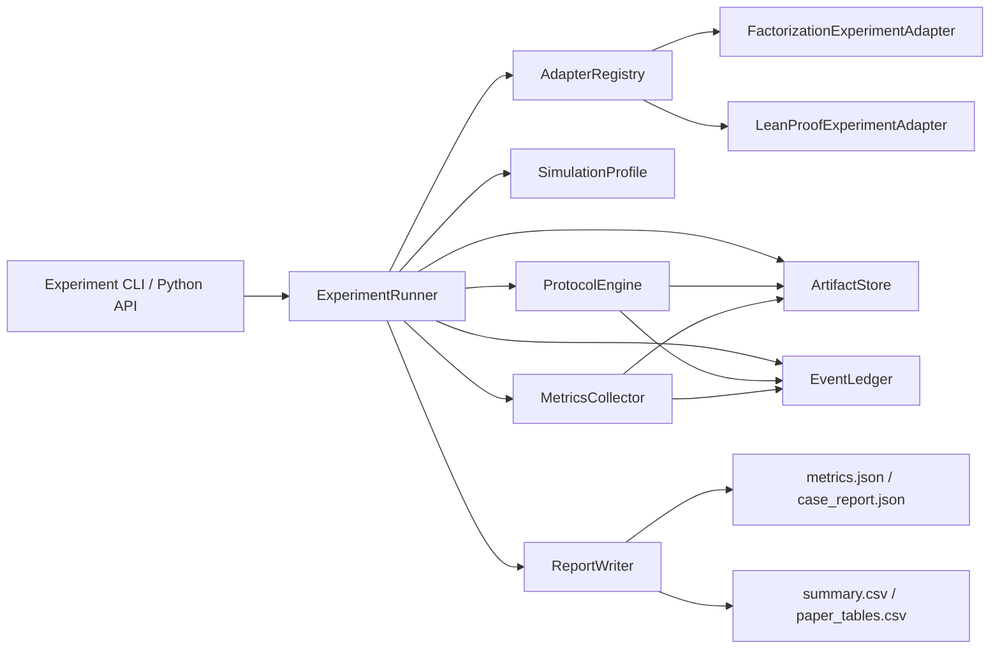

# Phase 8 实验基础设施 TDD 设计文稿

## 元数据

| 项目 | 内容 |
|---|---|
| 日期 | 2026-06-29 |
| 状态 | Draft / design-only / implementation not started |
| 对应 feature | `feat-009` - Phase 8 - Experiment Infrastructure, Fault Simulation, and Metrics |
| 用户确认 | 2026-06-29：采用方案 A，即“通用实验内核 + 插件适配器契约”。Lean 插件未完成时 Experiment 4 输出 blocked / pending；Lean 插件完成并满足同一契约后，通用实验 runner 不需要改造即可运行。 |
| 上游设计依据 | `AGENTS.md`、`Doc/agent-navigation.md`、`Doc/TechnicalDocument/tokenshare_latest_real_plugin_experiment_design.tex`、Phase 6 factorization code map、Phase 6 real Lean scope change、Phase 7 AI API executor code map。 |
| 目的 | 固化 Phase 8 实验自动化代码的模块边界、插件适配契约、实验 run 身份、故障模拟、消融、指标采集、结构化本地输出和论文调用格式。 |

## 1. 背景与问题

TokenShare 当前已经具备本地协议实验的核心对象：`TaskUnit`、`Lease`、`Attempt`、artifact、JSONL event ledger、Phase 3 executor contract、Phase 4 verification / canonical / expansion flow、Phase 5 merge / contribution / settlement flow，以及 Phase 7 实验级 AI API executor。

最新论文实验设计要求不再使用 toy demo 或 `lean_stub` 结论。实验必须围绕真实插件边界、真实 descriptor、真实 artifact、真实 parser / verifier / merge policy 和真实 protocol lifecycle 展开。Factorization 插件第一切片已经具备可运行的真实插件 fixture；真实 Lean proof plugin 正在实现中，但 Experiment 4 必须在缺失真实 checker logs、proof artifacts 或 `EnvironmentRef` 时输出 blocked / pending，不能用 stub 替代。

因此 Phase 8 的问题不是“写一个 factorization 脚本”，而是建立一个可复用的实验基础设施：同一套 runner 能执行 factorization、未来真实 Lean proof plugin，以及后续插件，只要插件提供一致的实验适配契约。

## 2. 目标

Phase 8 需要交付以下能力：

- 将实验代码单独放在 `src/tokenshare/experiments/`，测试放在 `tests/experiments/`。
- 以 `ExperimentRunner` 编排真实协议生命周期，不在实验层硬编码 factorization、Lean 或 structured report 领域规则。
- 定义 `PluginExperimentAdapter` / fixture manifest 契约，使 factorization 和真实 Lean proof plugin 共享同一实验入口。
- 生成结构化本地输出，供论文脚本读取：event log、artifact 根目录、run manifest、case report、metrics JSON、summary CSV。
- 覆盖最新实验设计中的 Experiment 1-4：factorization end-to-end、failure injection / recovery、protocol ablation、factorization + real Lean plugin generality。
- 在 Lean 插件未满足真实 checker 证据契约时，输出机器可读 blocked / pending 状态；Lean 插件完成后通过同一契约直接运行，不改通用 runner 主体。
- 从 JSONL events 和 artifact refs 复算指标，避免在实验脚本里硬写成功结论。

## 3. 非目标

Phase 8 不做以下事项：

- 不实现真实 Lean proof plugin、Lean checker adapter 或 Lean toolchain 安装；这些属于 Phase 6 Lean 插件工作。
- 不实现生产级实验平台、Web UI、HTTP worker pool、动态插件市场或分布式任务网络。
- 不重新实现 Phase 9 的完整 replay / audit engine；Phase 8 只做实验输出层的 event / artifact evidence check。
- 不允许实验 runner 直接修改 protocol core 规则、绑定 canonical output、决定 reward 或伪造 settlement。
- 不用 toy fixture、raw-only 输出或 `lean_stub` 结果作为论文通过证据。
- 不把 factorization 的 divisibility 规则或 Lean tactic / checker 语义写入 `tokenshare.core` 或通用实验模块。

## 4. 总体方案

采用方案 A：通用实验内核 + 插件适配器契约。

通用实验内核只理解以下对象：

- `ExperimentRun`：一次可复现实验运行身份。
- `ExperimentCase`：Experiment 1-4 中的具体 case。
- `SimulationProfile`：故障注入、消融模式、executor profile 和随机种子。
- `PluginExperimentAdapter`：插件向实验框架暴露 fixture、capability 和运行入口。
- `ExperimentRunner`：执行 discovery、preflight、run、metrics、report。
- `MetricsCollector`：从 event log 和 artifact refs 复算协议指标。
- `ReportWriter`：写本地 JSON / CSV 输出。

插件适配器负责插件领域事实：

- Factorization adapter 可以复用 `run_factorization_fixture_flow()` 及后续故障 fixture。
- Lean adapter 在插件完成后提供真实 Lean direct proof 和 decomposition / merge proof fixture。
- 如果 adapter、fixture、checker 环境或真实证据缺失，通用 runner 写 blocked report。

### 4.1 架构图



## 5. 模块边界

| 路径 | 职责 | 禁止事项 |
|---|---|---|
| `tokenshare.experiments.models` | `ExperimentRun`、`ExperimentCase`、`SimulationProfile`、`ExperimentStatus`、metric record 的纯数据结构和 digest helper。 | 不调用插件、不读写文件、不写 ledger。 |
| `tokenshare.experiments.adapters` | `PluginExperimentAdapter` 协议、adapter registry、preflight result。 | 不包含 factorization 或 Lean 具体规则。 |
| `tokenshare.experiments.factorization_adapter` | 将 factorization fixture manifest 映射为通用 case 结果。 | 不复制 factorization verifier / merge policy 逻辑。 |
| `tokenshare.experiments.lean_adapter` | 真实 Lean plugin 完成后的实验接入点；缺失时返回 blocked preflight。 | 不实现 Lean 插件本身，不调用 synthetic stub。 |
| `tokenshare.experiments.runner` | 调度 case、创建输出目录、调用 adapter、调用 metrics/report。 | 不直接发明 canonical output 或 settlement。 |
| `tokenshare.experiments.simulation` | 故障注入和 ablation wrapper；通过配置改变执行路径或阻断步骤。 | 不把故障模式写入 protocol core。 |
| `tokenshare.experiments.metrics` | 从 events / artifacts 复算指标。 | 不信任实验脚本内联的“成功”布尔值。 |
| `tokenshare.experiments.report` | 写 JSON / CSV / manifest。 | 不读取 API key，不重新调用 executor / Lean / AI。 |
| `tests/experiments/` | Phase 8 单元、集成、blocked gate、report schema 测试。 | 不依赖真实 API key 或外部网络作为 baseline。 |

## 6. 插件适配契约

通用 runner 通过 adapter contract 判断插件是否可运行。第一版契约应覆盖：

| 字段 / 方法 | 说明 |
|---|---|
| `plugin_id` / `plugin_version` | 与 `PluginDescriptor` 对齐。 |
| `supported_experiments` | 例如 `["exp1_factorization", "exp4_generality"]`。 |
| `fixture_manifests()` | 返回 fixture 名、输入 artifact schema、expected lifecycle、expected metric targets。 |
| `preflight(case, profile)` | 检查 descriptor、fixture、checker 环境、executor profile 和真实证据能力；返回 ready 或 blocked。 |
| `run_case(case, profile, output_root)` | 调用插件自己的 fixture / lifecycle helper，返回 event log path、artifact root、run evidence refs。 |
| `domain_expected_outputs(case)` | 返回插件领域的预期输出摘要，用于 metrics 校验；不由通用 runner 推导领域正确性。 |
| `blocked_reason()` | 缺失条件的结构化原因，例如 `missing_real_lean_plugin`、`missing_checker_environment`。 |

### 6.1 Lean pending 契约

Lean adapter 初始可以存在为 gate-only adapter。它不能返回 pass；只能在未满足真实插件条件时输出：

```json
{
  "status": "blocked",
  "blocker_kind": "pending_real_lean_plugin",
  "required_capabilities": [
    "lean_plugin_descriptor",
    "lean_fixture_manifest",
    "fixed_lean_environment_ref",
    "checker_log_artifacts",
    "proof_artifact_refs"
  ]
}
```

Lean 插件完成后，只要提供同名 adapter 的 ready preflight、fixture manifest 和真实 checker evidence，Experiment 4 runner 主体不需要修改。

## 7. ExperimentRun 输出结构

推荐输出根目录：

```text
outputs/
  experiments/
    <run_id>/
      run_manifest.json
      case_report.json
      events/
        event_log.jsonl
      artifacts/
        ...
      metrics/
        metrics.json
        lifecycle_coverage.csv
        paper_summary.csv
```

`run_manifest.json` 第一版字段：

| 字段 | 说明 |
|---|---|
| `schema_version` | `phase8.experiment_run_manifest.v1`。 |
| `run_id` | 稳定 ID，包含 experiment、case、profile digest、seed digest 和时间戳摘要。 |
| `experiment_id` | `exp1_factorization_e2e`、`exp2_failure_recovery`、`exp3_protocol_ablation`、`exp4_real_plugin_generality`。 |
| `case_id` | 具体 fixture 或 failure / ablation case。 |
| `status` | `passed`、`failed`、`blocked`、`pending`、`inconclusive`。 |
| `profile_digest` | `SimulationProfile` canonical digest。 |
| `seed` | 本地实验种子；所有随机选择须记录实际结果。 |
| `clock_semantics` | `fixed_logical_clock` 或 `wall_clock_recorded`。 |
| `plugin_descriptors` | plugin id、version、descriptor digest、artifact ref。 |
| `executor_descriptors` | executor id、version、descriptor digest、artifact ref。 |
| `event_log_ref` | JSONL event log 路径、hash、event count。 |
| `artifact_root` | 本 run artifact 根目录和 manifest hash。 |
| `blocked_reason` | status 为 blocked / pending 时必填。 |
| `created_at` | 运行创建时间。 |

`metrics.json` 第一版顶层结构：

```json
{
  "schema_version": "phase8.experiment_metrics.v1",
  "run_id": "exp1_factorization_semiprime_seed1",
  "status": "passed",
  "common_metrics": {},
  "experiment_metrics": {},
  "evidence_refs": {},
  "paper_table_rows": []
}
```

## 8. 实验覆盖

### 8.1 Experiment 1: Factorization End-to-End

第一版必须自动化以下 fixture：

- `small_prime_direct_complete`：`target_n=2` 或 `3`，验证 direct complete 路径不生成 proposal / merge plan / child ranges。
- `prime_range_flow`：`target_n=97`，验证 all no-factor ranges、prime certificate、settlement。
- `semiprime_range_flow`：`target_n=91`，验证 found factor + no-factor ranges、all-required merge、final `PrimeFactorizationResult([7,13])`、settlement。
- `extended_semiprime_benchmark`：`target_n=8051` 可作为论文展示 run，不能替代基线回归。

必须报告 descriptor freeze、split invocation、verification、canonical binding、merge、expected output resolution、parent completion、settlement 和 event / artifact evidence。

### 8.2 Experiment 2: Failure Injection and Recovery

每个 failure case 单独 run：

- `invalid_found_factor`
- `false_no_factor_in_range`
- `parse_failure_raw_only_forbidden`
- `worker_crash_expired_lease`
- `no_factor_recheck_budget_exceeded`

成功标准是 invalid / raw-only / crashed output 不污染 canonical state；可恢复 case 能 requeue 并完成；不可恢复 case 输出结构化 failure，不伪造成功。

### 8.3 Experiment 3: Protocol Ablation

第一版 ablation mode：

- `FULL`
- `NO_VERIFICATION`
- `NO_PARSER_POLICY`
- `NO_REQUEUE`
- `NO_ALL_REQUIRED_MERGE_GATE`
- `NO_SLOT_INTEGRITY_CHECK`

Ablation 必须明确标记为实验 wrapper 行为，不修改 protocol core 默认语义。FULL mode 是论文主结论；ablation mode 用于展示退化，不作为协议正确运行证据。

### 8.4 Experiment 4: Real-Plugin Generality

Experiment 4 使用同一 runner 执行：

- factorization semiprime lifecycle。
- Lean direct proof fixture。
- Lean decomposition / merge proof fixture。

当 Lean 插件尚未满足真实条件时，Experiment 4 输出 blocked / pending，并包含缺失条件清单。Lean 完成后，adapter preflight 从 blocked 变为 ready；通用 `ExperimentRunner` 不需要改造。

Lean 真实通过最低证据：

- `PluginDescriptor` 指向真实 Lean proof plugin。
- 输入是 Lean theorem / proof-state code artifact。
- split strategy 由插件 deterministic parser / normalizer 生成。
- executor 只提交 proof candidate。
- verifier 使用固定本地 Lean / lake / toolchain / library context。
- `EnvironmentRef` 记录 executable、toolchain、lake project、import set、namespace/context、config digest。
- checker stdout/stderr、exit code、timeout、diagnostics、normalized theorem/proof digest 和 proof artifact ref 均持久化。
- replay / metrics 不重新运行 Lean。

## 9. 故障注入与消融边界

`SimulationProfile` 第一版字段：

| 字段 | 说明 |
|---|---|
| `schema_version` | `phase8.simulation_profile.v1`。 |
| `profile_id` | 本地稳定 ID。 |
| `seed` | 随机种子；实际随机决策必须写入 report。 |
| `executor_profile` | `deterministic_local`、`mock_ai`、`ai_api`。 |
| `fault_profile` | `none` 或五类 failure case。 |
| `ablation_mode` | `FULL` 或 Experiment 3 ablation mode。 |
| `clock_semantics` | 固定逻辑时钟或记录 wall clock。 |
| `output_policy` | event/artifact/metrics 输出根目录和覆盖策略。 |

`SimulationWrapper` 只能包裹实验 adapter 或 executor fixture。它可以模拟 offline、slow、executor_error、invalid_output、late_submission，但不得修改协议核心默认代码来让错误变成正常路径。

## 10. 指标体系

通用指标：

| Metric | 说明 |
|---|---|
| `shared_protocol_event_coverage` | observed lifecycle events / expected lifecycle events。 |
| `descriptor_freeze_success` | descriptor digest 可定位且稳定。 |
| `artifact_link_success` | event refs 指向的 artifacts 存在且 digest 校验通过。 |
| `canonical_pollution_count` | invalid / raw-only / crashed attempts 被 canonical 绑定的数量。 |
| `completion_rate` | completed runs / total runnable runs。 |
| `blocked_rate` | blocked runs / total runs，需按 blocker_kind 分组。 |
| `settlement_success` | settlement event 和 settlement artifact 均存在并对齐。 |
| `ai_api_usage_cost` | Phase 7 executor 路径的 token、latency、cost estimate、provider attempt count。 |

Factorization 指标：

- `subject_canonical_success`
- `range_coverage_valid`
- `range_verification_rate`
- `prompt_package_coverage`
- `all_required_merge_gate_success`
- `final_correctness`
- `false_accept_rate`
- `requeue_success_rate`
- `premature_merge_rate`
- `slot_mismatch_acceptance_rate`

Lean 指标：

- `real_checker_evidence`
- `checker_success_rate`
- `proof_artifact_digest_success`
- `environment_ref_complete`
- `lean_decomposition_lifecycle_coverage`
- `lean_replay_no_checker_call`

## 11. 报告和论文调用

论文侧不应解析测试 stdout。Phase 8 必须输出稳定文件：

- `case_report.json`：单个 run 的完整结构化证据。
- `metrics.json`：机器可读指标。
- `paper_summary.csv`：论文表格直接读取的宽表。
- `lifecycle_coverage.csv`：event coverage 明细。

CSV 行应至少包含：

```text
experiment_id,case_id,plugin_id,plugin_version,executor_profile,
simulation_profile,ablation_mode,status,blocker_kind,final_correctness,
canonical_pollution_count,completion_rate,settlement_success,
real_checker_evidence,ai_api_cost_estimate_total,event_count,artifact_count
```

## 12. Replay / Evidence Check

Phase 8 的 evidence check 只做实验级可复查：

- 读取 `event_log.jsonl`。
- 校验 referenced artifact 存在且 digest 匹配。
- 统计 expected lifecycle events。
- 检查 blocked run 是否有 blocker evidence。
- 检查 AI API / Lean / executor 没有在 metrics 阶段被重新调用。

完整状态重放、审计重放和 no-double-settlement verification 仍属于 `feat-010` / Phase 9。

## 13. 测试策略

Phase 8 应按红绿步骤实现：

1. 纯模型和 digest：`ExperimentRun`、`SimulationProfile`、status、blocked reason、metrics record。
2. 输出 writer：创建 run 目录、写 manifest / report / metrics / CSV。
3. Adapter contract：factorization ready；Lean 缺失时 blocked。
4. Factorization adapter：复用现有 `run_factorization_fixture_flow()` 生成 Experiment 1 report。
5. Metrics collector：从现有 factorization event log / artifacts 复算 Experiment 1 指标。
6. Experiment 1 CLI / API：prime、semiprime、direct complete 路径。
7. Experiment 2 failure injection：五类 failure case。
8. Experiment 3 ablation：FULL 与五个 ablation mode 的退化报告。
9. AI API executor profile：mock / deterministic / optional real API 路径的 usage/cost evidence。
10. Experiment 4 gate：Lean 缺失时 blocked；真实 Lean adapter 完成后同一测试切换为 runnable。
11. Report schema regression：JSON / CSV 字段稳定，无论文表格断列。
12. Code map / 状态同步：新增 Phase 8 code map，更新导航、progress、handoff、feature evidence。

Baseline 测试不得依赖真实 API key、真实网络或本机已安装 Lean。真实 AI API smoke 和真实 Lean checker flow 必须有显式本地环境门禁。

## 14. 风险与缓解

| 风险 | 影响 | 缓解 |
|---|---|---|
| Lean 插件完成时间与 Phase 8 不同步 | Experiment 4 无法立即产出 passed 结论 | runner 先输出 blocked / pending；Lean adapter 满足契约后直接转 runnable。 |
| 实验层复制插件领域逻辑 | 破坏协议核心 / 插件边界 | adapter 只调用插件公开 fixture / verifier / merge policy，不重写规则。 |
| Ablation 误改默认协议路径 | FULL mode 结论不可信 | ablation 通过 `SimulationWrapper` 或独立 profile 实现，报告中强制标记。 |
| metrics 依赖脚本内联成功值 | 论文表格不可审计 | metrics 从 event / artifact 复算，并输出 evidence refs。 |
| 输出文件结构频繁变化 | 论文脚本脆弱 | versioned schema + report schema regression tests。 |
| 真实 AI / Lean 环境缺失 | CI 或普通启动验证失败 | baseline 使用 deterministic / mock 路径；真实路径显式 opt-in。 |

## 15. 完成标准

Phase 8 设计和后续实现只有在满足以下条件时才可标记完成：

- `src/tokenshare/experiments/` 中存在通用 runner、adapter contract、simulation、metrics、report 模块。
- Experiment 1-3 可在本地 deterministic / mock profile 下自动运行并写结构化输出。
- Experiment 4 在 Lean 不可用时输出 blocked / pending；在真实 Lean adapter ready 时同一 runner 可运行。
- 输出 JSON / CSV schema 稳定，论文侧可直接读取。
- 指标来自 event log 和 artifact refs，不来自硬编码通过结论。
- `.\init.ps1` 通过，相关 targeted tests 通过。
- `feature_list.json`、`progress.md`、`session-handoff.md`、`Doc/agent-navigation.md` 和 Phase 8 code map 同步验证证据。

