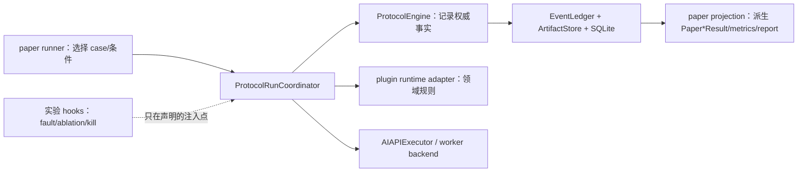

# Feat-011 System Runtime and Paper Experiment Migration Implementation Plan

> **For agentic workers:** REQUIRED SUB-SKILL: Use `superpowers:subagent-driven-development` (recommended) or `superpowers:executing-plans` to implement this plan task-by-task. Steps use checkbox (`- [ ]`) syntax for tracking. Every feature or bug fix must follow `superpowers:test-driven-development`; every completion claim must follow `superpowers:verification-before-completion`.

**Goal:** 让正常论文实验通过 TokenShare 系统自身完成注册、拆分、调度、lease、executor、submission、verification、canonical、requeue、merge、completion 和 settlement；实验代码只负责冻结条件、注入故障/消融并从权威事件与 artifact 观察结果。

**Architecture:** 保持 `tokenshare.core` 为无 I/O 的协议对象与纯决策层；由 `ProtocolEngine` 写入权威协议事实；新增 `tokenshare.local_runtime` 作为本地应用协调层，循环驱动 `ProtocolEngine`、插件和 executor；领域拆分/验证/合并仍在插件；`tokenshare.experiments` 只提供 catalog 选择、预算、真实模型配置、fault/ablation hooks、结果投影和报告。Lean 不改成 AI 拆分，也不要求自动从任意 theorem 推导 lemma-DAG：保留 catalog/脚本预先写好的固定拆分图，由 Lean 插件确定性校验、规范化并生成 certificate，再由协议系统正式记录 split/expand 事实。

**Tech Stack:** Python 3、SQLite、JSON/JSONL、`ArtifactStore`、`EventLedger`、`ProtocolEngine`、Factorization/Lean plugins、Phase 7 `AIAPIExecutor`、pytest、PowerShell。

---

## 0. 本计划的权威性和执行约束

本计划是 `feat-011` 的架构迁移执行文档。实验矩阵、样本数、模型、真实 API 门槛和论文指标仍以 `tokenshare_latest_real_plugin_experiment_design.md` 为唯一权威；当旧的 `2026-07-13-feat-011-paper-real-ai-experiments-implementation-plan.md` 把 adapter/runner 描述成协议生命周期执行者时，以本计划为准。

执行 agent 必须遵守以下约束：

- [ ] 一次只实施本计划中的一个 Task；不要把全部迁移压成一个大改动。
- [ ] 每个 Task 先写 RED 测试，再实现，再运行本 Task 的定向测试。
- [ ] 不删除现有 paper adapter 或历史输出读取能力，直到新路径通过行为对等和权威事件覆盖测试。
- [ ] 不用旧 formal run 证明新系统路径已工作。迁移前由 paper adapter/runner 直接推进生命周期的结果可保留作历史/模型效果资料，但不能作为“协议系统完成了该生命周期”的新证据。
- [ ] 不在本迁移中实现生产网络、P2P、远程 worker 服务、动态插件市场或 coordinator crash/restart。
- [ ] 不把完整 replay 提前塞入本迁移；resume/replay 只能复用现有能力，而且不得重新调用 AI。
- [ ] 不改变 500 道 Factorization catalog、135 道正式 Lean selection、Experiment 1–5 矩阵和固定模型政策，除非用户另行批准。

### 0.1 强制范围：不要做外部输入攻击加固

这是本地、单机、受信工作流下的研究原型，不是面对不可信用户或互联网攻击者的生产系统。执行 agent **不得**借本次 runtime 迁移新增外部输入攻击防护、通用安全框架或攻击测试。

错误处理逻辑只覆盖权威实验设计中 Experiment 3 的五类 rate-fault：

1. `false_positive`；
2. `false_negative`；
3. `no_return`；
4. `late_submission`；
5. `executor_error`。

`worker_death` 只保留为 Experiment 3 已预注册的独立进程终止条件，不扩展为任意 crash/hostile worker/Byzantine recovery；Experiment 4 的 ablation 只关闭既定机制，不算新增故障类型。

正常运行仍可如实记录 `provider_error`、`rate_limited`、`parse_failure`、`verifier_rejected`、`checker_rejected`、`budget_limit`、`internal_error` 等结果分类；这些是已有执行结果/报告字段，不得被扩展成新的 fault-injection 类型、攻击场景或专项恢复工程。

明确禁止新增：

- 恶意手工修改 event、artifact、manifest、SQLite 或 checkpoint 后的防伪/抗篡改逻辑；
- path traversal、symlink、SQL/JSON/command injection、反序列化攻击、超大输入/资源耗尽等攻击面加固；
- schema fuzzing、security fuzzing、property-based adversarial input suite；
- 不可信 plugin/executor/registry/provider envelope、恶意 worker、拜占庭行为或伪造模型响应的通用防护；
- 用户身份、权限、签名、密钥轮换、ACL、sandbox 隔离或生产级 secret management；
- 为上述范围新建 validator、middleware、security package、attack fixture、attack report 或论文安全主张。

可以保留并完成正常实验运行必需的正确性检查：类型/schema 校验、插件 parser/verifier/checker、lease/fencing/deadline 不变量、artifact 内容哈希、secret 不写入持久化输出、checkpoint/resume 身份一致性。这些检查只按可信本地工作流和五类故障验证，不得继续扩展成攻击者模型下的 hardening。

### 0.2 本迁移采用的分层验证方案

本计划的检查机制以 `2026-07-22-lean-checker-verification-profiles-design.md` 为通用权威，不在本计划中复制 manifest、entry key、checker 注入或 Lake bootstrap 算法。本节只规定这些通用能力在本迁移的各 Task 如何组合。

这里的 **Lean catalog audit** 指对 30 个 direct case 和 570 个 lemma-graph node、共 600 个 entry 的真实 checker 证据审计。普通 catalog load 只验证 tracked manifest；增量 audit 重算完整 coverage 和所有内容寻址 key，但只真实重检失效 entry；force-all audit 才真实重检全部 600 个 entry。无论复用或重检，provider call 都必须为 0。

每个 Task 的共同门槛是“本 Task 定向测试 + `\.\init.ps1` Fast”。除此之外按风险增加下列检查：

| Task | 额外检查 | 目的 |
| --- | --- | --- |
| 1–4 | 无默认 catalog audit；Task 3/4 的 runtime/plugin spy 必须断言 verifier/checker 调用、mode、artifact binding 和 rejection propagation | 捕获忘调 checker、错误 canonical/requeue 等系统 bug，不为无关改动启动 600 次 Lean |
| 5 | 固定 Lean canary bundle + `lean_catalog_audit --verify` | 用真实 Lean 覆盖 direct/child/merge，用 3×3/readiness 与 spy 覆盖固定拆分和调用契约；只重检内容变化 entry |
| 6–8 | 若改动经过 Lean runtime 调用链，运行固定 Lean canary；仅当 audit 报告 Lean 输入失效时运行增量 audit | worker、fault、runner 变化主要由系统契约和集成测试捕获，不能用重复 catalog proof 掩盖调用链 bug |
| 9 | 固定 Lean canary + 增量 `--verify` + 双领域系统集成测试 | 在最终系统路径上同时验证真实 checker 契约、manifest 新鲜度和生命周期覆盖 |
| 10 | 只运行一次最终 Full gate；同时带增量 LeanAudit。若 checker/toolchain/fixture helper/source rendering 变化或准备发布正式结果，在该 gate 前只做一次 `--refresh --force-all`，最终 gate 仍用增量 audit 复用刚生成的 evidence | 避免 Task 间或 final gate 重复全量，同时保留最终全仓和正式证据门槛 |

固定 Lean canary 命令：

```powershell
conda run -n tokenshare python verification/run_verification.py --mode full --only-lean-canary
```

增量、只读 Lean catalog audit：

```powershell
conda run -n tokenshare python -m tokenshare.experiments.lean_catalog_audit --verify
```

若增量 audit 报告 `checker_implementation_changed`、`environment_digest_changed` 或未知全局失效，它会 fail closed/全量重检，不允许加载器静默跳过。若 Task 修改了 tracked evidence 对应输入，先用 `--refresh` 生成完整成功的新 manifest；失败不得覆盖上一份 good manifest。

## 1. 用户已确认的 Lean 拆分决定

### 1.1 保留什么

保留 `benchmarks/paper/lean_lemma_graph_catalog.v1.jsonl` 中预先写好的：

- theorem/root payload；
- lemma nodes；
- dependency edges；
- node depth/kind；
- merge plan shape；
- oracle proof package 和固定 Lean environment identity。

这些数据仍可以由当前生成脚本批量产生。它们是“预注册的固定拆分方案”，不是运行时由 AI 决定的拆分，也不是要求 TokenShare 自动发现任意 Lean theorem 的所有中间引理。

### 1.2 改变什么

当前 `_lemma_graph_certificate_from_case()` 位于 `src/tokenshare/experiments/lean_paper_adapter.py`，意味着实验层自己把固定图解释成协议拆分 certificate。迁移后：

1. 实验层只选择 case，并把其中的固定 plan body 作为 root input/config 传入系统。
2. Lean 插件读取、校验和规范化该固定 plan。
3. Lean 插件生成 `LeanLemmaGraphCertificate`、`DecompositionProposal` 和 `MergePlan`。
4. `ProtocolEngine.record_split_strategy_invocation()` 与 `record_expand_decision()` 记录权威 split/expand 事实。
5. `local_runtime` 只负责调用这些接口和推进状态，不重新实现 Lean 图算法。

因此论文和文档统一使用以下说法：

> Lean 实验使用预注册、确定性、版本化的 lemma-DAG 拆分方案；Lean 插件在运行时校验并生成拆分证书，AI 只负责被分派 proof unit 的候选证明。

不得写成“AI 自动拆 theorem”，也不得在没有实现通用 theorem-structure discovery 时写成“系统自动发现全部 lemma-DAG”。

### 1.3 题库文件原地保留

本迁移不移动或重写题库：

- `benchmarks/paper/factorization_catalog.v2.jsonl`：正式 500 道 Factorization roots，原地保留。
- `benchmarks/paper/factorization_catalog.v1.jsonl`：历史 30 道回归输入，原地保留。
- `benchmarks/paper/lean_catalog.v1.jsonl`：30 道 simple/shallow Lean pool，原地保留。
- `benchmarks/paper/lean_lemma_graph_catalog.v1.jsonl`：预注册 lemma-DAG pool，原地保留，其中固定 nodes/edges/merge shape 不因 runtime 迁移而改变。
- `benchmarks/paper/lean_task14_3x3_readiness.v1.json`：正式 135 道 Lean selection（9 格×15），原地保留。

`src/tokenshare/experiments/paper_catalog.py` 继续负责论文 catalog 的加载、筛选、matrix/digest 和 condition 绑定；但它不得把 catalog row 直接解释为权威协议状态。系统 runtime 接收已冻结 case input，插件负责把领域 input 解释为可执行 plan。

## 2. 目标调用链



正常 `FULL` run 中，任何 `PaperTaskStatus`、`PaperAttemptStatus` 或 callback 返回值都不得决定协议状态。协议状态只由 `tokenshare.core` 的规则、`ProtocolEngine` 的写入结果以及 ledger 中已记录的事实决定。

## 3. 分层边界

| 层 | 应负责 | 不应负责 |
|:---|:---|:---|
| `tokenshare.core` | 协议对象、状态机、不变量、submission 接受性、retry/recovery、merge readiness 等纯决策。 | 文件/SQLite/JSONL 写入、线程/进程、provider 调用、实验矩阵、Factorization/Lean 规则。 |
| `tokenshare.protocol_engine` | 校验决定并原子记录 submission、verification、canonical、split/expand、recovery、merge、completion、settlement 等权威事实。 | 主循环、worker pool、provider transport、实验 fault/ablation 选择。 |
| `tokenshare.local_runtime` | 本地应用层；把 scheduler、lease、executor、plugin、ProtocolEngine 串成完整生命周期；管理本地 worker 容量和 worker 存活。 | 领域算法、论文矩阵、论文指标、真实网络。 |
| `tokenshare.plugins.factorization` | range split、prompt/domain payload、parser/verifier、slot/merge 规则。 | condition/repeat、论文预算、线程池、协议事件写入。 |
| `tokenshare.plugins.lean_proof` | 固定 Lean plan 校验、certificate/proposal/merge plan、prompt、checker、proof assembly/root recheck。 | condition/repeat、论文预算、协议状态推进。 |
| `tokenshare.executors` | 执行请求、真实 API transport、raw/parsed/provenance/usage artifact。 | canonical、requeue、merge、实验模型比较政策。 |
| `tokenshare.experiments` | catalog/selection、condition/repeat、预算、固定 endpoint、fault/ablation hook 配置、checkpoint、结果投影、metrics/report。 | 自己决定 canonical/requeue/merge/root completion；伪造成功生命周期事件。 |

这也是不把所有功能直接塞进 `tokenshare.core` 的原因：这些功能属于“如何在本机把纯协议规则真正跑起来”的应用协调，有线程、进程、时钟、I/O、executor 和插件副作用；`core` 应保持可单元测试、可重放推导、与本地运行方式无关。

## 4. 最终文件布局

### 4.1 新增系统应用层

```text
src/tokenshare/local_runtime/
  __init__.py
  contracts.py
  coordinator.py
  workers.py
  projection.py

tests/local_runtime/
  test_coordinator_full_lifecycle.py
  test_submission_and_recovery.py
  test_worker_death_recovery.py
  test_factorization_runtime.py
  test_lean_fixed_plan_runtime.py
  test_protocol_projection.py
```

职责固定如下：

- `contracts.py`：`ProtocolRunRequest`、`ProtocolRunResult`、`ProtocolTaskPluginRuntime`、`RuntimeHooks`、`ProtocolMechanismPolicy`、`WorkerBackend` 等接口和数据对象。
- `coordinator.py`：`ProtocolRunCoordinator`；唯一的本地完整生命周期主循环。
- `workers.py`：sequential/thread/process worker backend、liveness、worker death、lease heartbeat/expiry 触发；只报告执行事实，requeue 决策交给 core/engine。
- `projection.py`：从 ledger/artifacts 派生通用 runtime run/unit/attempt 视图；不导入 `tokenshare.experiments`。

### 4.2 新增插件 runtime bridge

```text
src/tokenshare/plugins/factorization/runtime_adapter.py
src/tokenshare/plugins/lean_proof/fixed_plan.py
src/tokenshare/plugins/lean_proof/runtime_adapter.py

tests/plugins/factorization/test_factorization_runtime_adapter.py
tests/plugins/lean_proof/test_lean_fixed_plan.py
tests/plugins/lean_proof/test_lean_runtime_adapter.py
```

插件 bridge 实现 `ProtocolTaskPluginRuntime`，把通用 runtime 调用翻译为现有插件的 split/parser/verifier/merge/checker 调用。它们不得导入 `tokenshare.experiments`。

## 5. 文件级迁移总表

“迁移”表示迁移职责并消除重复权威，不要求机械复制原函数名。旧 private helper 在兼容壳不再使用后才删除。

| 当前文件/函数 | 迁移到 | 迁移后的处理 |
|:---|:---|:---|
| `factorization_paper_adapter.py::run_factorization_paper_case` 中的注册后生命周期主流程 | `local_runtime/coordinator.py` | runner 只构造 `ProtocolRunRequest`；调度、lease、executor、submission、verification、canonical、merge、completion 全部由 coordinator + engine 执行。 |
| `factorization_paper_adapter.py::_save_root_input`、`_factor_integer_subject`、`_build_split_plan`、`_build_range_execution_request`、`_range_task_unit`、`_range_output_contract`、`_slot_inputs_for_merge`、`_save_prime_factorization_result` | `plugins/factorization/runtime_adapter.py` | 变成 Factorization 插件 runtime bridge 的领域方法；不得保留第二套 paper-only 实现。 |
| `factorization_paper_adapter.py::_prepare_config`、模型身份、usage/model record、scripted transport | 保留在 executor/experiments | 这些是 executor 配置或 regression/paper evidence，不迁入 plugin/core。正式兼容壳把 config/transport 注入 coordinator。 |
| `lean_paper_adapter.py::build_lean_lemma_graph_oracle_evidence`、`_lemma_graph_certificate_from_case`、`_lemma_graph_merge_nodes_from_case`、拓扑/依赖路径和 certificate 校验相关 helper | `plugins/lean_proof/fixed_plan.py` 或现有 `preflight.py` | 固定 plan 仍来自 catalog；插件负责 oracle preflight、解析、规范化、校验、生成 certificate。 |
| `lean_paper_adapter.py::_save_parent_payload`、`_build_lemma_node_execution_request`、`_build_child_execution_request`、`_lemma_node_task_unit`、`_child_task_unit`、proof output contract | `plugins/lean_proof/runtime_adapter.py` | 作为 Lean plugin runtime bridge；复用现有 prompt/checker/split/merge 模块。 |
| `lean_paper_adapter.py::_run_child_attempt`、`_run_lemma_graph_node_attempt`、`_merge_lemma_graph_if_ready`、`_merge_children_if_ready` | `local_runtime/coordinator.py` + Lean runtime bridge | 通用执行/状态推进归 coordinator；Lean proof assembly/checker/merge 规则归 plugin。 |
| `paper_unit_commitments.py` 中 Factorization/Lean `TaskUnit`、payload、dependency path 的重复构造 | 对应 plugin runtime adapter 的 `plan_root()`/`plan_units()` | paper budget 从 runtime preflight plan 派生 commitments；不能再由实验层另造一套可能与真实执行漂移的 TaskUnit。 |
| `paper_unit_commitments.py` 中 condition/budget digest envelope | 原地保留 | 它仍是实验预算和选择身份；内部必须消费 runtime/plugin 生成的 plan snapshot。 |
| `paper_workers.py::run_worker_death_harness` 中进程、lease、expiry、replacement 流程 | `local_runtime/workers.py` + `ProtocolRunCoordinator` | worker backend 终止真实 worker；engine 根据 lease expiry 记录 recovery/requeue。 |
| `paper_workers.py::WorkerDeathKillPoint`、目标选择和论文 record schema | 原地保留或移到 `paper_faults.py` | 只描述“杀谁、何时杀”和实验观察字段，不再实现 lease/requeue。 |
| `paper_formal_callbacks.py::run_scheduled_cases` 的 `ThreadPoolExecutor` AI-unit 调度 | `local_runtime/workers.py` | experiment callback 只把 `worker_count` 传给 runtime；不得自己领取/执行协议 unit。独立 root condition 的外层遍历可以保留。 |
| `paper_formal_runner.py::_apply_exp4_requeue_boundary` 和 replacement adapter 再调用 | `core/recovery.py` + `ProtocolEngine` + coordinator | `FULL` 由系统恢复；`NO_REQUEUE` 通过注入的机制 policy 禁用创建 replacement，但实验 runner 不手工造 replacement。 |
| `paper_formal_runner.py::_apply_exp3_worker_death` | runtime hook + `local_runtime/workers.py` | runner 只选择 kill target/progress；worker backend 执行 kill，协议 lease expiry 产生恢复事实。 |
| `paper_formal_runner.py::_synthetic_attempt`、`_event_record` | 仅保留 blocked/budget/internal runner 事件，重命名为 `EXPERIMENT_*` | 成功、失败、requeue、merge、completion 路径禁止用 synthetic attempt/event 补齐。 |
| `paper_dispatcher.py::dispatch_paper_case` | 调用新 coordinator | domain 分派仍保留；不得再直接调用拥有独立生命周期的 paper adapter。 |
| `PaperTaskResult`、`PaperAttemptResult`、failure stage/kind | `experiments/paper_projection.py` 从通用 projection 派生 | 保留报告 schema，但彻底取消其对 canonical、requeue、merge、root completion 的控制作用。 |
| 两个 paper adapter 中 `_paper_attempt_result`、`_child_record`、`_lemma_node_record`、`_run_evidence` 等报表组装 | `experiments/paper_projection.py` | 只从 runtime projection/events/artifacts 组装兼容报表，不再根据局部变量猜协议状态。 |
| `factorization_paper_adapter.py`、`lean_paper_adapter.py` public API | 原地变成兼容壳 | 只做 catalog case → `ProtocolRunRequest`、调用 coordinator、投影旧 result shape；不得保留第二套生命周期。 |

## 6. 必须先补齐的系统能力

当前 `ProtocolEngine` 已有大部分生命周期写入接口，但正式 runtime 落地前必须补齐两类缺口。

### 6.1 Submission 接受性

Create: `src/tokenshare/core/recovery.py`

Modify: `src/tokenshare/protocol_engine.py`

Modify: `src/tokenshare/storage/events.py`

Modify: `src/tokenshare/storage/sqlite_index.py`

Create: `tests/core/test_recovery.py`

Modify/Create: `tests/test_phase3_execution_flow.py`、`tests/storage/test_phase3_event_projection.py`

`evaluate_submission_acceptance()` 至少检查：

- attempt 必须为 `Running`；
- lease 必须为 `Active`；
- submission 的 task/unit/attempt/lease/fencing token 与 attempt/lease 一致；
- `submitted_at <= lease.expires_at`；
- expired/superseded lease 的 late submission 只记录审计事实，不推进 attempt，不进入 verification/canonical。

`EXECUTION_SUBMISSION_RECORDED` payload 升级为显式版本，增加 `acceptance_status` 和稳定 `rejection_reason`。任何 schema/version 变化同步更新 SQLite projection 和 code map。

### 6.2 通用 retry/recovery

`evaluate_retry()` 至少接受以下 trigger：

- `lease_expired`；
- `executor_error`；
- `parser_failure`；
- `verification_rejected`；
- `checker_rejected`；
- `no_return`。

输出必须是纯决策对象，至少包括：`retry_allowed`、`next_task_state`、`superseded_attempt_state`、`retry_count`、`reason`。`LeaseManager.expire()` 改为复用同一规则，避免 lease recovery 和 verifier rejection recovery 两套算法漂移。

`ProtocolEngine.record_recovery_decision()` 必须以一个原子 batch 记录 attempt terminal/superseded、`RECOVERY_ACTION_RECORDED` 和 TaskUnit `Ready/Failed`。coordinator 之后只能通过 scheduler/lease 创建 replacement attempt，不能直接再次调用 adapter。

## 7. Runtime 稳定接口

实现前先用 tests 冻结以下最小接口；具体 dataclass 字段可以增加，但不得把 experiments 类型引入 runtime。

```python
class ProtocolTaskPluginRuntime(Protocol):
    def plan_root(self, root_input: object, *, artifact_store: ArtifactStore) -> RootProtocolPlan: ...
    def build_execution_request(self, unit: TaskUnit, *, attempt: Attempt, lease: Lease) -> ExecutionRequest: ...
    def verify_submission(self, submission: ExecutionSubmission, *, unit: TaskUnit) -> VerificationReport: ...
    def build_merge(self, *, parent: TaskUnit, canonical_children: tuple[TaskUnit, ...]) -> MergeAction: ...

class RuntimeHooks(Protocol):
    def after_raw_output_persisted(self, context: RawOutputContext) -> RawOutputDirective: ...
    def before_parser(self, context: ParserContext) -> GateDirective: ...
    def before_verification(self, context: VerificationContext) -> GateDirective: ...
    def before_requeue(self, context: RecoveryContext) -> GateDirective: ...
    def before_merge(self, context: MergeContext) -> GateDirective: ...
    def on_unit_progress(self, context: UnitProgressContext) -> WorkerDirective: ...

class ProtocolRunCoordinator:
    def run_root(self, request: ProtocolRunRequest) -> ProtocolRunResult: ...
```

`RuntimeHooks` 的默认实现必须是 `NoOpRuntimeHooks`，等价于完整协议语义。hooks 可以：

- 在 raw output 已持久化后返回 fault mutation directive；
- 对声明的 ablation gate 返回 bypass/disable directive；
- 在 unit progress 点要求 worker backend 杀死选定 executor worker。

hooks 不可以：

- 直接修改 `TaskUnit`/`Attempt`/`Lease` state；
- 直接 append 协议事件；
- 直接绑定 canonical；
- 直接创建 replacement attempt；
- 把失败任务改写为 completed。

## 8. 分 Task 执行清单

### Task 1: 冻结新边界和 RED 契约

**Files:**

- Create: `src/tokenshare/local_runtime/__init__.py`
- Create: `src/tokenshare/local_runtime/contracts.py`
- Create: `tests/local_runtime/test_runtime_boundaries.py`
- Modify: `tests/test_package_layout.py`

- [ ] 先写 RED：package layout 缺少 `tokenshare.local_runtime` 和 contracts。
- [ ] 新建最小 contracts：`ProtocolRunRequest`、`ProtocolRunResult`、`ProtocolTaskPluginRuntime`、`RuntimeHooks`、`NoOpRuntimeHooks`、`ProtocolMechanismPolicy`、`WorkerBackend`。
- [ ] 写 GREEN 边界测试：runtime 不导入 experiments，plugins 不导入 experiments，core 不导入 runtime/storage/executors。
- [ ] 写 GREEN 静态测试：experiments 中新增代码不得导入 `transition_task_unit` 或直接调用 `EventLedger.append()` 写协议状态事件。
- [ ] 做一次轻量 scope review：实现只枚举五类 rate-fault，且没有创建 security/attack/fuzz/tamper-hardening 模块或测试；不要为“证明没做安全功能”另写生产测试框架。
- [ ] 在 Task 2–8 各自实现前再写相应行为 RED；不要把未实现的完整生命周期失败测试提交为长期红灯。

**Verify:**

```powershell
$env:PYTHONPATH='src'
conda run -n tokenshare python -m pytest tests/local_runtime/test_runtime_boundaries.py tests/test_package_layout.py -q
powershell -ExecutionPolicy Bypass -File .\init.ps1
```

### Task 2: 补齐 submission 和通用 recovery 权威

**Files:** 第 6 节所列 core/engine/storage/tests。

- [ ] TDD 实现 `SubmissionAcceptanceDecision` 和 `RetryDecision`。
- [ ] 修复 active/deadline/fencing 校验；late submission 只审计，不推进。
- [ ] 实现 `ProtocolEngine.record_recovery_decision()` 原子 batch。
- [ ] 让 `record_lease_expiry()`/`LeaseManager.expire()` 复用通用 retry 规则。
- [ ] SQLite 能投影新 schema；历史 v1 event 仍可读取。
- [ ] 运行 Phase 2/3/4、storage 影响测试。

**Verify:**

```powershell
$env:PYTHONPATH='src'
conda run -n tokenshare python -m pytest tests/core/test_recovery.py tests/core/test_lease_manager.py tests/test_phase2_scheduling_flow.py tests/test_phase3_execution_flow.py tests/test_phase4_verification_flow.py tests/storage/test_phase2_event_projection.py tests/storage/test_phase3_event_projection.py -q
powershell -ExecutionPolicy Bypass -File .\init.ps1
```

### Task 3: 建立 `tokenshare.local_runtime` 最小 FULL 生命周期

**Files:** 第 4.1 节所列 runtime package/tests。

- [ ] 实现 contracts 和 `NoOpRuntimeHooks`。
- [ ] 实现单 worker/sequential backend，先跑通一个 root；此 Task 不做并发。
- [ ] coordinator 必须通过 `ProtocolEngine.schedule_ready_unit()` 取得 unit/attempt/lease。
- [ ] executor 返回后通过 engine 记录 submission、verification、canonical。
- [ ] rejected/error/expired 通过 engine recovery 回到 scheduler；达到 retry 上限后失败。
- [ ] split/expand/merge/complete/settlement 均调用已有 engine API。
- [ ] runtime result 只保存 event/artifact refs 和派生摘要，不成为第二套状态机。

**Verify:**

```powershell
$env:PYTHONPATH='src'
conda run -n tokenshare python -m pytest tests/local_runtime/test_coordinator_full_lifecycle.py tests/local_runtime/test_submission_and_recovery.py tests/test_phase3_execution_flow.py tests/test_phase4_canonical_flow.py tests/test_phase4_expand_flow.py tests/test_phase5_merge_resolution_flow.py tests/test_phase5_contribution_settlement_flow.py -q
powershell -ExecutionPolicy Bypass -File .\init.ps1
```

### Task 4: 迁移 Factorization 正式路径

**Files:**

- Create: `src/tokenshare/plugins/factorization/runtime_adapter.py`
- Create: `tests/plugins/factorization/test_factorization_runtime_adapter.py`
- Modify: `src/tokenshare/experiments/factorization_paper_adapter.py`
- Modify: `src/tokenshare/experiments/paper_unit_commitments.py`
- Modify: `tests/experiments/test_factorization_paper_adapter.py`
- Modify: `tests/test_phase6_factorization_flow.py`

- [ ] 把第 5 节列出的 Factorization 领域 helper 迁入 plugin runtime adapter。
- [ ] runtime adapter 复用现有 split strategy、validator 和 merge policy，不复制算法。
- [ ] paper adapter 改成薄壳；旧 public result shape 保持兼容。
- [ ] budget commitment 从 `plan_root()` 的真实 TaskUnit snapshot 派生。
- [ ] scripted/capturing regression 仍允许，但结果保持 paper-ineligible。
- [ ] 证明每个 range child 都有 scheduler/lease/request/submission/verification/canonical 事件，root merge/completion 也来自 engine。

**Verify:**

```powershell
$env:PYTHONPATH='src'
conda run -n tokenshare python -m pytest tests/plugins/factorization tests/local_runtime/test_factorization_runtime.py tests/experiments/test_factorization_paper_adapter.py tests/test_phase6_factorization_flow.py -q
powershell -ExecutionPolicy Bypass -File .\init.ps1
```

### Task 5: 迁移 Lean 固定拆分方案和正式路径

**Files:** 第 4.2 节 Lean files/tests，以及：

- Modify: `src/tokenshare/plugins/lean_proof/split_strategy.py`
- Modify: `src/tokenshare/experiments/lean_paper_adapter.py`
- Modify: `src/tokenshare/experiments/paper_unit_commitments.py`
- Modify: `tests/experiments/test_lean_paper_adapter.py`
- Modify: `tests/plugins/lean_proof/test_lean_lemma_graph_certificate.py`
- Modify: `tests/test_phase6_lean_proof_flow.py`

- [x] 新建 `LeanFixedDecompositionPlan`，schema/version 明确，直接接受 catalog 中预写的 nodes/edges/merge shape。
- [x] 把 `_lemma_graph_certificate_from_case()` 迁为 plugin API，例如 `build_fixed_plan_certificate()`。
- [x] 插件必须校验 DAG 无环、root 唯一、node/edge/slot 完整、depth/leaf/count 限制、environment/oracle digest。
- [x] 保留 `lean_split.lemma_graph_dag.v2` 或显式升级版本；不得偷偷改成 AI 决策。
- [x] `build_lean_split_plan()` 继续消费插件生成的 certificate，产生 proposal/child units/merge plan。
- [x] simple/shallow path 也通过 coordinator；不得保留 direct child attempt 状态机。
- [x] 证明 proof candidate 由真实/注入 executor 产生，checker、canonical、dependency-aware merge、root recheck 的事实均可回到 engine ledger。
- [x] 更新论文措辞为“预注册固定拆分 + 插件校验”，不声称通用自动 lemma discovery。

**Verify:**

```powershell
$env:PYTHONPATH='src'
conda run -n tokenshare python -m pytest tests/plugins/lean_proof/test_lean_fixed_plan.py tests/plugins/lean_proof/test_lean_runtime_adapter.py tests/plugins/lean_proof/test_lean_lemma_graph_certificate.py tests/plugins/lean_proof/test_lean_lemma_graph_merge_policy.py tests/local_runtime/test_lean_fixed_plan_runtime.py tests/experiments/test_lean_paper_adapter.py tests/test_phase6_lean_proof_flow.py -q
conda run -n tokenshare python verification/run_verification.py --mode full --only-lean-canary
conda run -n tokenshare python -m tokenshare.experiments.lean_catalog_audit --verify
powershell -ExecutionPolicy Bypass -File .\init.ps1
```

完成证据（2026-07-22）：Task 5 定向测试 `71 passed in 69.33s`；固定 Lean canary `11 passed in 62.01s`，且 common JSON/SQLite、harness、compileall 均通过；内容寻址 audit `status=passed`，600 entries 全部复用、0 重检、0 invalidation、0 provider calls，manifest digest=`sha256:0059769900115c51628797e5d35f294add2f95408f00b9120fa2ccd7dfd964bf`；最终文档同步后 Fast `330 passed, 1 skipped in 44.70s`。本 Task 按第 0.2 节和用户指令不运行 Full/force-all，也未进入 Task 6。

### Task 6: 迁移 worker 容量、death 和 recovery

**Files:**

- Modify: `src/tokenshare/local_runtime/workers.py`
- Modify: `src/tokenshare/local_runtime/coordinator.py`
- Modify: `src/tokenshare/experiments/paper_workers.py`
- Modify: `src/tokenshare/experiments/paper_formal_callbacks.py`
- Modify: `tests/local_runtime/test_worker_death_recovery.py`
- Modify: `tests/experiments/test_paper_workers.py`
- Modify: `tests/experiments/test_paper_exp2_scalability.py`
- Modify: `tests/experiments/test_paper_exp3_fault_recovery.py`

- [ ] sequential backend 通过后再增加 thread/process backend。
- [ ] `worker_count` 只表示 runtime worker capacity；每个 unit 必须由 scheduler/lease 获取。
- [ ] worker death 真正终止执行 unit 的 process；coordinator 保持存活。
- [ ] lease expiry、attempt supersede、TaskUnit Ready、replacement schedule 都由 engine 事件证明。
- [ ] `paper_workers.py` 只剩 kill plan/selection/experiment record；删除其独立 `LeaseManager` 权威。
- [ ] Exp2 的 throughput/critical path 从 runtime timestamps/dependencies 派生。
- [ ] 若本 Task 修改了 Lean unit 的 scheduler/executor/checker 调用链，额外运行第 0.2 节固定 Lean canary；不要因此默认 force-all catalog audit。

**Verify:**

```powershell
$env:PYTHONPATH='src'
conda run -n tokenshare python -m pytest tests/local_runtime/test_worker_death_recovery.py tests/experiments/test_paper_workers.py tests/experiments/test_paper_exp2_scalability.py tests/experiments/test_paper_exp3_fault_recovery.py -q
powershell -ExecutionPolicy Bypass -File .\init.ps1
```

### Task 7: 把 fault/ablation 改成 runtime hooks

**Files:**

- Modify: `src/tokenshare/local_runtime/contracts.py`
- Modify: `src/tokenshare/local_runtime/coordinator.py`
- Modify: `src/tokenshare/local_runtime/__init__.py`
- Modify: `src/tokenshare/experiments/paper_faults.py`
- Modify: `src/tokenshare/experiments/paper_ablation.py`
- Modify: `src/tokenshare/experiments/paper_formal_callbacks.py`
- Modify: `src/tokenshare/experiments/paper_formal_runner.py`
- Modify: `src/tokenshare/experiments/factorization_paper_adapter.py`
- Modify: `src/tokenshare/experiments/lean_paper_adapter.py`
- Modify: `src/tokenshare/experiments/__init__.py`
- Modify: `tests/local_runtime/test_submission_and_recovery.py`
- Modify: `tests/experiments/test_paper_faults.py`
- Modify: `tests/experiments/test_paper_ablation.py`
- Modify: `tests/experiments/test_paper_exp3_fault_recovery.py`
- Modify: `tests/experiments/test_paper_exp4_ablation_runner.py`

- [x] fault 只能在真实 raw/provenance/usage artifact 已持久化后触发。
- [x] FULL 使用 `NoOpRuntimeHooks`，必须与无实验 runtime 行为完全相同。
- [x] 六种 ablation 由 `ProtocolMechanismPolicy`/hook 在稳定 gate 禁用一个机制。
- [x] `NO_REQUEUE` 只阻止 engine recovery 后继续创建 replacement；runner 不再手写 stuck/replacement 状态。
- [x] `NO_VERIFICATION`、`NO_PARSER_POLICY`、`NO_MERGE_GATE`、`NO_SLOT_INTEGRITY` 的逃逸事实必须由实际 runtime 结果显示，不能事后改 `PaperTaskResult`。
- [x] 实验事件使用 `EXPERIMENT_*` namespace，并引用对应协议 event/artifact；不得冒充协议事件。
- [x] 若 hook/gate 会经过 Lean verification/canonical/merge，额外运行第 0.2 节固定 Lean canary；catalog entry key 未变化时复用已有 audit evidence。

**Verify:**

```powershell
$env:PYTHONPATH='src'
conda run -n tokenshare python -m pytest tests/experiments/test_paper_faults.py tests/experiments/test_paper_ablation.py tests/experiments/test_paper_exp3_fault_recovery.py tests/experiments/test_paper_exp4_ablation_runner.py -q
powershell -ExecutionPolicy Bypass -File .\init.ps1
```

**完成证据（2026-07-23）：** TDD RED 先在 collection 阶段精确失败于缺少 `PaperFaultRuntimeHooks` / `runtime_controls_for_mode()`，随后行为 RED 暴露 formal runner 的手工 replacement/requeue 以及 `NO_VERIFICATION` / `NO_REQUEUE` 契约漂移。最小 GREEN 后，按本 Task 原文命令最终重跑指定 suite 为 `92 passed in 2.44s`；含 formal callback 影响面为 `105 passed in 2.85s`；全部 local runtime 为 `38 passed in 59.59s`；Factorization FULL 薄壳为 `3 passed in 16.81s`。固定 Lean canary 为 `11 passed in 62.72s`，common JSON/SQLite/harness/compileall 全绿；最终文档同步阶段 Fast 为 `330 passed, 1 skipped in 14.71s`。未运行 Full、600-entry LeanAudit/force-all、provider/formal paper run，也未处理无关 Gate C/Experiment 5 旧断言漂移；Task 8 尚未开始。

### Task 8: 让 paper runner 只设条件和观察

**Files:**

- Create: `src/tokenshare/experiments/paper_projection.py`
- Create: `tests/experiments/test_paper_projection.py`
- Modify: `src/tokenshare/experiments/paper_dispatcher.py`
- Modify: `src/tokenshare/experiments/paper_formal_runner.py`
- Modify: `src/tokenshare/experiments/paper_formal_callbacks.py`
- Modify: `src/tokenshare/experiments/paper_metrics.py`
- Modify: `src/tokenshare/experiments/paper_formal_metrics.py`
- Modify: `tests/experiments/test_paper_gate_c_dispatcher.py`
- Modify: `tests/experiments/test_paper_formal_runner.py`
- Modify: `tests/experiments/test_paper_formal_metrics.py`

- [x] dispatcher 为每个 case 构造 `ProtocolRunRequest` 并调用 coordinator。
- [x] `PaperAttemptResult` 从 attempt/request/submission/verification/recovery events 与 usage artifacts 派生。
- [x] `PaperTaskResult` 从 TaskUnit/canonical/merge/completion/settlement events 派生。
- [x] `failure_stage/kind` 只做稳定映射，不驱动协议行为。
- [x] 成功 run 缺任一必需 lifecycle event 时 `paper_eligible=false`，不得用 `_synthetic_attempt` 或 `_event_record` 补齐。
- [x] blocked catalog、budget exhausted、runner internal error 可以有实验级结果，但必须与协议执行结果分开。
- [x] checkpoint 保存 runtime/ledger generation identity；resume 不重复调用已完成 unit。
- [x] 若 dispatcher/projection 改动覆盖 Lean 正式路径，额外运行第 0.2 节固定 Lean canary，并由 spy 证明 checker 调用没有被 projection 结果替代。

Task 8 完成证据（2026-07-23）：精确 Verify 测试集合 `100 passed in 188.03s`；Factorization adapter `31 passed`，Lean adapter `26 passed`，local runtime submission/recovery `12 passed`；固定 Lean canary `11 passed`，额外 checker spy `1 passed`；最终文档同步后 Fast `330 passed, 1 skipped in 38.25s`。本 Task 未运行 Full、600-entry LeanAudit/force-all 或 provider/formal paper run。

**Verify:**

```powershell
$env:PYTHONPATH='src'
conda run -n tokenshare python -m pytest tests/experiments/test_paper_projection.py tests/experiments/test_paper_gate_c_dispatcher.py tests/experiments/test_paper_formal_runner.py tests/experiments/test_paper_formal_metrics.py tests/experiments/test_paper_metrics.py -q
powershell -ExecutionPolicy Bypass -File .\init.ps1
```

### Task 9: 双领域、故障和消融系统路径验收

**Files:**

- Create: `tests/integration/test_paper_protocol_runtime_integration.py`
- Modify: Experiment 1–5 formal integration tests as needed.

- [x] 用 capturing transport 跑 Factorization FULL，证明完整协议事件覆盖，`paper_eligible=false` 仅因 transport 非真实。
- [x] 用 capturing transport 跑 Lean fixed-plan FULL，证明预写 DAG 被插件校验并由 engine split/expand/merge。
- [x] 用 deterministic verifier rejection 证明系统 requeue/replacement。
- [x] 用 late submission 证明旧 lease 输出不能 canonical。
- [x] 用真实 OS worker death regression 证明 lease expiry/reassignment。
- [x] 跑六种 ablation，证明差异来自 hook/gate，而不是 runner 改写结果。
- [x] 证明 experiments package 不再拥有协议状态迁移权威。

**Verify:**

```powershell
$env:PYTHONPATH='src'
conda run -n tokenshare python -m pytest tests/integration/test_paper_protocol_runtime_integration.py tests/experiments/test_paper_exp1_formal.py tests/experiments/test_paper_exp2_scalability.py tests/experiments/test_paper_exp3_fault_recovery.py tests/experiments/test_paper_exp4_ablation_runner.py tests/experiments/test_paper_exp5_model_comparison.py -q
conda run -n tokenshare python verification/run_verification.py --mode full --only-lean-canary
conda run -n tokenshare python -m tokenshare.experiments.lean_catalog_audit --verify
powershell -ExecutionPolicy Bypass -File .\init.ps1
```

### Task 10: 文档、code map、兼容壳和最终门禁

**Files:**

- Modify: `Doc/TechnicalDocument/tokenshare_latest_real_plugin_experiment_design.md`
- Modify: `Doc/TechnicalDocument/tokenshare_v1_code_map.md`
- Modify: `Doc/TechnicalDocument/2026-06-29-phase-8-experiment-infrastructure-code-map.md`
- Modify: `Doc/agent-navigation.md`
- Modify: `README.md`
- Modify: `feature_list.json`
- Modify: `progress.md`
- Modify: `session-handoff.md`

- [x] code map 列出 `local_runtime`、plugin runtime bridge 和 paper projection。
- [x] 搜索并修正文档中“adapter/runner 自己 canonical/requeue/merge”的当前式表述；历史记录明确标成 historical。
- [x] 搜索并修正文档中把 Lean fixed plan 说成通用自动拆分的表述。
- [x] 搜索本迁移新增文件，确认没有 external-input attack、tamper/fabrication、path/injection、security fuzzing、auth/signature/ACL/Byzantine hardening；正常路径的 schema/hash/secret/replay 一致性检查不得被误报为安全主张。
- [x] 兼容壳内不再存在正式生命周期实现后，删除未使用 private helpers；public API 先保留 deprecation 注释。
- [x] 已运行 package import/compile、原唯一失败节点和 Fast。2026-07-23 用户明确取消本轮 923 项完整定向与 Full gate，改用 150-entry Lean checker 确定性分层抽样；不得把该抽样记成 Full 或 600-entry audit。
- [x] 2026-07-23 用户明确取消本轮 `--refresh --force-all` 和最终 `-Full -LeanAudit`。本轮抽样不写 tracked manifest；将来若准备发布正式结果，仍须重新评估并取得发布级 evidence。
- [x] 本轮未运行新的正式真实 API 矩阵；抽样验证的 provider call 为 0。

**Verify:**

仅当 tracked evidence 输入变化时，先按第 0.2 节运行一次 `--refresh`；共享 checker/toolchain/helper/source rendering 变化或正式发布改用 `--refresh --force-all`。这一步是唯一允许的长时间 600-entry 检查，后面的最终门禁不得再次 force-all。

2026-07-23 用户批准的本次实际收尾口径：

- package import 和 `src/tests` compileall passed；
- 原唯一失败节点 `test_lean_paper_adapter_simple_blocked_split_preserves_frozen_metadata` passed；
- Fast passed：`330 passed, 1 skipped`；
- Lean checker 确定性抽样 passed：600-entry pool 中检查 150 条，包含全部 30 条 direct 和按 9 个 `paper_difficulty × topic_family` 分层固定哈希抽取的 120 条 lemma-graph node；150/150 accepted，provider call 为 0；
- 样本 seed 为 `tokenshare-task10-lean-sample-v1`，entry-id digest 为 `sha256:a21508e5b2fc184f046dcf644914e553fb1021dbc0924c9d00322c55e8481b73`，proof bundle digest 为 `sha256:f3e2182a6218575b281cf7d59bb31c6476d7684b08011051fc1af78b697bfff4`；
- 未运行 923 项完整定向、600-entry force-all、Full 或 Full+LeanAudit；因此本次收尾不能作为发布级全量门禁证据。

原始发布级 Verify 命令保留如下，供未来明确批准发布验证时使用；本次未执行：

```powershell
$env:PYTHONPATH='src'
conda run -n tokenshare python -m pytest tests/local_runtime tests/plugins/factorization tests/plugins/lean_proof tests/experiments -q
conda run -n tokenshare python -m compileall -q -x reference_repos src tests
powershell -ExecutionPolicy Bypass -File .\init.ps1
powershell -ExecutionPolicy Bypass -File .\init.ps1 -Full -LeanAudit
git diff --check
```

## 9. 删除/停用门槛

只有同时满足以下条件，才能删除旧 direct lifecycle 代码：

- [ ] Factorization 与 Lean 兼容 public API 均已调用 coordinator。
- [ ] 500/135 catalog 的 plan commitments 从 plugin/runtime preflight 派生且 digest 稳定。
- [ ] FULL、五类 fault、worker death、六种 ablation 都有系统路径测试。
- [ ] 正常成功路径不含 synthetic protocol attempt/event。
- [ ] 旧结果 reader/replay regression 仍通过。
- [ ] `tests/experiments`、plugin tests、protocol phase tests、`init.ps1 -Full` 全部通过。
- [ ] code map、progress、feature list 和 handoff 已同步。

禁止直接删除：

- paper catalog 和 experiment matrix；
- `Paper*Result` 报告 schema；
- historical output reader；
- scripted/capturing transport regression fixtures；
- Lean catalog 中预先写好的 lemma-DAG；
- Phase 7 AI API executor 的 artifact/provenance/secret/replay guard。

## 10. 最终验收标准

迁移完成必须同时证明：

1. `tokenshare.experiments` 只设条件、注入和观察，正常 FULL 路径不直接推进协议状态。
2. Factorization 和 Lean 的正式 case 都经过同一个 `ProtocolRunCoordinator` 和 `ProtocolEngine` 生命周期。
3. Lean 保留预写固定拆分，插件校验并生成 certificate；没有 AI 拆分，也没有虚假“通用自动拆分”主张。
4. executor error、verification/checker rejection、late submission、lease expiry、worker death 的 recovery/requeue 都由 core/engine 决定并记录。
5. worker pool 只提供容量；所有 AI unit 都由 scheduler/lease 取得。
6. `PaperTaskResult`/`PaperAttemptResult` 完全由 ledger/artifacts 派生，不再作为平行协议状态系统。
7. paper eligibility 要求真实 provider evidence 和完整协议 lifecycle coverage；synthetic success evidence 无法通过。
8. 历史回归、targeted tests、fast init 和 full init 均通过，并记录验证证据。
9. 没有新增外部攻击防护或第六类故障；故障处理仍严格限于五类 rate-fault，worker death/ablation 只按既定矩阵运行。
