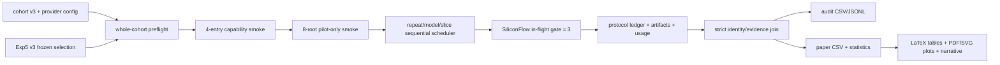

# feat-011：Experiment 5 SiliconFlow 四模型 cohort v3 设计

日期：2026-07-29  
状态：离线设施与独立 8-root 启动入口已实现并完成定向验证；最小 endpoint/key 诊断已完成，artifact-backed capability/8-root smoke 尚未运行，正式 preflight blocked（EPD-010 / EPD-011）  
Owner：TokenShare 研究实验负责人  
实施者：Codex  
适用 feature：`feat-011`  
替代范围：只替代未来新运行的 Experiment 5；不改写 cohort v1/v2 或历史 evidence

## 1. 背景

当前已实现的 Experiment 5 cohort v2 依赖 SiliconFlow、官方 DeepSeek 和 OpenAI 三个 provider。用户当前无法取得 OpenAI API，希望把 Experiment 5 改为同一 SiliconFlow 平台上的四个能力差异明显的模型，并把平台总并发固定为 3。这样可以消除“不同 provider transport/限流/网络路径”这一层混杂，但比较对象仍是“模型及其 SiliconFlow serving/reasoning profile 的组合”，不能解释成纯模型权重的离线能力对比。

现有 v2 设施可生成审计级 CSV/JSONL，但还不能直接生成论文可用的排版表格、矢量图、统计比较和结果段落。旧题库每个 model-repeat 有 211 个 hard roots；用户已通过 EPD-010 决定，只为下一版 Exp5 保留分层确定性的半量 hard-only 题库，不影响 Experiment 1–4。

本设计实施前曾要求等待 Experiment 1–4 smoke 退出并完成输出闭合检查；该保护门已满足，v3 离线设施现已实现并完成定向验证。2026-07-30 已做五次最小 endpoint/key 诊断，但它们不是 artifact-backed capability/smoke evidence；8-root Exp5 smoke 和正式矩阵仍未运行。

## 0. 当前实施与验证状态（2026-07-30）

- cohort/config/entry-map/107-root selection/smoke-profile v3、repeat-major sequence、全局并发 3、逐 entry 预算、统计与论文 artifact renderer 均已接入；v1/v2 replay 保持不变。
- 冻结数量：48 conditions、1,284 roots、9,888 planned first-attempt AI units、token ceiling 607,518,720；`paper_smoke_profile.v3.json` 为 29 direct roots，其中 Exp5 为 8；`paper_smoke_exp5_profile.v3.json` 是物理独立的 Exp5-only 8-root profile。
- digest：cohort=`sha256:1b317c9827d87c43b974b77c469b115906da463a79064d3ffb3b949dc5257942`；provider config=`sha256:6b1d6ffe977340ebbf59d69368d8c977fef664007575de72593c08c038d5ffe1`；semantic selection=`sha256:fbec153a02befa4071b4ad4d639e51e910a3bc4c433cc9eea4b19ac6489a3490`；sequence=`sha256:de9271732513d7d2ab20624d2949af3c9230b9adc2cd8db4b1f1ddb0d57b58cb`；Exp5-only smoke profile=`sha256:b44646d8b298200165abb73155304085c6800fab9ab363aa52483bd03556e61b`。
- 最终 Exp5 定向离线集合为 `464 passed in 231.56s`；其中 Task 7=`55 passed`、Task 8=`52 passed in 3.54s`、Task 9=`17 passed`，三项独立 review 均为 PASS；受影响 compileall 与 diff-check 均 exit 0。
- 2026-07-30 四模型最小诊断均 HTTP 200；MiniMax 在显式 `enable_thinking=false` 时仍返回非空 reasoning，usage 报告 87 reasoning tokens，因此按用户决定改为 thinking。诊断不等同正式 capability/smoke evidence；8-root smoke 未运行。
- Exp5-only identity preflight 不再错误展示 Exp1–4 DeepSeek baseline，而是冻结四个 cohort member 的 endpoint/reasoning/config/request identity；最终离线复核为 8 roots、60 planned units、60 attempts、3,686,400-token hard limit，且未创建目标 output root。
- 输出契约覆盖 CSV、JSONL、TeX、PDF、SVG、Markdown。四模型虽然共享 SiliconFlow，仍受该 provider serving profile、路由、限流和计费约束；结果不能解释为纯模型因果效应。

## 2. 要解决的问题

1. cohort v2 的 OpenAI/官方 DeepSeek 凭据条件当前不满足，无法形成完整正式矩阵。
2. 四个模型共享 SiliconFlow 资源；若模型条件同时运行，模型间资源竞争会污染 latency、429 和 completion 结果。
3. 各模型 context、reasoning 控制与 token 上限能力不同，不能机械复制 Exp1–4 的 `max_tokens=300000`。
4. 当前 Exp5 report 主要是审计数据，不足以直接进入论文正文或附录。
5. 当前 condition expansion 是 member-major，不能表达 repeat 内的预注册模型顺序轮换。

若不修复，Experiment 5 要么整体 blocked，要么只能得到不可公平解释、无法直接写入论文的临时结果。

## 3. 目标与非目标

### 3.1 范围内

- 新建不可变 cohort v3，包含四个 SiliconFlow model entries。
- 使用 Exp5 专属、冻结的半量 hard-only selection。
- 形式矩阵保留 3 repeats，并在 repeat 间使用预注册的部分平衡模型顺序。
- 所有模型 arm 严格顺序执行；SiliconFlow 全局实际 in-flight 上限为 3。
- 为四个 entry 增加 capability smoke 与 8-root 小型 smoke。
- 输出审计数据、论文 CSV、LaTeX 表、PDF/SVG 图、统计比较、结果摘要和失败附录。
- 保留 v1/v2 cohort、旧 digest、旧 outputs 和 replay 行为。

### 3.2 范围外

- 不修改 Experiment 1–4 的模型、题库、参数、并发、输出或论文分母。
- 不修改共享 Factorization/Lean catalog；只生成 Exp5 selection artifact。
- 不并行运行多个模型 arm，不实现 mixed routing 或失败后换模型。
- 不把 smoke 升级为正式 evidence。
- 不伪造跨模型统一的 reasoning 模式；不把 missing reasoning usage 当作 0。
- 不增加新的攻击或安全工程范围。
- 本设计阶段不调用付费 API，也不运行全量测试、Full、LeanAudit 或正式矩阵。

## 4. cohort v3

cohort schema 新版本建议为 `tokenshare.paper.model_endpoint_cohort.v3`：

| member | SiliconFlow model id | 页面能力定位 | reasoning profile |
| --- | --- | --- | --- |
| `glm_5_2_siliconflow` | `zai-org/GLM-5.2` | 753B MoE、1M context、reasoning | `enable_thinking=true, thinking_budget=32768` |
| `qwen3_14b_siliconflow` | `Qwen/Qwen3-14B` | 14B、128K context、thinking/non-thinking | `enable_thinking=true, thinking_budget=32768` |
| `minimax_m2_5_siliconflow` | `MiniMaxAI/MiniMax-M2.5` | 229B MoE、200K context | `enable_thinking=true, thinking_budget=32768` |
| `deepseek_v3_pro_siliconflow` | `Pro/deepseek-ai/DeepSeek-V3` | 671B MoE、128K context | `enable_thinking=false` |

四个 member 使用同一个 SiliconFlow provider config namespace，但每个 member 必须绑定唯一 `entry_id`、精确 model id、reasoning controls、source config digest、prepared config digest 和 response resolved model。`Pro/deepseek-ai/DeepSeek-V3` 不得静默解析到 DeepSeek-V3.2、V3-1226 或其他 alias。

### 4.1 请求参数

已确认或可直接继承的公共控制：

| 字段 | v3 设计值 | 状态 |
| --- | --- | --- |
| `provider_family` | `siliconflow` | 已确认 |
| `base_url` | `https://api.siliconflow.cn/v1` | 沿用当前 SiliconFlow executor contract |
| `endpoint` | `/chat/completions` | 沿用当前 SiliconFlow executor contract |
| `stream` | `false` | 推荐保持现有正式路径 |
| `timeout_seconds` | v3=`600` | 推荐继承 Exp1–4 稳定 timeout；v1/v2 历史值仍为 `100` |
| `max_provider_attempts` | `1` | 推荐保持单次 provider attempt |
| `max_in_flight_global` | `3` | 用户已确认 |
| `temperature` | 四模型统一显式 `0.0` | 当前 JSON transport 实际总会发送该字段；冻结确定性值 |
| `top_p` | 四模型统一显式 `1.0` | 当前 JSON transport 实际总会发送该字段；禁止省略后退化为 `0.0` |
| `max_tokens` | `32768` | 推荐，需 capability smoke 批准 |
| `enable_thinking` | GLM/Qwen/MiniMax=`true`；DeepSeek=`false` | 四 entry 显式冻结；MiniMax 依据端点诊断改为 thinking |
| `thinking_budget` | GLM/Qwen/MiniMax=`32768`；DeepSeek 不发送 | 只对 thinking entry 生效，需 artifact-backed smoke 复核 |

不能把 `max_tokens=300000` 直接用于四模型共同正式配置：Qwen3-14B 与 DeepSeek-V3 的页面 context 为 128K，输入、reasoning 和输出必须共同落在模型上下文能力内；而 SiliconFlow 文档对 reasoning token 与 `max_tokens` 的表述还需要按 entry 验证。推荐的 `32768 + 32768 thinking budget` 为预注册候选，不在看到 benchmark 正确率后调整。

正式 config 冻结前执行无 benchmark 内容的 capability smoke：验证 model id、请求字段、`32768` 上限、thinking toggle、`thinking_budget`、response model、usage 字段和 timeout 路径。任一 entry 不接受推荐控制时，整个 cohort 保持 `blocked`，先形成新的参数决定；不得在正式题目运行中临时降档。

cohort policy 必须按版本读取请求门禁，不能把共享 `PAPER_FORMAL_AI_TIMEOUT_SECONDS=100` 全局改成 `600`。v1/v2 继续验证历史 `100/8192/1 attempt` 及各自 reasoning profile；只有 v3 验证本节的 `600/32768/1 attempt` 和四 entry controls。这样历史 replay、digest 与旧 evidence 不会因新实验参数改变而失效。

### 4.2 token 与预算口径

`max_tokens` 在 v3 中定义为最终回答生成上限；GLM/Qwen/MiniMax 的 `thinking_budget` 是额外推理上限，不能塞进同一个标量后假装四模型预算相同。transport、prepared-config identity、preflight comparable controls 和 execution record 都必须识别并冻结 `thinking_budget`；它只允许在 `enable_thinking=true` 时出现，且必须为正整数。

正式 plan 使用逐 entry 的保守 token 上界，不再复用 Exp1–4 面向 `300000+4096` 的单一标量。以当前冻结的每次 prompt 规划上限 `4096` 和每模型 2,472 个 first-attempt AI units 计算：

| entry 类型 | 单次规划上界 | 三 repeats 的 units | 分组上界 |
| --- | ---: | ---: | ---: |
| GLM/Qwen/MiniMax（各一组） | `4096 + 32768 + 32768 = 69632` | 每模型 `2472` | 每模型 `172,130,304` |
| DeepSeek | `4096 + 32768 = 36864` | `2472` | `91,127,808` |

四模型合计保守上界为 `607,518,720` tokens，其中最终回答上限合计 `324,009,984`、thinking 上限合计 `243,007,488`、prompt 规划上限合计 `40,501,248`。这是 fail-closed 的 plan ceiling，不是预计消耗或计费量；论文只报告 provider response 中可审计的实际 usage。若实现时 prompt ceiling 或任一 entry cap 改变，plan drift gate 必须先失败并要求新决策，不能静默重算后继续正式运行。

token ceiling 与货币预算分开冻结。2026-07-29 已从 SiliconFlow 官方价格页与官方更新公告取得四个精确 model id 的 CNY/M tokens pricing snapshot：GLM-5.2 为 uncached input `8.00`、output `28.00`、cache hit `2.00`；Qwen3-14B 为 input `0.50`、output `2.00`，官方提取结果未列 cache rate；MiniMax-M2.5 为 uncached input `2.10`、output `8.40`、cache hit `0.21`；Pro DeepSeek-V3 为 input `2.00`、output `8.00`，官方提取结果未列 cache rate。正式 v3 provider config 必须保存 currency、计价单位、访问时间和 source ref，并纳入 config/budget digest；GLM/MiniMax 可按 provider cache breakdown 估计，Qwen/DeepSeek 只能按公开 input rate 估计，不得杜撰 cache 折扣。价格是可变外部状态，因此每次正式矩阵前仍需 freshness gate；smoke/正式付费调用仍须用户另行明确批准并设置独立硬金额上限。该段只保留 `2026-07-29` 历史 provenance；当前正式运行价格身份以下段 `2026-08-15` 刷新为准。

2026-08-15 正式运行前刷新证据：访问 SiliconFlow 官方实时定价页 `https://siliconflow.cn/pricing`，页面明确标记“实时价格同步”“仅展示可用模型”；展开 deepseek-ai 与 Qwen 的隐藏行后，四个预注册 endpoint 的输入/输出/缓存命中价格（CNY/M tokens）分别为 `zai-org/GLM-5.2=8.00/28.00/2.00`、`Qwen/Qwen3-14B=0.50/2.00/-`、`MiniMaxAI/MiniMax-M2.5=2.10/8.40/0.21`、`Pro/deepseek-ai/DeepSeek-V3=2.00/8.00/0.20`。本次刷新不改变四模型、request controls 或保守 uncached-input 预算公式，只把 snapshot `accessed_at` 冻结为 `2026-08-15` 并补齐 DeepSeek cache rate；刷新后的 source provider config digest 为 `sha256:5135c1c2da0f7512b9891f4ea35c65891044dab544d7ad01230ef1db43ff4b5d`。影响范围限于 v3 provider config/policy pricing identity、freshness authority、相关 digest 与预算重算。`Doc/agent-navigation.md` 已索引本权威设计，因此不新增平行索引文档。

## 5. Exp5 专属题库

EPD-010 固定每个 model-repeat 的 selection：

| stratum | 父 catalog 数量 | v3 保留 |
| --- | ---: | ---: |
| Factorization hard | 166 | 83 |
| Lean hard / pure_logic | 15 | 8 |
| Lean hard / function_set | 15 | 8 |
| Lean hard / induction | 15 | 8 |
| 合计 | 211 | 107 |

每个 stratum 按 `sha256(case_id)` 升序保留前 `ceil(n/2)`，并冻结 selected case IDs/order、父 catalog digest、selection digest 和算法版本。四个模型与三个 repeats 使用完全相同的 selection。Factorization 继续使用 Exp1 8-way split；Lean 继续使用每题预注册 lemma-DAG。

正式规模：

- `4 models × 3 repeats × 4 domain/topic slices = 48 conditions`；
- `107 × 4 × 3 = 1,284 root-runs`；
- `(83×8 + 8×7 + 8×6 + 8×7) × 4 × 3 = 9,888` 首轮 planned AI units。

## 6. 调度与并发

模型 arm 必须顺序执行；一个模型的 Factorization 和三个 Lean slices 全部闭合后，才能启动该 repeat 的下一个模型。每个 condition 内 worker capacity 和 SiliconFlow provider in-flight gate 都固定为 3，运行证据必须报告 `observed_peak_concurrency <= 3`。

令 A=GLM-5.2、B=Qwen3-14B、C=MiniMax-M2.5、D=DeepSeek-V3。三个 repeats 使用以下顺序：

| repeat | 模型顺序 | 相邻转换 |
| --- | --- | --- |
| 0 | A → B → C → D | AB、BC、CD |
| 1 | B → D → A → C | BD、DA、AC |
| 2 | C → A → D → B | CA、AD、DB |

该 3×4 Latin rectangle 使每个模型占据三个不同顺序位置，四个位置全局各出现 3 次，并使 9 个相邻转换不重复。因为只有 3 repeats，每个模型仍缺少一个位置，所以报告必须保留 `order_slot`、`predecessor_model`、repeat 开始时间和平台错误/限流证据；不得声称完成了四模型全 Latin-square 平衡。

condition expansion 必须改为 `repeat → model_order → slice`，不能沿用 member-major 的“一个模型跑完全部 repeats”顺序。任何并发模型 arm、顺序漂移或 peak concurrency >3 都使相应正式结果 paper-ineligible。

## 7. 运行流程与数据流



正式 preflight 必须原子验证四个 entry；任一 key/config/model/reasoning/capability/smoke evidence 缺失，正式 Exp5 在 provider dispatch 前整体 blocked。首次 smoke 的 bootstrap preflight 不要求事先已有 smoke evidence，否则会形成循环门禁；它仍严格验证四 entry identity、key/config、catalog/selection、请求与预算。小型 smoke 使用物理独立的 `paper_smoke_exp5_profile.v3.json`，每模型 1 个 Factorization hard root与 1 个 Lean hard root，共 8 direct root-runs；固定 `formal=false,pilot_only=true,regression_only=true,paper_eligible=false`。

## 8. 输出契约

### 8.1 审计与分析数据

必须生成：

```text
metrics/
  exp5_model_overall.csv
  exp5_model_by_domain_topic.csv
  exp5_paired_comparisons.csv
  exp5_model_execution_records.jsonl
  exp5_order_and_concurrency.csv
  exp5_failure_taxonomy.csv
```

`exp5_model_overall.csv` 每模型一行，至少包含 root 数、completion、accepted validity、provider attempts、prompt/reasoning/visible-output/total tokens、cost estimate、cost estimate status/pricing snapshot digest、wall-clock、provider latency、429、timeout、retry、identity coverage 和 paper eligibility。

`exp5_model_by_domain_topic.csv` 按 Factorization 与三个 Lean topic 分层；必须同时给分子、分母和 rate。`reasoning_tokens` 缺失时写 `null + unavailable reason`，不得写 0。

token 派生规则固定如下：response 明确给出 `reasoning_tokens` 时，`visible_output_tokens = completion_tokens - reasoning_tokens`，并验证结果非负；entry 明确 `enable_thinking=false` 且 response 没有 reasoning 明细时，`visible_output_tokens = completion_tokens`，同时写入 `visible_output_basis=explicit_non_thinking`；thinking entry 缺少 reasoning 明细时，`visible_output_tokens=null` 并记录原因。不得把未知 reasoning 静默当作 0，也不得用字符数或本地 tokenizer 冒充 provider usage。capability smoke 若证明该 endpoint 的 `completion_tokens` 不包含 reasoning，则必须在正式运行前另立版本化派生规则，不得套用减法。

`exp5_paired_comparisons.csv` 覆盖六个模型对，至少包含 metric、domain/topic、paired sample size、模型 A/B 点估计、paired difference、95% CI、检验方法、raw p-value、Holm-adjusted p-value 和 effect direction。二元 completion/validity 使用同一 `case_id×repeat_id` 配对；连续 token/latency 报告 paired median difference。95% CI 使用以 `case_id` 为 cluster 的预注册 bootstrap，保留三个 repeats 的组内相关性。

`exp5_order_and_concurrency.csv` 必须证明实际模型顺序、order slot、predecessor、condition 时间窗不重叠、全局 peak in-flight≤3，并支持按 order slot 做 sensitivity summary。

### 8.2 论文成品

必须生成：

```text
paper/
  exp5_model_overall.tex
  exp5_model_by_domain_topic.tex
  exp5_completion_validity.pdf
  exp5_completion_validity.svg
  exp5_tokens_latency.pdf
  exp5_tokens_latency.svg
  exp5_results_summary.md
  exp5_failure_appendix.md
```

LaTeX 表只能读取正式 eligible CSV，不能从日志临时拼数。图必须带样本量、误差区间和明确单位。`exp5_results_summary.md` 生成可直接改写进论文的事实段落，但只能描述真实观察，不预写“某模型最好”或因果结论；若差异不显著或 evidence 不完整，应生成对应的负面/限定性表述。

失败附录按 model/domain/topic/failure stage 分层，并为 parse failure、checker rejection、timeout、429、identity mismatch、length truncation 至少保存代表性 evidence refs；引用 raw output 时只生成短摘要，不复制 reasoning chain 或 secret。

## 9. 统计与论文解释边界

- primary outcomes：root completion rate、accepted validity rate。
- secondary outcomes：total/reasoning/visible-output tokens、wall-clock、provider latency、cost estimate、429/timeout/failure taxonomy。
- 所有模型共用题目和 repeats，主要比较使用 paired analysis；不能退化成四组互不相关均值。
- 同一 SiliconFlow 平台降低 provider 级混杂，但 model serving、reasoning profile、定价和内部资源仍与模型共同变化，论文用语固定为 model-endpoint comparison。
- v2 report 中的 `provider_confounding=model_provider_endpoint_pair` 只解释历史跨 provider cohort；v3 必须改为 same-provider serving-profile limitation，不得沿用“跨 provider 混杂”模板句。
- 三 repeats 只提供有限的 order sensitivity，不把 n=3 的 condition-level 分位数当作稳定分布证据；root-level区间必须保留 case clustering。
- smoke、capability probe、blocked 或 identity incomplete 数据不得进入论文主表。

## 10. Secret 与审计边界

- tracked config 只保存 `api_key_env="SILICONFLOW_API_KEY"`，不得保存真实 key。
- 本地 key 只能从受忽略的 local config 注入当前进程。
- request/artifact/event/SQLite/CSV/LaTeX/Markdown/日志不得包含 Authorization、key 或可识别片段。
- resolved model 必须来自 response 原始字段；不得从 configured/requested model fallback。
- v1/v2 cohort 和历史 evidence 只读，v3 使用新 cohort/config/selection/profile/digest。

## 11. 风险与缓解

| 风险 | 影响 | 概率 | 缓解 |
| --- | --- | --- | --- |
| 运行中修改共享代码污染 Exp1–4 smoke | 高 | 高 | smoke 退出前只写新设计/计划文档；不改 Python/config/test，不运行初始化或测试 |
| SiliconFlow 共享算力造成模型顺序效应 | 高 | 中 | 模型 arm 顺序执行、3×4 部分平衡、记录 order/predecessor/time/429 |
| `max_tokens`/thinking 语义按模型不同 | 高 | 中 | 无 benchmark capability smoke、冻结有效 controls、分离 reasoning/output usage、漂移即 blocked |
| 128K 模型不接受过大生成预算 | 高 | 高 | 不使用 300K；推荐 32K output + 32K thinking，并在正式 config 前验证 |
| 用全局 timeout 或标量 token budget 覆盖 v1/v2 | 高 | 中 | policy 按 cohort version 校验 timeout；plan 按 entry 计算上界；旧 digest/replay 回归 |
| 模型卡无可审计单价却生成精确成本 | 高 | 中 | 正式前冻结官方 pricing snapshot；缺失时货币预算 blocked、成本为 unavailable |
| 半量题库产生选择偏差 | 中 | 低 | 分层哈希确定性选择、冻结 digest、所有模型共享、禁止结果后换题 |
| 三 repeats 不能完全平衡四个位置 | 中 | 高 | 使用 9 个不重复 carryover 的 Latin rectangle；显式报告限制和 order sensitivity |
| report 生成漂亮但不可靠的结论 | 高 | 中 | 只从 eligible CSV 派生；模板禁止预写结论；CI、分母、missingness 与限制必须呈现 |
| 模型 alias 或后端更新 | 高 | 中 | strict response model identity；alias 变化生成新 cohort version，不猜测匹配 |

## 12. 备选方案

### 方案 A：公共 32K output cap（推荐）

四个模型统一 `max_tokens=32768`；GLM/Qwen/MiniMax 另设 `thinking_budget=32768`，DeepSeek 显式 `enable_thinking=false`；四者统一 `temperature=0.0, top_p=1.0`。优点是比较口径清楚、远高于旧 8192，并适配 128K context；缺点是 reasoning 模型与非 reasoning 模型的实际 token 组成仍不同。

### 方案 B：每模型使用 provider-native 最大值

优点是最少发生 length truncation；缺点是预算、失败率和 completion 都受到不同上限影响，论文很难解释为公平对比，不推荐作为主实验。

### 方案 C：公共 cap 主实验 + native-cap 附录

统计上最完整，但近似加倍真实 API 工作量，与当前主动减半题库的预算目标冲突。只在主实验发现大量 `finish_reason=length` 时另立扩展实验决定，不在 v3 默认实施。

## 13. 测试策略

实现遵循 TDD，先写失败测试，再改生产代码。测试至少覆盖：

- cohort v3 精确四成员、v1/v2 digest/replay 不变；
- selection `83/8/8/8`、case IDs/order/digest 稳定，Exp1–4 catalog 与计划数量不变；
- repeat/model/slice expansion 为 48 conditions，顺序与 3×4 表完全一致；
- 全局并发和 condition capacity 均为 3，禁止 arm overlap；
- 四 entry request controls、thinking 字段和 strict resolved-model identity；
- v1/v2 timeout 门禁仍为 `100`，v3 为 `600`，互不覆盖；
- `thinking_budget` transport/identity/preflight 及逐 entry `607,518,720` token plan ceiling；
- visible-output token 三分支派生、非负检查和 unknown missingness；
- capability smoke/8-root smoke 的非正式资格与 whole-cohort fail-closed；
- `1,284 roots / 9,888 first-attempt units` 预算与 drift gate；
- 六类 CSV、八类论文成品的 schema、eligibility、missingness 和 deterministic rendering；
- 旧 v1/v2 reader、capturing/replay provider calls=0。

在 Exp1–4 smoke 运行期间不执行任何测试。其退出后只运行 Exp5/provider/metrics/report 定向测试和 `compileall` 相关范围；用户明确要求本轮不跑全量测试，因此不运行 `pytest tests`、`init.ps1 -Full`、LeanAudit 或正式 API 矩阵。任何最终“实现完成”声明必须注明这一验证边界。

## 14. 实施计划与安全门

| 阶段 | 内容 | 当前是否可做 |
| --- | --- | --- |
| 0 | 决策台账、TDD、外部资料摘要、输出 schema、实施任务拆分 | 可以，立即完成 |
| 1 | 等待 Exp1–4 smoke 进程退出；只读检查 suite/condition/report 已闭合并记录其代码/config digest | 必须作为代码修改前 gate |
| 2 | 新增 cohort/config/selection/profile v3 与 RED tests | smoke 退出后 |
| 3 | 修改 policy、condition expansion、并发/顺序 evidence 和 budget | smoke 退出后 |
| 4 | 修改 metrics、统计、LaTeX/plot/narrative renderer | smoke 退出后 |
| 5 | 运行定向离线测试；修复到通过；不跑全量 | smoke 退出后 |
| 6 | 四 entry capability smoke，再运行 8-root pilot-only smoke | 用户确认付费调用后 |
| 7 | 审计 smoke outputs；重新 plan-only 和预算；是否启动正式矩阵另行确认 | smoke 合格后 |

回滚策略是版本回退：v3 实现不修改 v1/v2 文件；若 v3 preflight、smoke 或 report 不合格，停止新正式任务并保留结构化 blocked/audit outputs，正式默认不切换到 v3。历史 replay 继续读取原 cohort/schema/digest，不重新调用 provider。

### 14.1 当前实现差距与改动落点

只读代码审计确认以下差距，实施时应以版本化扩展解决：

- 实施前基线中的 `paper_exp5_model_comparison.py` 当时仍是 3 模型、36 conditions、1,899 roots、14,652 units，且按 member-major 展开、每 condition 10 workers、选择全部 hard roots；该历史缺口现已由 v3 独立常量、repeat-major 轮换、3 workers 和冻结半量 selection 闭合。
- `paper_model_policy.py` 当前把 v2 当 current，并以共享 `100` 秒常量做门禁；需要同时保留 v1/v2/v3 定义，并让 timeout、comparable controls 和 reasoning identity 从 cohort version/entry 读取。
- `ai_api_transport.py` 当前 JSON 路径总会发送 `temperature/top_p`，但不支持 `thinking_budget`；v3 config 必须显式给 `0.0/1.0`，transport 增加经过校验的 `thinking_budget`。
- `paper_model_identity.py` 当前 reasoning identity 只识别 `enable_thinking`；需要把有效 `thinking_budget` 纳入 prepared config digest、preflight 和审计记录。
- `run_paper_experiments.py` 与 `paper_budget.py` 当前 formal plan 只接受单一 token 标量；v3 需要逐 entry 上界，避免把 reasoning cap 漏算或错算到非 thinking 模型。
- `ai_api.py` 已能读取 response 的 reasoning usage，但当前 metrics 没有 `visible_output_tokens`；新增派生时必须保留 provenance/missingness。
- `paper_formal_metrics.py` 与 `paper_formal_report.py` 当前只有基础 CSV/JSONL，并带 v2 跨 provider 模板；v3 新 renderer 从 eligible audit rows 派生 paired stats、LaTeX、PDF/SVG 和结果/失败 Markdown，不改写历史 v2 输出语义。
- `paper_smoke_profile.v2.json` 当前 Exp5 是 3 模型共 6 roots；v3 综合 profile 的 Exp5 部分为 4 模型共 8 roots，另有物理独立的 `paper_smoke_exp5_profile.v3.json`，不修改 v2 文件。

## 15. 外部资料落库记录

访问日期统一为 2026-07-29。本节记录本轮已用于设计的官方在线资料、摘要和影响范围；未使用第三方论文或开源仓库。

| 来源 | 本地摘要 | 设计影响 |
| --- | --- | --- |
| `https://cloud.siliconflow.cn/me/models` 与 `https://www.siliconflow.cn/models` | 登录后的模型广场确认四个精确 model id 可用；卡片分别标注 GLM-5.2 1M、Qwen3-14B 128K、MiniMax-M2.5 200K、DeepSeek-V3 128K context，并区分 reasoning 标签。卡片当前未展示足以冻结的输入/输出单价，因此不从页面推断 pricing。未记录任何账号信息。 | cohort v3 identity、不能公共使用 300K、reasoning controls 分层、正式 config 另需官方 pricing snapshot |
| `https://docs.siliconflow.cn/cn/api-reference/chat-completions/chat-completions` | Chat Completions 提供 `max_tokens`、stream、model 等请求字段，并返回 model/usage。通用文案把 `max_tokens` 描述为生成上限。 | request schema、identity/usage evidence、capability smoke |
| `https://docs.siliconflow.cn/cn/userguide/capabilities/reasoning` | reasoning 指南区分 `thinking_budget` 与最终回答 `max_tokens`；usage 可包含 reasoning token 明细，但不同模型支持度需要验证。 | 推荐 32K+32K、missing reasoning 不得记 0、逐 entry probe |
| `https://siliconflow.cn/pricing` | 官方实时价格页按 input/output/cache-hit（元/M tokens）展示：`zai-org/GLM-5.2=8.00/28.00/2.00`，`MiniMaxAI/MiniMax-M2.5=2.10/8.40/0.21`；同一官方价格页的可检索结果给出 `Qwen/Qwen3-14B=0.50/2.00` 与 `Pro/deepseek-ai/DeepSeek-V3=2.00/8.00`，后二者的提取行未展示 cache-hit rate。 | 冻结 v3 pricing snapshot；GLM/MiniMax 使用 split cached/uncached rates，Qwen/DeepSeek 使用公开单一 input rate；正式运行前重新验证 freshness |
| `https://api-docs.siliconflow.cn/docs/release-notes/overview` | 官方更新公告确认 `Pro/deepseek-ai/DeepSeek-V3` 与非 Pro entry 已升级为 0324，并记录 DeepSeek-V3 在 2025-02-09 恢复 input `2`、output `8` 元/M tokens；未把它静默替换为 V3.2。 | 交叉核对 DeepSeek 精确 entry、价格与 resolved-model drift gate |

这些普通在线文档不需要下载论文或 clone 开源仓库；本节即为本地可复查来源、访问日期、摘要和影响记录。

## 16. 验收标准与已批准实施项

设计验收：cohort、题库、调度、并发、请求参数、输出、统计、风险、测试和回滚边界都有唯一表述；权威设计与 EPD 台账不再把 v2 当作下一次正式 Exp5。

实现验收：定向测试通过；v1/v2 replay 不变；Exp1–4 计划数量不变；v3 plan-only 精确得到 48 conditions、1,284 roots、9,888 首轮 AI units；8-root smoke 真实调用后能生成完整审计输出但不能进入正式论文表。

2026-07-29 用户已通过 EPD-011 批准以下两项：

1. 方案 A（2026-07-30 修订）：v3 `timeout_seconds=600`、公共 `max_tokens=32768`、`temperature=0.0`、`top_p=1.0`；GLM/Qwen/MiniMax `enable_thinking=true, thinking_budget=32768`，DeepSeek `enable_thinking=false`；v1/v2 保留历史 timeout/参数；
2. 第 8 节列出的“CSV + LaTeX + PDF/SVG + 结果摘要 + 失败附录”为 Exp5 强制输出契约。

代码与离线定向测试现已获准实施；人为注入攻击不在范围内。真实 capability smoke、8-root smoke 与正式 v3 provider matrix 仍受各自运行前授权门约束，不能由本设计批准自动触发。
